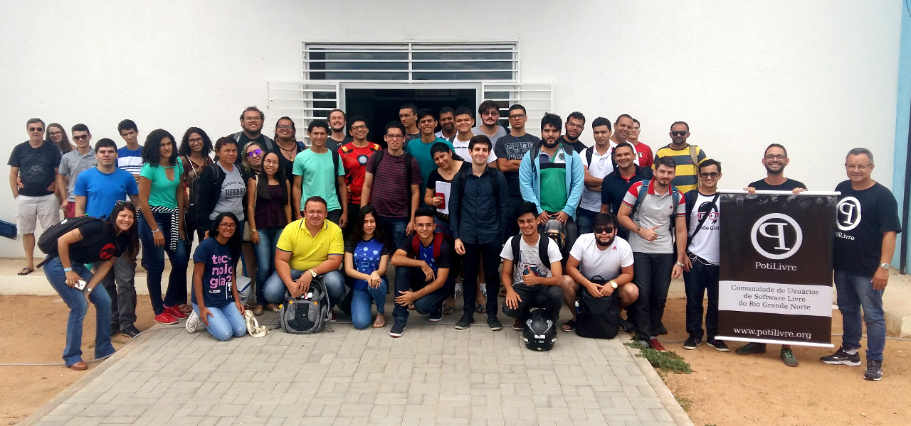
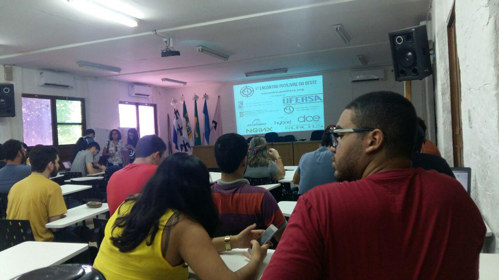
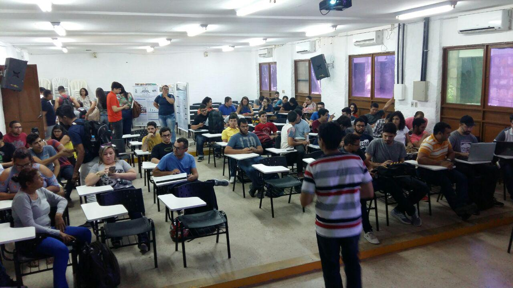
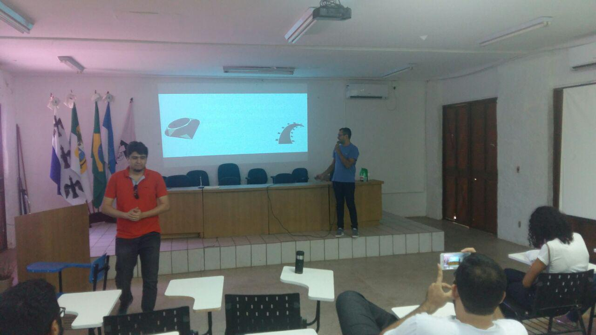
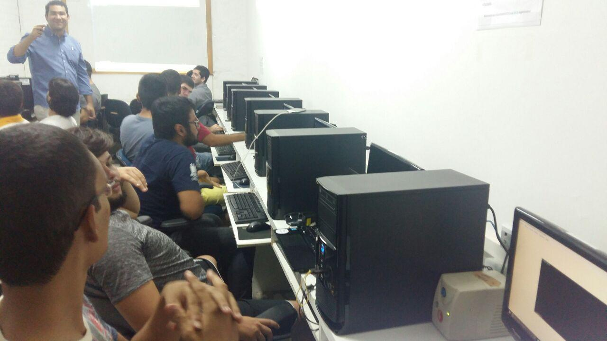
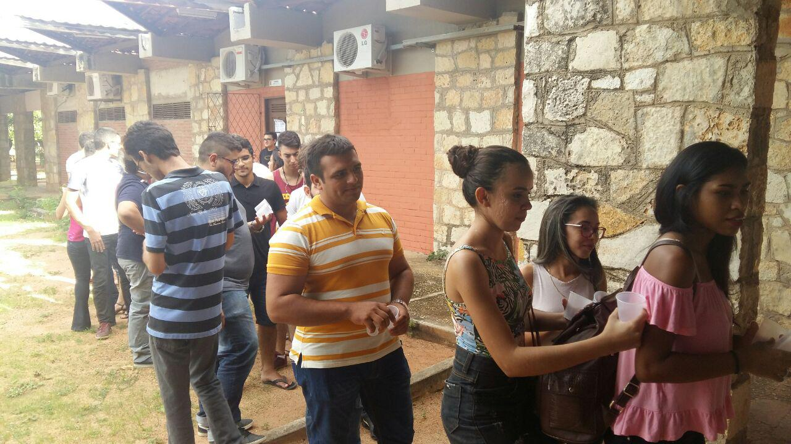
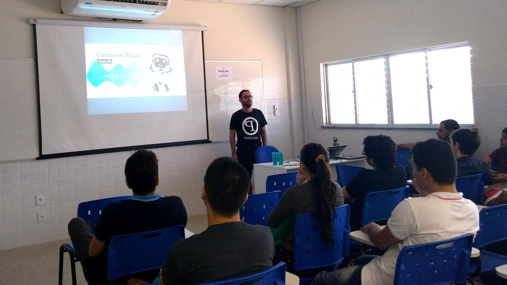
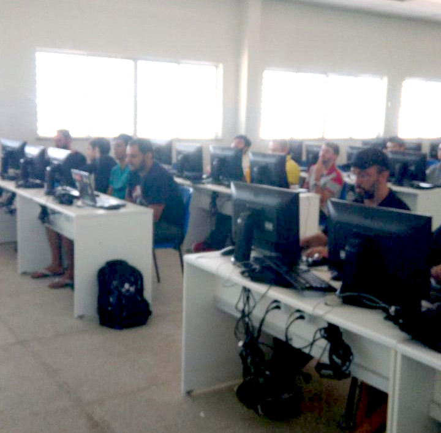

A PotiLivre, Comunidade Potiguar de Software Livre, nos dias 2 e 3 de de março de 2018 realizou em Mossoró nas instalações da UERN, Universidade do Estado do Rio Grande do Norte, e da UFERSA, Universidade Federal Rural do Semi-Árido, o 1º Encontro PotiLivre do Oeste. Foi um evento gratuito com uma programação de palestras e oficinas com temas voltados à filosofia do software livre. O encontro foi organizado por membros da coordenação da PotiLivre de Natal e pelos seguintes professores: Prof. Dr. Sebastiao Emidio Alves Filho (UERN), Prof. Dr. Paulo Henrique Lopes Silva (UFERSA) e Prof.ª Me. Ana Eliza Trajano Soares (IFRN Campus Nova Cruz).

Além do público mossoroense, o evento teve a participação de caravanas de alunos das cidades de Angicos, Caraúbas e Pau dos Ferros.\
A coordenação do evento ficou impressionada com o público presente nos dois dias do encontro, demonstrando que "o espírito e as ideias de desenvolvimento livre vivem em nós", como afirmou Lucas Vinicius Ferreira da Silva, um dos participantes do evento.\
Tivemos também o depoimento de outro participante, Gyl Monteiro dos Santos de Sousa: "Gostaria de parabenizar pelo evento. Foi muito proveitoso. O que vocês estão fazendo é de grande importância, interiorizando o conhecimento. O que antes ficava restrito à capital e região metropolitana, agora esses encontros são expandidos para cidades mais distantes e ofertando a possibilidade de disseminar o conhecimento e dialogar com pessoas das diversas regiões do Rio Grande do Norte e também do Ceará. Parabéns realmente pela iniciativa".\
A coordenação ficou bastante feliz e informa que a comunidade está disponível para a realização de outros eventos em qualquer cidade que tenha interesse sobre software livre. \
No 1º Encontro PotiLivre do Oeste aconteceram as seguintes atividades:

Palestras:

- [Desenvolvimento Web: Conhecendo o Vue.Js](https://pt.slideshare.net/potilivre/desenvolvimento-web-conhecendo-o-vuejs-francisco-matheus-ricelly-pinto-de-sena) por Francisco Matheus Ricelly Pinto de Sena;
- Pedagogia da gambiarra: cultura hacker ampliando a visão de mundo por Bryan Sousa de Oliveira;
- [Ruby on Rails como deve ser utilizada e onde!](https://pt.slideshare.net/potilivre/ruby-on-rails-como-deve-ser-utilizada-e-onde-julio-cartier-maia-gomes) por Julio Cartier Maia Gomes;
- [O que é Software Livre e a comunidade PotiLivre](https://pt.slideshare.net/potilivre/afinal-de-contas-o-que-e-software-livre-allythy-rennan-medeiros-de-souza-sfd2017) por Allythy Rennan Medeiros de Souza e Pedro Baesse Alves Pereira;
- [Mudando para o Software Livre sem complicação](https://pt.slideshare.net/potilivre/mudando-para-o-software-livre-sem-complicacao-digenes-emmanuel-dantas-soares) por Diógenes Emmanuel Dantas Soares;
- [Software Livre no Banco do Brasil: como o BB economizou R\$ 50 milhões de reais com ferramentas livres](https://pt.slideshare.net/potilivre/software-livre-no-banco-do-brasil-como-o-bb-economizou-50-milhoes-de-reais-com-ferramentas-livres-mario-araujo-xavier) por Mário Araújo Xavier;
- [Quem é a Mozilla?? A fundação que te defende na web e você nem sabia](https://pt.slideshare.net/potilivre/quem-a-mozilla-a-fundacao-que-te-defende-na-web-e-voce-nem-sabia-pedro-baesse-alves-pereira) por Pedro Baesse Alves Pereira;
- [Implementando Distribuição de Sistemas WEB Com NGINX](https://pt.slideshare.net/potilivre/implementando-distribuicao-de-sistemas-web-com-nginx-fernando-henrique-eisele-bellincanta) por Fernando Henrique Eisele Bellincanta e
- [A importância das certificações para profissionais de software livre](https://pt.slideshare.net/potilivre/a-importancia-das-certificacoes-para-profissionais-de-software-livre-matheus-cavalcante-de-oliveira) por Matheus Cavalcante de Oliveira

Minicursos

- [Minicurso de Git e GitHub](https://github.com/allythy/Palestras/tree/master/Minicurso%20de%20Git%20e%20GitHUb) por Ana Clara Nobre Mendes e Allythy Rennan Medeiros de Souza;
- [Introdução à Plataforma Arduino](https://pt.slideshare.net/potilivre/minicurso-introducao-a-plataforma-arduino-nathecia-cunha-e-alcimar-medeiros-encontro-potilivre) por Nathecia da Cunha Santos e Alcimar Francelino de Medeiros;
- Administração Básica de Sistemas GNU/Linux com Shell Script por João Batista Gonçalves da Silva;
- [Desenvolvimento de Sites com CMS Joomla!](https://pt.slideshare.net/potilivre/o-que-e-joomla-jose-roberto-encontro-potilivre) por José Roberto da Costa Ferreira;
- NGINX na prática por Fernando Henrique Eisele Bellincanta e
- [Minicurso de PHP para iniciantes](https://pt.slideshare.net/potilivre/minicurso-de-php-para-iniciantes-mario-araujo-xavier) por Mário Araújo Xavier.

A coordenação do evento agradece a todos que colaboraram para a realização deste encontro: UERN e UFERSA pela cessão dos auditórios e laboratórios para as palestras e minicursos. Hybrid com a hospedagem do site do evento. DAE Networs, AutoForce e NGINX pela disponibilização de brindes para sorteios. Cactus Tecnologia pelo patrocínio. Aos palestrantes que se dispuseram a dividir seus conhecimentos, aos voluntários que ajudaram a organização do evento e claro, aos participantes, onde alguns tornaram-se membros da comunidade, destacando a força de vontade da caravana de alunos e professores de Angicos, Caraúbas e Pau dos Ferros que aproveitaram para aprender um pouco mais sobre liberdade com software livre.

## Fotos

*Amostra de 8 fotos das 142 registradas neste evento.*

