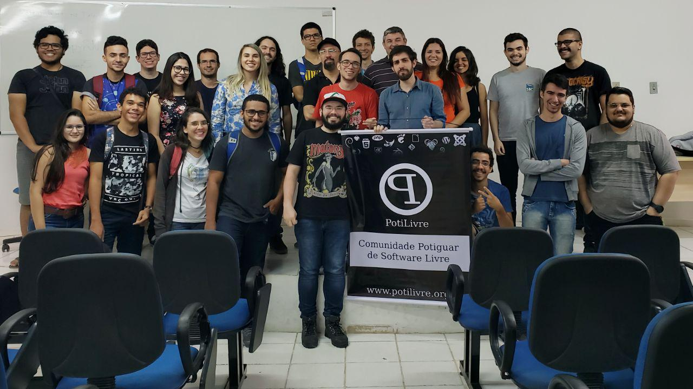
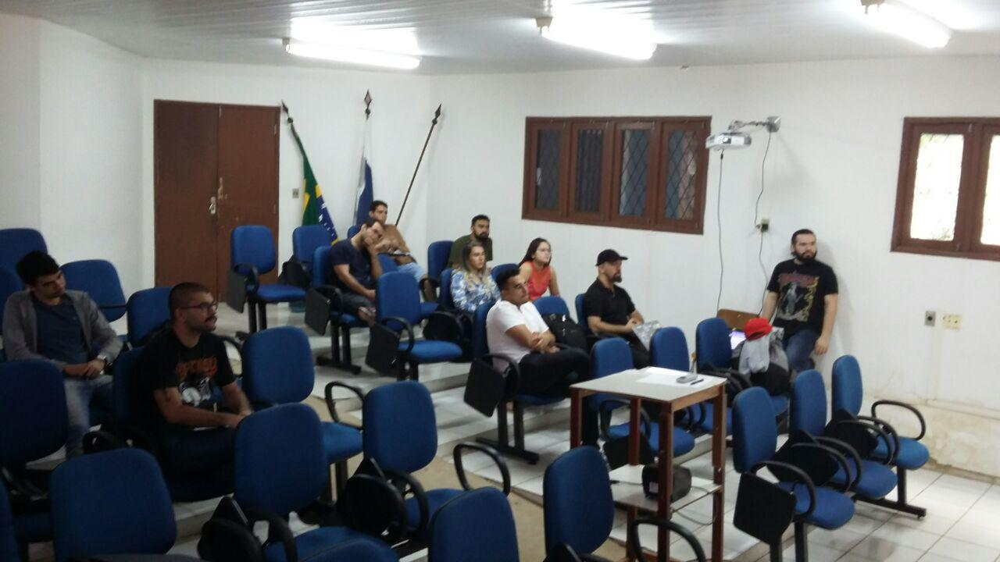
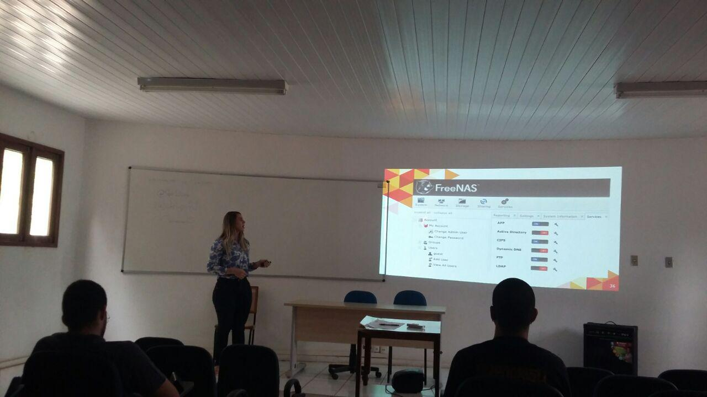
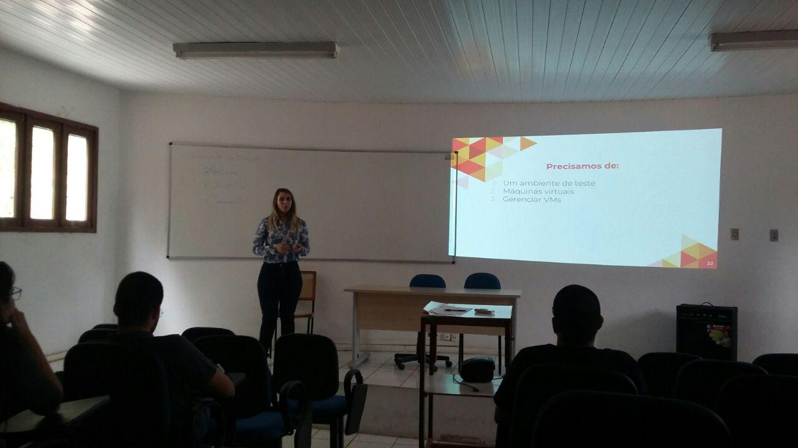
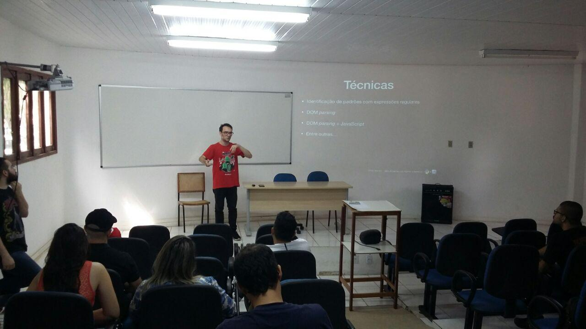
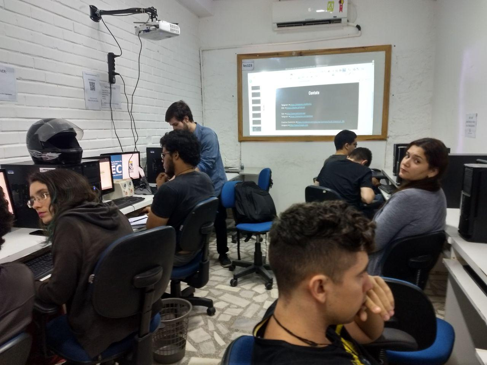
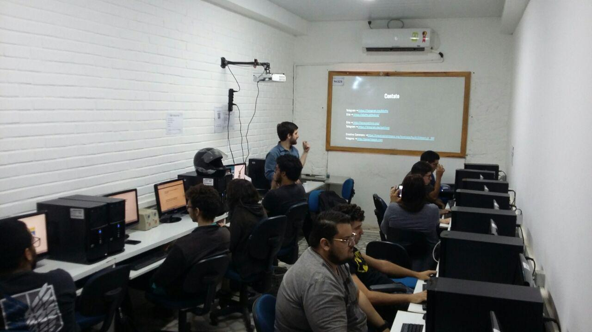

A Faculdade de Ciências Exatas e Naturais (FANAT), da Universidade do Estado do Rio Grande do Norte (UERN), recebeu no sábado, 21 de julho de 2018 o "MeetUp Potilivre Mossoró", evento gratuito onde profissionais e entusiastas de tecnologias de software livre se reuniram para troca de experiências, oferecendo uma oportunidade de aprendizado e desenvolvimento profissional.

Nesta primeira edição ocorreram o ciclo de palestras e a oferta de minicursos. O evento foi uma promoção da PotiLivre, Comunidade Potiguar de Software Livre, e teve a coordenação local do professor Alysson Oliveira, do Departamento de Informática da UERN.

Tivemos as seguintes palestras:

- O que é Software Livre e Comunidade PotiLivre por Allythy Souza;
- Web Scraping com Python e Selenium por Sedir Morais;
- LibreOffice: A inclusão de pacote office nas escolas públicas por Gabriel Rocha, Bianca Ferreira e Rellyson Douglas;
- A utilização de software livre no ambiente de trabalho: do desktop ao servidor por Thalia Katiane Sampaio Gurgel e
- Conhecendo o Node.Js por Arthur Aleksandro Alves Silva.

E ainda os seguintes minicursos:

- Introdução ao maravilhoso mundo de Python por Victor Matheus Castro e
- Introdução à linha de comando no GNU/Linux+Python por Allythy Souza.

##  Fotos

## Fotos

