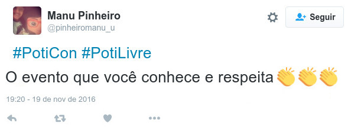
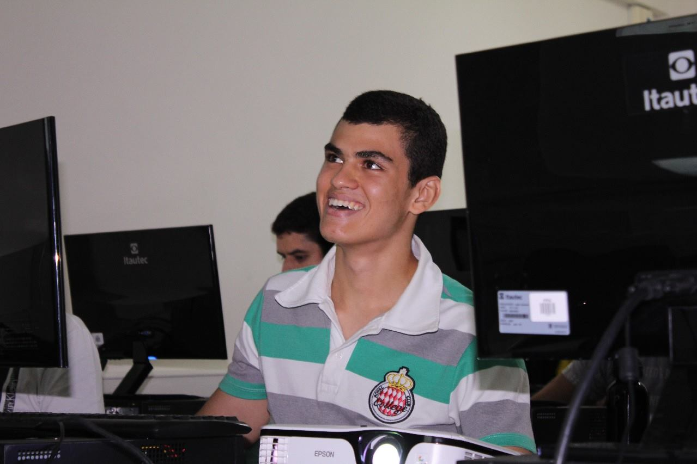
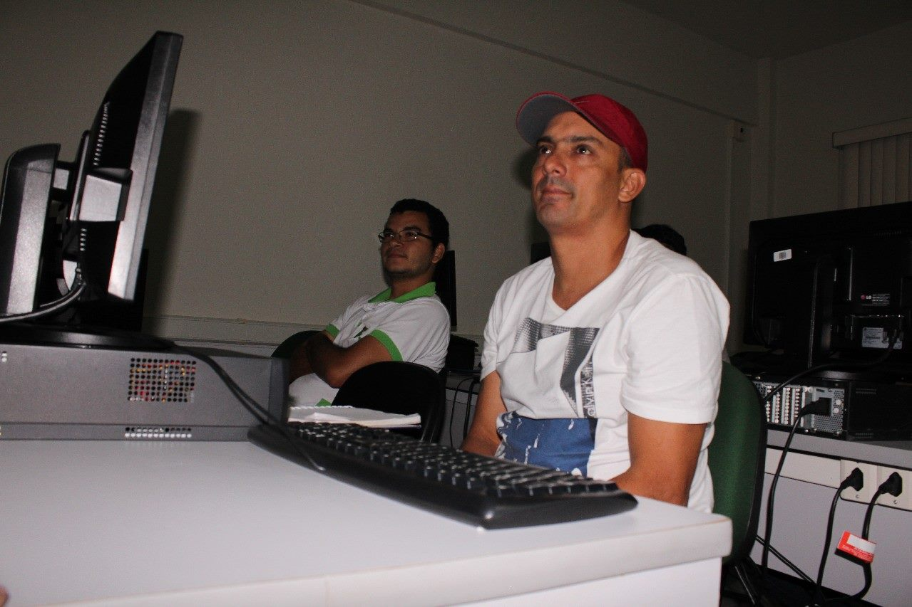
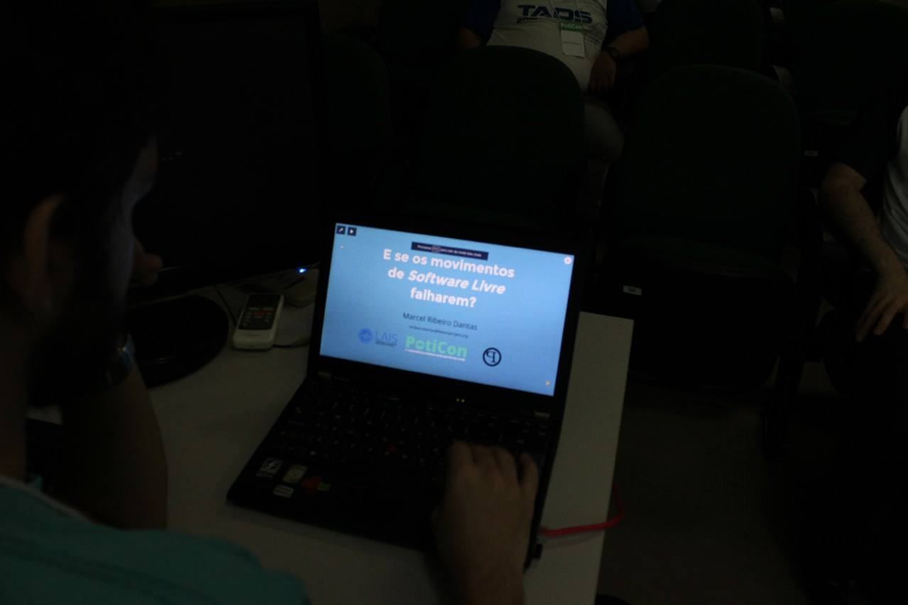
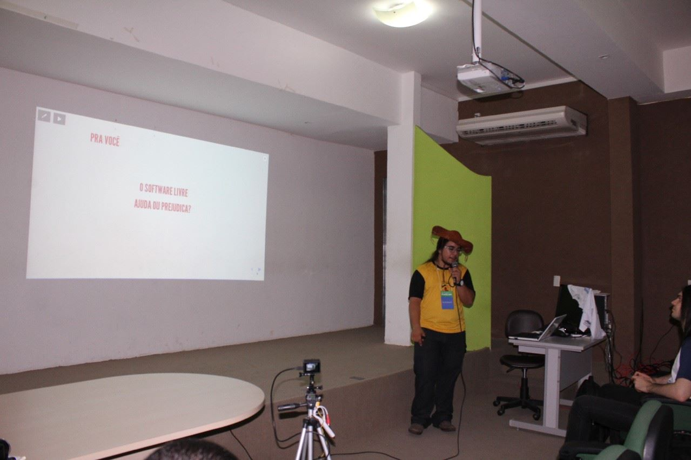
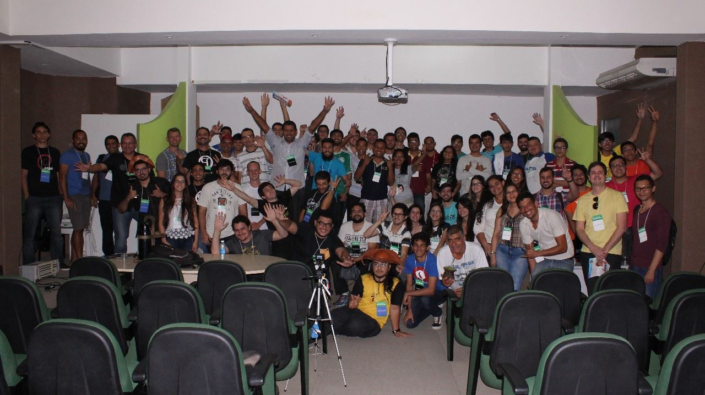
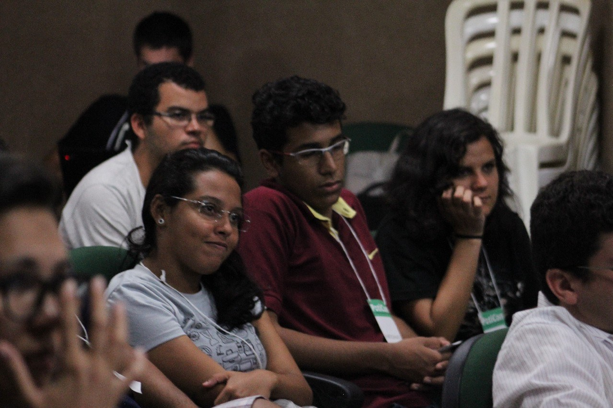
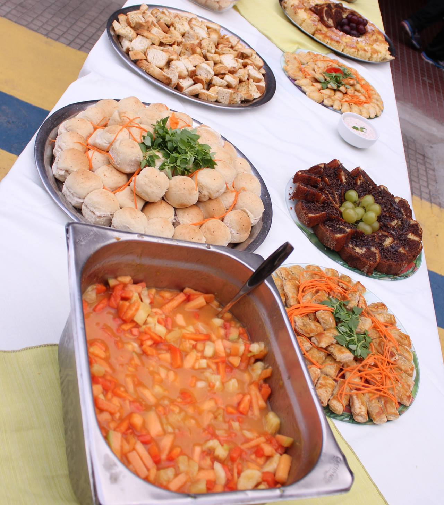
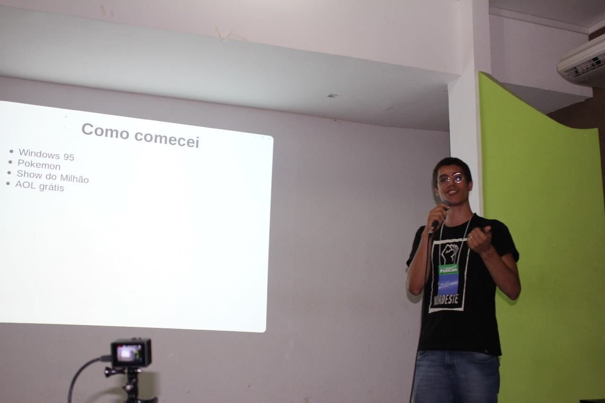

A PotiLivre, comunidade de usuários de Software Livre do Rio Grande do Norte, esteve a frente da organização da 1ª Conferência Potiguar de Software Livre (PotiCon), em Natal (RN). O evento aconteceu nos dias 18 e 19 de novembro de 2016 nas instalações do IFRN Campus Natal Central. Na noite da sexta-feira, 18, aconteceram os minicursos nos Laboratórios da DIATINF e durante o sábado, 19, as palestras foram apresentadas no miniauditório da DIAC.

O evento teve início às 18:00h de sexta-feira, 18, com os seguintes minicursos:

- [Processamento de Imagens Digitais](http://github.com/mribeirodantas/curso_pdi) por [Marcel Ribeiro Dantas](https://www.facebook.com/mribeirodantas) (Natal/RN);
- [Arduíno com Projetos Práticos](http://www.slideshare.net/potilivre/minicurso-arduino-com-projetos-praticos-jotacisio-oliveira) por [Jotacisio Araújo Oliveira](https://www.facebook.com/jotacisio.araujo) (Natal/RN);
- [Slackware - "O meu eu quero de flocos…"](http://www.slideshare.net/potilivre/minicurso-slackware-alexsandro-henrique) por [Alexsandro Henrique](https://www.facebook.com/profile.php?id=553263111) (Recife/PE) e
- [Softwares Educativos Livres](http://bit.ly/poticon_sel) por [Dennys Leite Maia](https://www.facebook.com/dennysleite) (Natal/RN)

Na grade do evento houveram 12 palestras no sábado, 19, que prenderam a atenção dos quase 80 presentes:

- [E se os Movimentos de Software Livre falharem?](http://slides.com/marcelribeirodantas/e-se-os-movimentos-de-software-livre-falharem/fullscreen#/) por [Marcel Ribeiro Dantas](https://www.facebook.com/mribeirodantas) (Natal/RN);
- Mantendo e Contribuindo com Um Projeto Open Source por [Victor Torres](https://www.facebook.com/victorpaivatorres) (Natal/RN);
- Software Livre por O que nunca te disseram! por [Luan Fonseca de Farias](https://www.facebook.com/luanfonceca) (Natal/RN);
- [Software Livre: Herói ou Ameaça?](http://slides.com/alessandrofeitoza/software-livre-heroi-ou-ameaca#/) por [Alessandro Feitoza](https://www.facebook.com/Alessandro.Feitoza) (Fortaleza/CE);
- [Hackeando sua mente - Software Livre da Philosofia a Prática](https://www.facebook.com/photo.php?fbid=493701764124458&set=a.443358722492096.1073741831.100004539153443&type=3&theater) por [Hagadir Cabral](https://www.facebook.com/JoseHagadirMennaCabral) (Cabedelo/PB);
- [Artífices do Ciberespaço: Quando a Ideia dialoga com a Prática Concreta](http://www.slideshare.net/potilivre/artfices-do-ciberespaco-quando-a-ideia-dialoga-com-a-pratica-concreta-ana-eliza-trajano) por [Ana Eliza Trajano](https://www.facebook.com/anaeliza.trajano) (Natal/RN);
- [Nodebots: Robôs com Javascript](https://marinalimeira.github.io/talk-nodebots/#/) por [Marina Limeira](https://www.facebook.com/marinalimeir4) (Maceió/AL);
- [Introdução a Data Science / Machine Learning com Python](https://github.com/gileno/poticon) por [Gileno Alves Santa Cruz Filho](https://www.facebook.com/gilenofilho) (Recife/PE);
- [Uma Contrarrevolução para exterminar a Filosofia do Software Livre](http://www.anahuac.eu/contrarrevolucao-osi/) por [Anahuac Gil](https://twitter.com/anahuacpg) (João Pessoa/PB);
- [Ei Macho, Já Conhece o Inkscape? Não? Pois se achegue aqui](http://www.slideshare.net/potilivre/ei-macho-ja-conhece-o-inkscape-nao-pois-se-achegue-aqui-yan-vancelis) por [Yan Vancelis](https://www.facebook.com/vancelis) (Russas/CE);
- [Diário de um Sobrevivente Livre](http://www.slideshare.net/potilivre/diario-de-um-sobrevivente-livre-abdala-cerqueira) por [Abdala Cerqueira](https://twitter.com/abdalac) (João Pessoa/PB) e
- [Docker: ao vivo e a cores!](http://www.slideshare.net/pedrarthur/docker-ao-vivo-e-a-cores) por [Pedro Arthur Duarte](https://www.facebook.com/pedrarthur) (Porto Alegre/RS)

Durante o evento a organização divulgou ao público presente que poderia utilizar duas hashtags: \#PotiCon e \#PotiLivre. E dentre diversos compartilhamentos, um chamou bastante a atenção:

Podemos dizer que o evento foi finalizado com sucesso! Um evento da comunidade para a comunidade de Software Livre que renderá novos e bons frutos e que estará de braços abertos para mudanças! Sem vocês (público, palestrantes, patrocinadores e organização) esse evento não aconteceria! A organização do evento agradece aos patrocinadores do evento: Hybrid Data Center, NetConsult, Kumon Nova Parnamirim, Brodycast, Evolux, GDG Natal, IFRN Natal Central, 168 Horas e SpeakerFight e vamos de GNU heim! \#SoftwareLivre \#PotiLivre \#PotiCon \#GNU

Fique por dentro do que aconteceu nos dois dias da PotiCon no vídeo produzido por [Moisés Abraão](https://www.facebook.com/moises.abraao.9).:

# Ocorreu um erro.

Não é possível executar o JavaScript.

## Fotos

*Amostra de 8 fotos das 130 registradas neste evento.*

