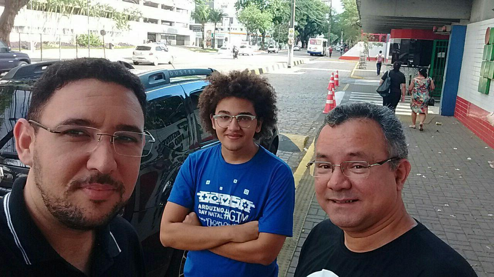
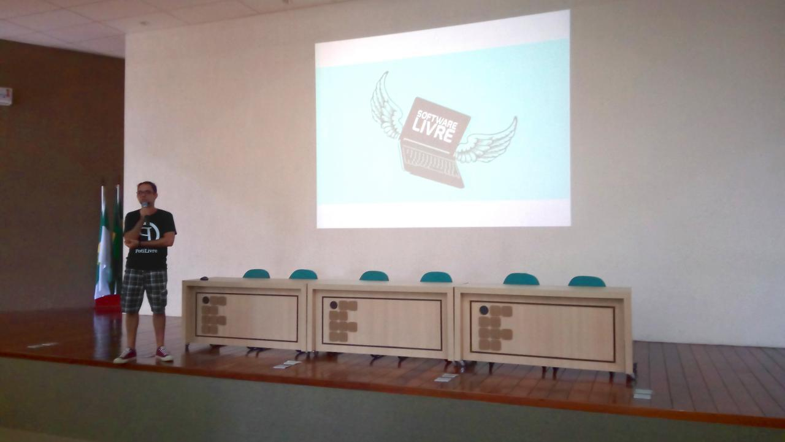
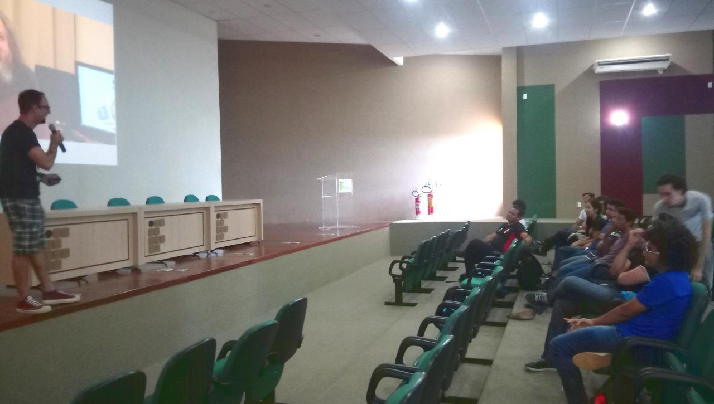
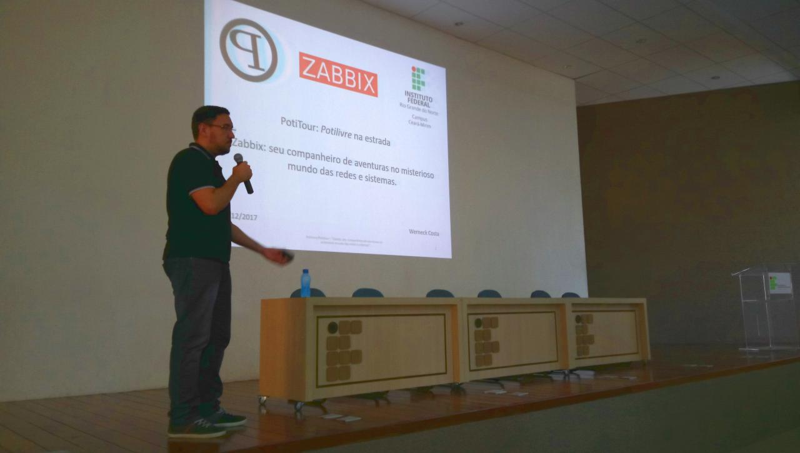
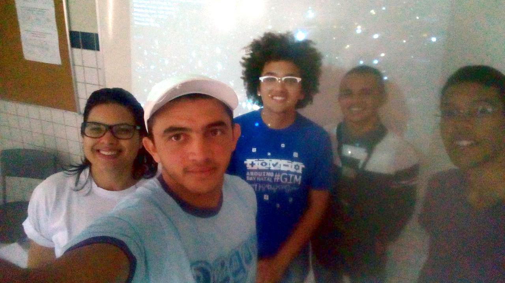
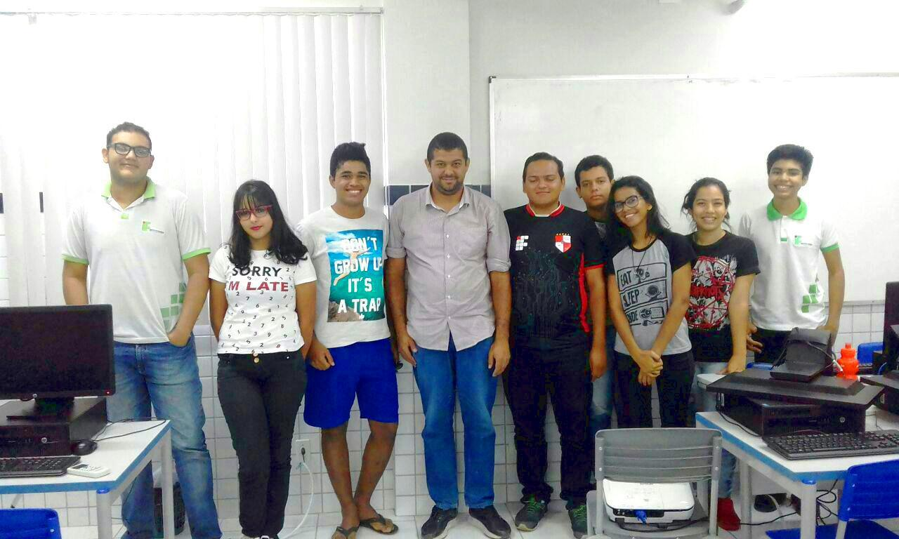
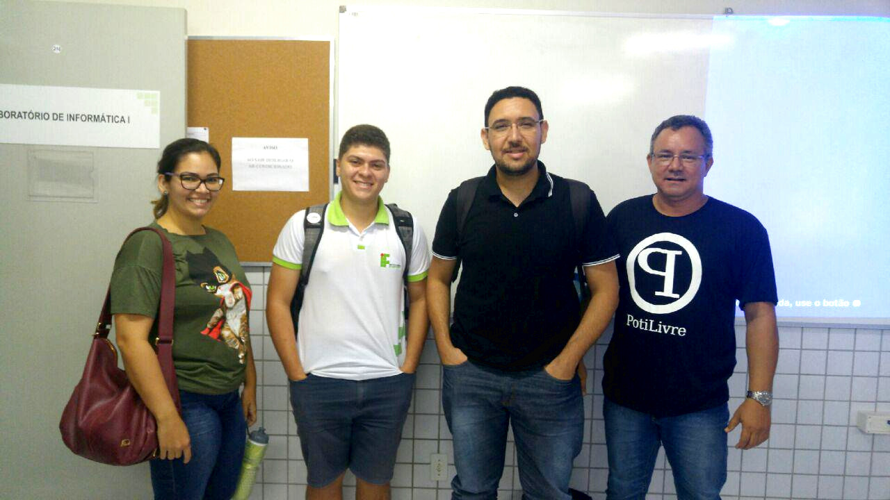
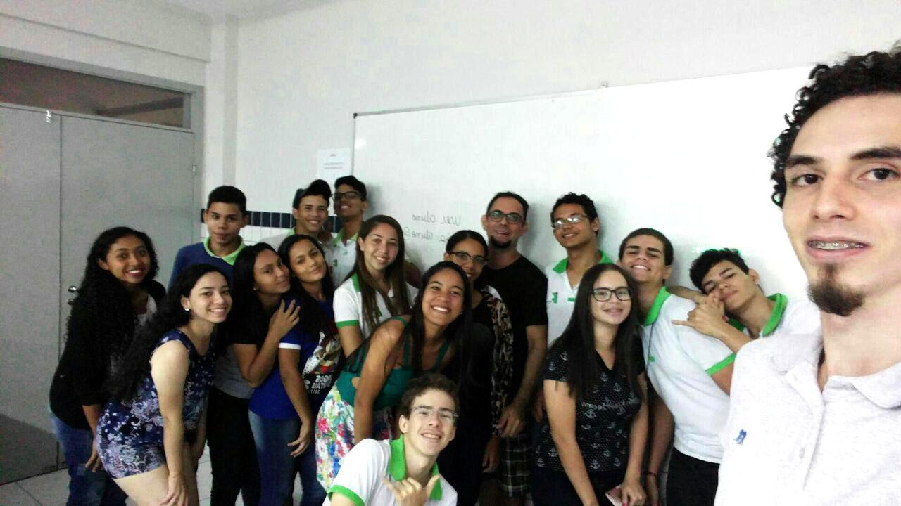

Foi realizada, no dia 02 de dezembro de 2017, pela PotiLivre, Comunidade Potiguar de Software Livre, a PotiTour no IFRN Campus Ceará-Mirim. PotiTour é um evento especial onde voluntários da PotiLivre compartilham seus conhecimentos através de palestras e minicursos em instituições de ensino que possuem cursos de Tecnologia da Informação, possibilitando que alunos da instituição e o público interessado por tecnologia fiquem por dentro das novidades sobre os assuntos que envolvam a filosofia do software livre. Neste evento aconteceram as seguintes atividades:

Palestras:

- [Conhecendo o que é software livre e como fazer parte da Comunidade PotiLivre!](https://pt.slideshare.net/potilivre/afinal-de-contas-o-que-e-software-livre-allythy-rennan-medeiros-de-souza-sfd2017) por Pedro Baesse e
- [Zabbix: seu companheiro de aventuras no misterioso mundo das redes e sistemas](http://www.slideshare.net/WerneckCosta/zabbix-seu-companheiro-de-aventuras-no-misterioso-mundo-das-redes-e-sistemas-potilivrepotitour-2017-ifrn-cearmirim?from_m_app=android) por Werneck Costa.

Minicursos:

- Stellarium - Explore o universo inteiro pelo computador por Gelly Viana Mota e Luís Eduardo Anunciado Silva;
- Programando seu primeiro sistema web em PHP por Mário Araújo Xavier;
- Coloque seu site no ar em minutos com o Joomla por José Roberto Ferreira e
- Aprenda Python e linha de comando de maneira simples e prática por Rodrigo Castro.

Confira abaixo as fotos da 1ª PotiTour em Ceará-Mirim:

## Fotos

*Amostra de 8 fotos das 10 registradas neste evento.*

