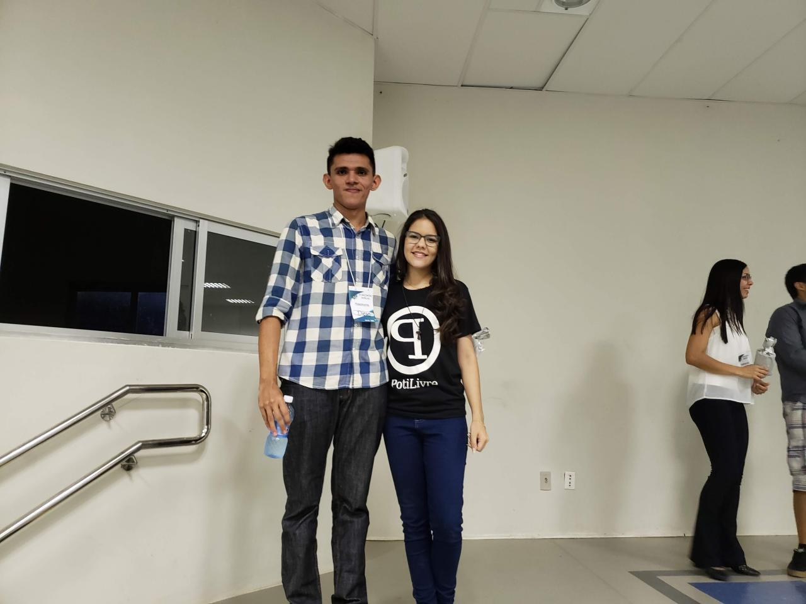
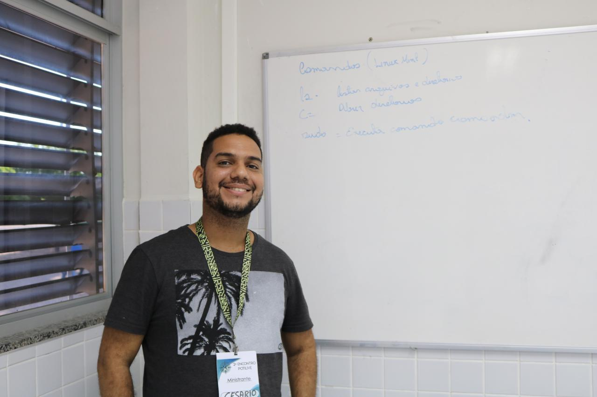
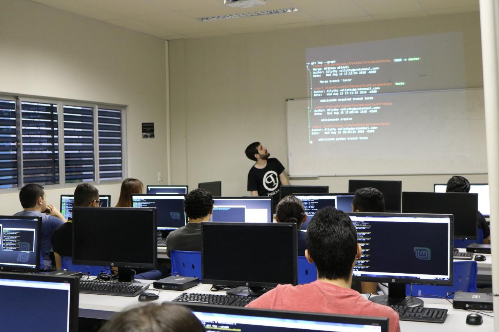
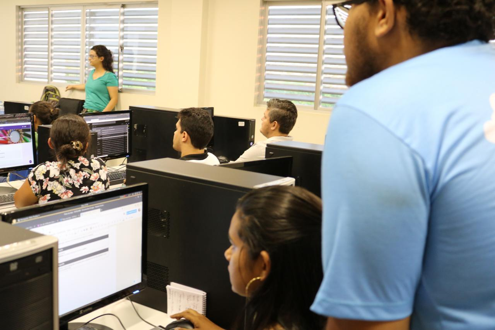
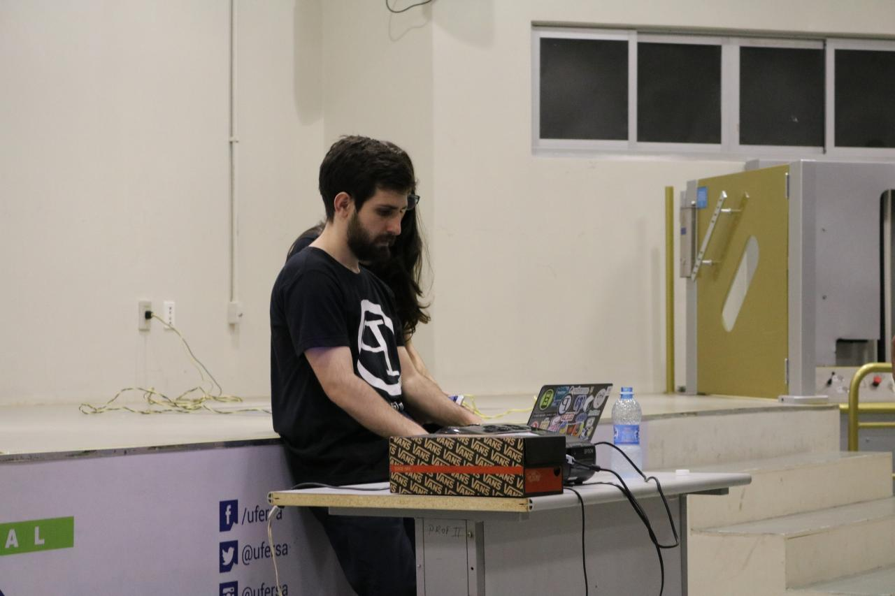
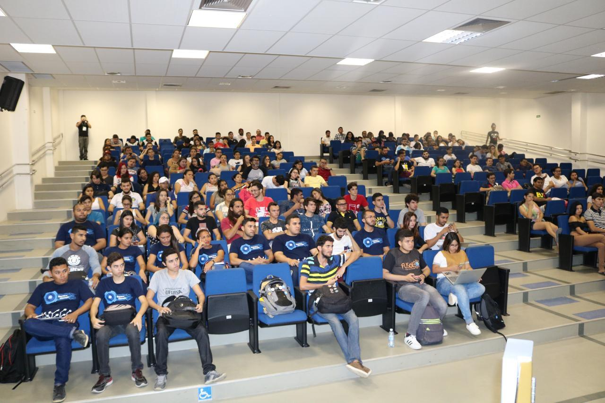
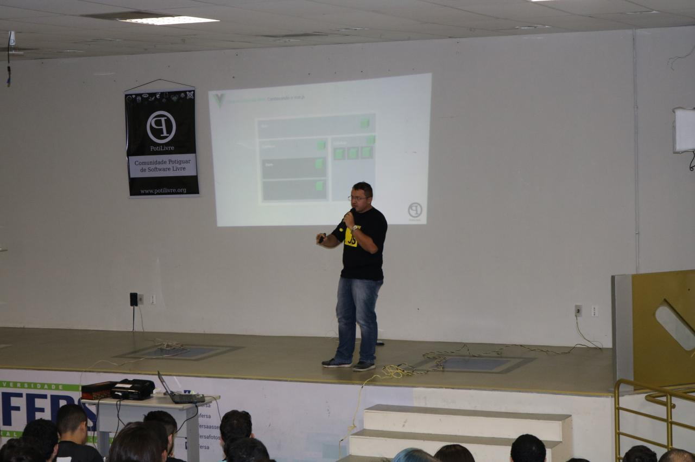
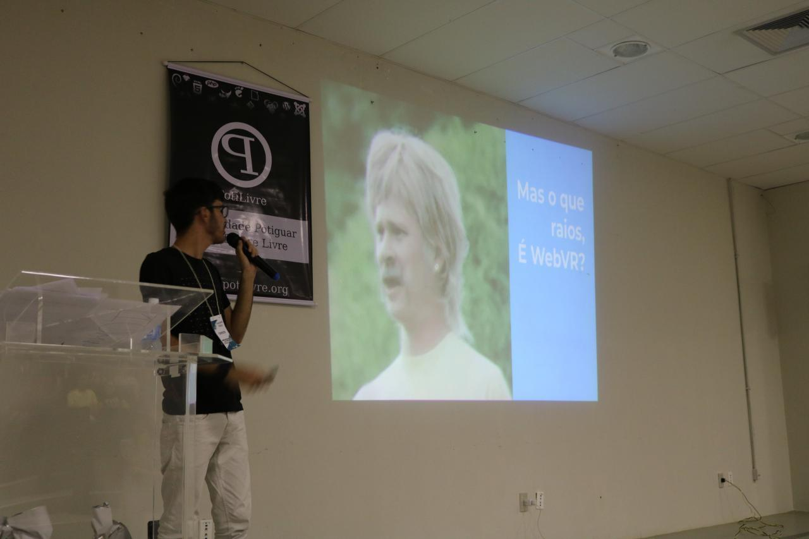

A PotiLivre, Comunidade Potiguar de Software Livre, no dia 15 agosto de 2018, realizou na cidade de Angicos-RN, a segunda edição do Encontro PotiLivre. O evento aconteceu nas instalações da UFERSA, Universidade Federal Rural do Semi-Árido e apresentou, gratuitamente, palestras, oficinas e minicursos com temas voltados à filosofia do software livre. O encontro foi organizado por membros da coordenação da PotiLivre, juntamente com alunos da UFERSA e a Prof.ª Ma. Luana Dantas Chagas (UFERSA).

\
Além do público da cidade Angicos, o evento teve a participação de caravana de alunos da UFERSA da cidade de Caraúbas-RN. A coordenação ficou bastante feliz com o sucesso do evento e informa que a comunidade está disponível para a realização de outros eventos em qualquer cidade que tenha interesse aprender e dividir experiências sobre software livre.

\
No 2º Encontro PotiLivre aconteceram as seguintes atividades:

**Palestras**:

- O que é Software Livre e a comunidade PotiLivre - Allythy Rennan.
- WebVR com A-Frame - Jefferson Moura.
- Desenvolvimento web, conhecendo o Vue.Js - Mathues Ricelly.
- Raspberry Pi + Software Livre: Solução acessível, versátil e compacta - Juan Diego

**Minicursos**:

- Introdução ao Git e GitHub - Allythy Rennan.
- Why-Fi? Vulnerabilidades em redes Wireless - Allan Kardec, Anderson Cirilo.
- Vim, mais que um editor - Tallys Cesar.
- O uso de softwares livres na educação - Erick Mateus, Ana Raquel .

**Oficinas**:

- Robótica Livre - Prof.Doutor Samuel Oliveira
- Instalação do Sistema Operacional GNU/Linux - Cesario Pereira

A coordenação do evento agradece a todos que colaboraram para a realização deste encontro: UFERSA pela cessão dos auditórios e laboratórios para as palestras e minicursos; Hybrid com a hospedagem do site do evento; R2Web, Assistência Familiar Elohim e Rede Ideal supermercados pelo patrocínio; aos palestrantes que se dispuseram a dividir seus conhecimentos; aos voluntários que ajudaram na organização do evento; e, claro, a todo o público que prestigiou o 2º Encontro PotiLivre. Fazemo um agradecimento especial aos palestrantes de Pau dos Ferros-RN e a caravana de Caraúbas que, mesmo com a distância entre as cidades, conseguiram estar presentes.

## Fotos

*Amostra de 8 fotos das 93 registradas neste evento.*

