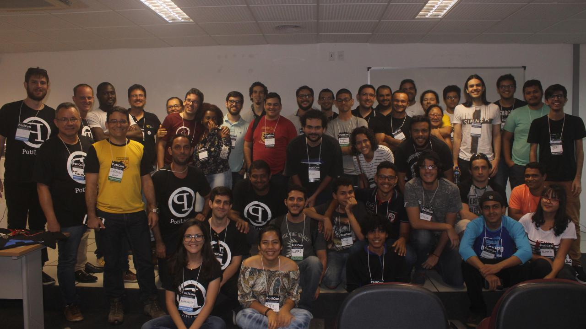
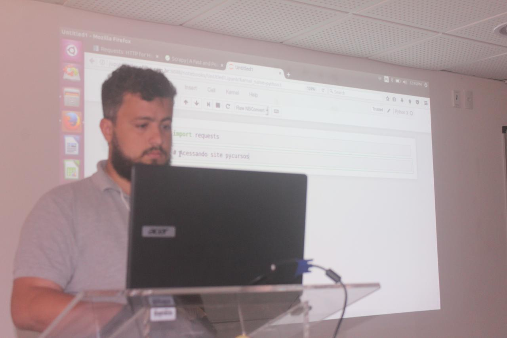
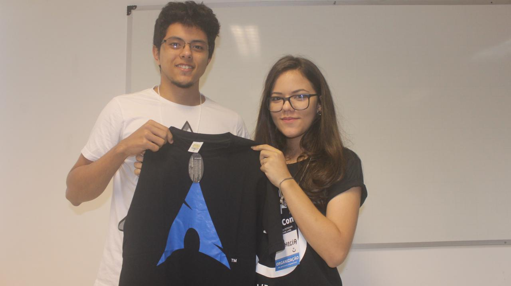
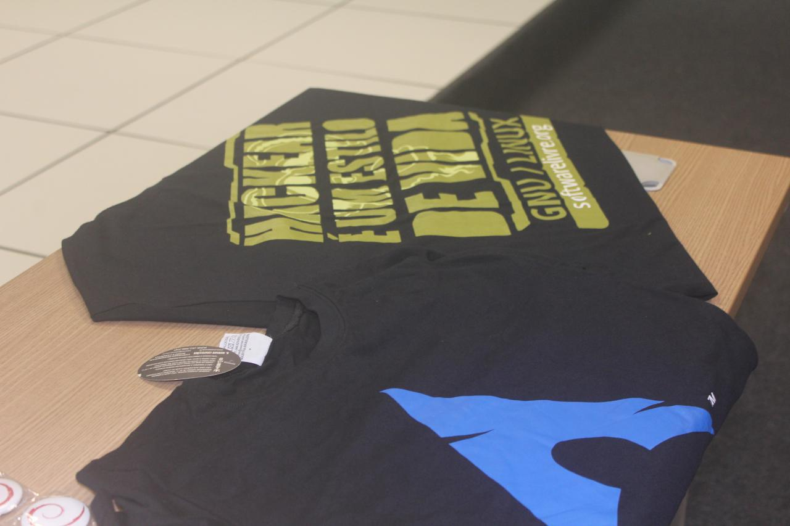
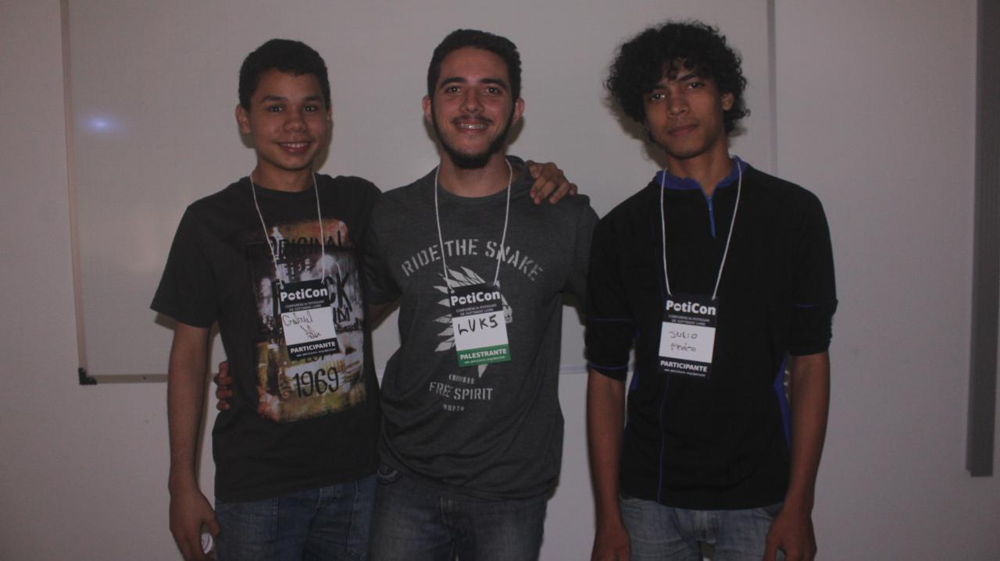
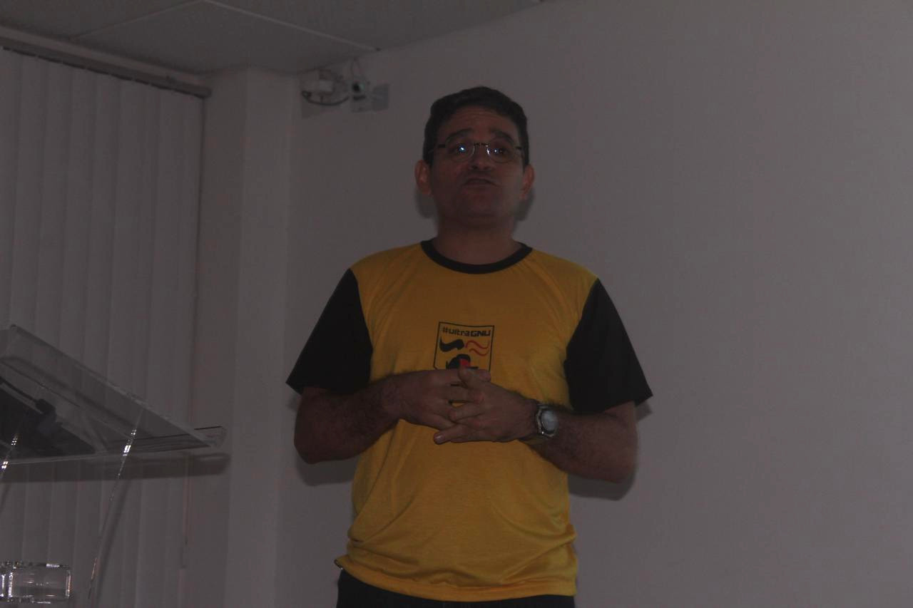
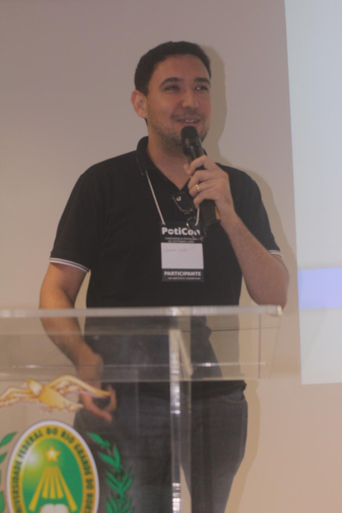
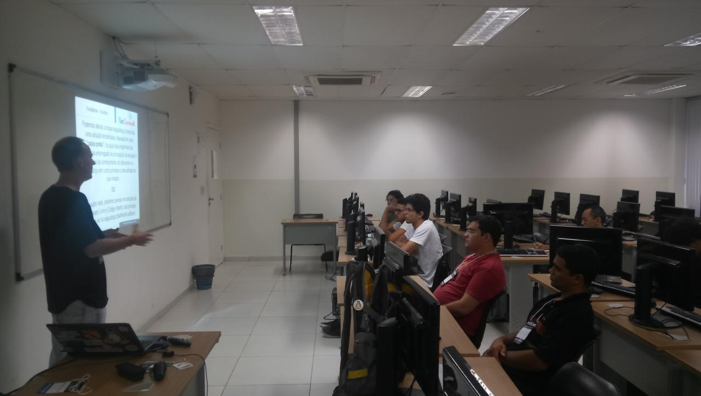

De 4 a 5 de novembro de 2017, a Comunidade Potiguar de Software Livre (PotiLivre) organizou a 2ª Conferência Potiguar de Software Livre (PotiCon) nas instalações do Instituto Metrópole Digital (IMD). A PotiCon objetiva ampliar os conhecimentos sobre as ferramentas livres de desenvolvimento e fomentar a troca de experiências e impressões sobre os projetos inovadores que utilizam software livre. Com uma proposta cada vez mais abrangente, a PotiCon destaca-se por reunir um amplo conteúdo de informações, ideal para que estudantes, professores e especialistas compartilhem os seus conhecimentos no mesmo ambiente. E foi justamente isto que aconteceu durante os dois dias do evento. No sábado, durante a manhã e a tarde, aconteceram a apresentação das seguintes palestras:

- [Código limpo: usando funções e módulos em Python](https://pt.slideshare.net/potilivre/codigo-limpo-usando-funcoes-e-modulos-em-python-luan-c-redmann) por Luan C. Redmann;
- [Como desenvolver um site para eventos com CMS Joomla!](https://pt.slideshare.net/potilivre/como-desenvolver-um-site-para-eventos-com-joomla-jose-roberto-da-costa-ferreira) por José Roberto da Costa Ferreira;
- [Criando Web Crawlers com Scrapy e Selenium para páginas com Javascript](https://github.com/gileno/pybr2017) por Gileno Alves Santa Cruz Filho;
- [HowTo: Migração para Software Livre sem mistérios](https://pt.slideshare.net/potilivre/migracao-para-software-livre-sem-misterios-matheus-oliveira) por Matheus Cavalcante de Oliveira;
- [Python, Django e a Inovação em Saúde: Caso de sucesso no Laboratório de Inovação Tecnológica em Saúde (LAIS/UFRN)](https://www.slideshare.net/allysonbarros/palestra-poticon-2017) por Allyson Bruno Campos Barros;
- Live [Teste de Software: desafios e oportunidades no mundo da virtualização, dos containers e do desenvolvimento mobile](https://pt.slideshare.net/potilivre/teste-de-software-desafios-e-oportunidades-no-mundo-da-virtualizacao-dos-containers-e-do-desenvolvimento-mobile-amador-pahim) por Amador Pahim;
- [Pedagogia da gambiarra: o IFRN e as possibilidades de hackear o sistema escolar](https://pt.slideshare.net/potilivre/pedagogia-da-gambiarra-o-ifrn-e-as-possibilidades-de-hackear-o-sistema-escolar-ana-eliza-trajano-soares) por Ana Eliza Trajano Soares;
- [Projeto de Garra Mecânica com Servo Motor Arduino](https://pt.slideshare.net/potilivre/projeto-garra-mecanica-com-servo-motor-e-arduino-marcos-oliveira) por Marcos Oliveira;
- [P3NTE5T W1TH ARM1T4GE](https://pt.slideshare.net/potilivre/p3nte5t-w1th-arm1t4ge-lucas-oliveira-dantas) por Lucas Oliveira Dantas;
- [Construa seu currículo com certificação Linux](https://pt.slideshare.net/potilivre/qual-sera-seu-trabalho-cesar-brod) por Cesar Brod;
- [Não use Linux](https://pt.slideshare.net/potilivre/nao-use-linux-anahuac-de-paula-gil-81734543) por Anahuac de Paula Gil e
- [Redes-em-Chip Uma Nova Arquitetura de Comunicação](https://pt.slideshare.net/potilivre/redes-emchip-uma-nova-arquitetura-de-comunicacao-samuel-da-silva-oliveira) por Samuel da Silva Oliveira

Na manhã do domingo, 05, aconteceram os seguintes minicursos:

- Jornada nas Estrelas com Software Livre: Explorando o Stellarium por Luís Eduardo Anunciado Silva, Gelly Viana Mota;
- Segurança de Redes com Software Livre por Maicon Wendhausen;
- Linha de comando do Sistema GNU ao Python por Ana Clara Nobre e Allythy Rennan;
- PHP para iniciantes por Mário Araújo Xavier e
- Desenvolvimento de Sites com CMS Joomla! por José Roberto da Costa Ferreira

No domingo pela tarde aconteceu a aplicação das provas de Certificações LPIC-1 e LPIC-2 no Hotel Maine.

## Fotos

*Amostra de 8 fotos das 110 registradas neste evento.*

