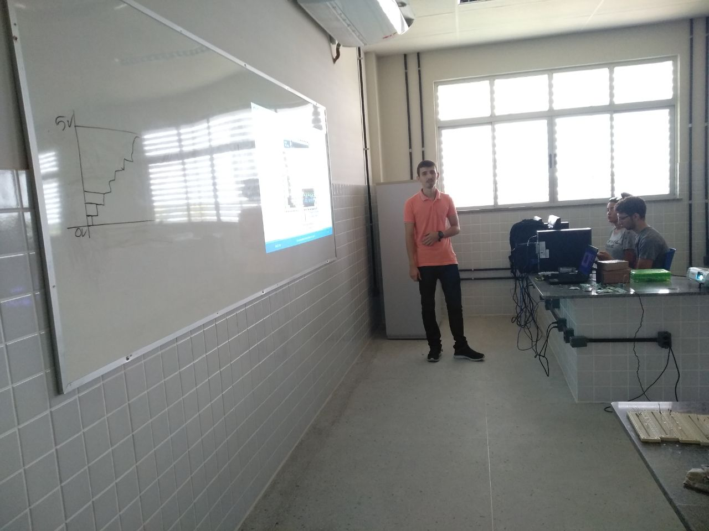
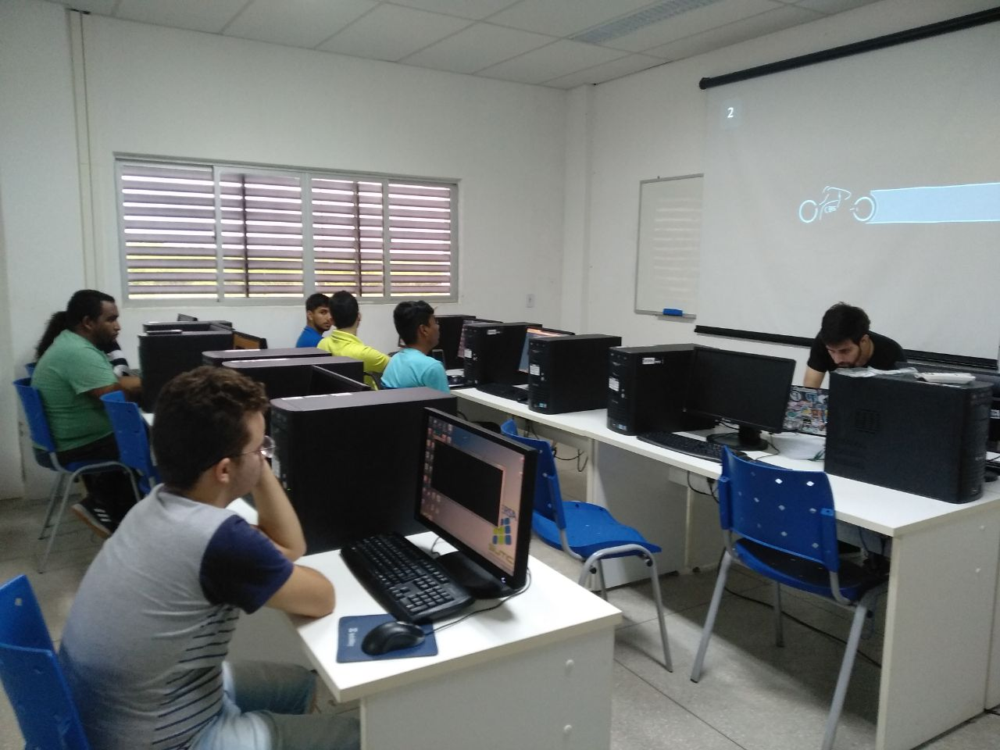
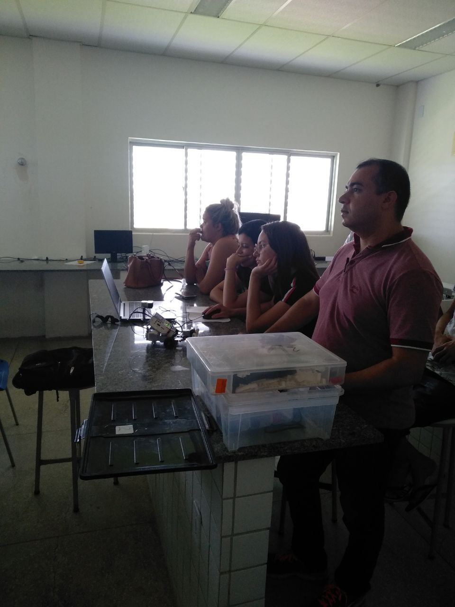
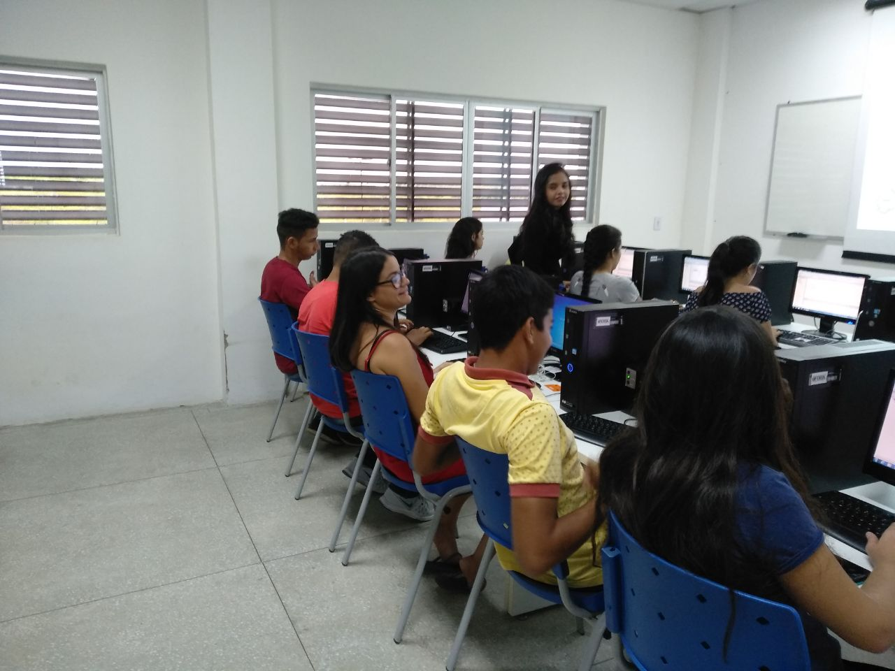
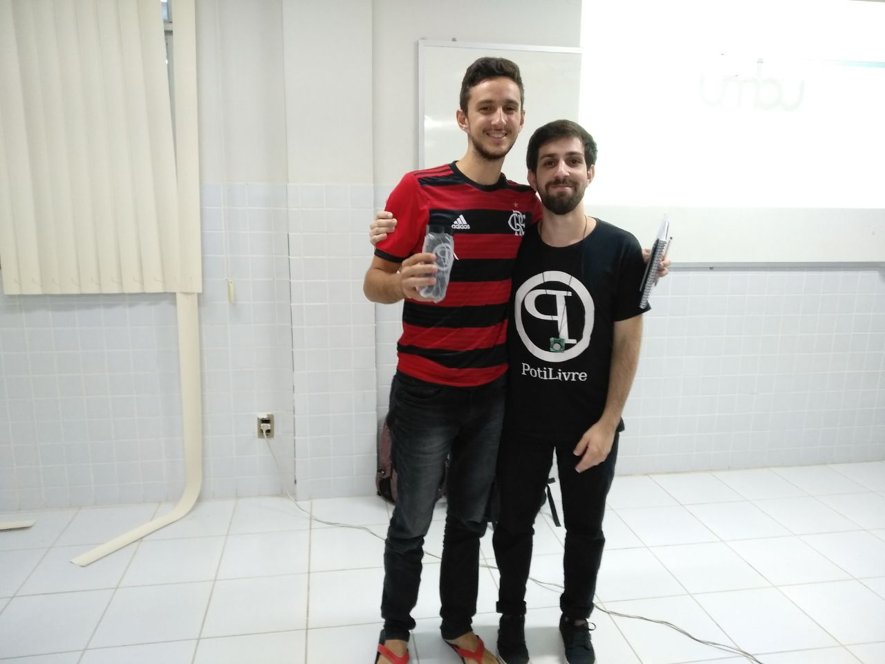
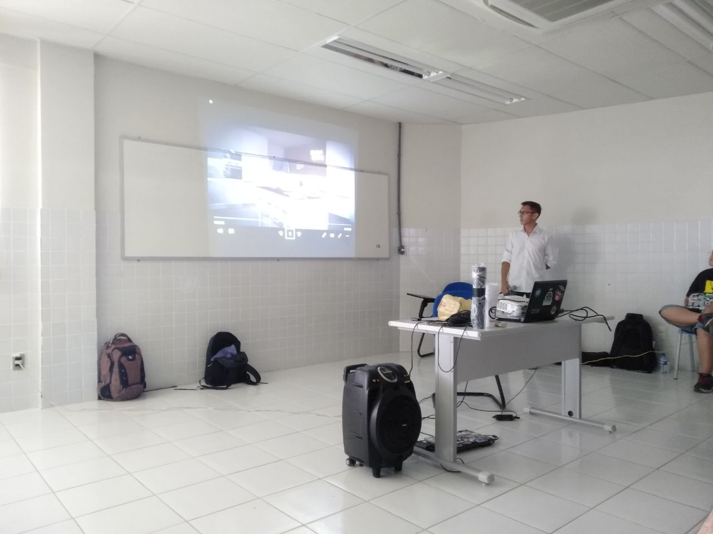
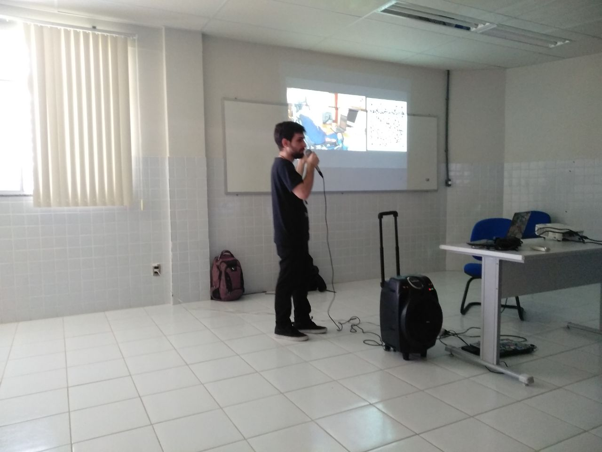
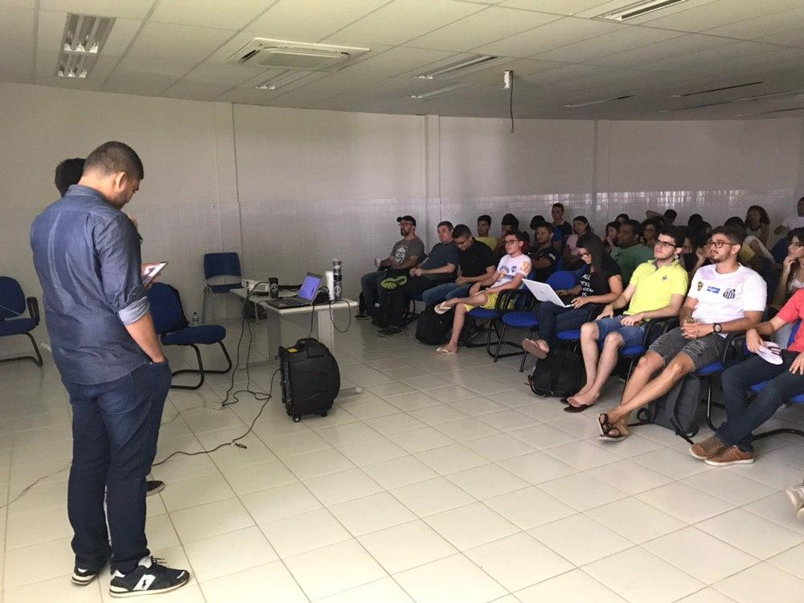

A PotiLivre, Comunidade Potiguar de Software Livre, no dia 15 março de 2019, realizou na cidade de Caraúbas -RN, a terceira edição do Encontro PotiLivre. O evento aconteceu nas instalações da UFERSA, Universidade Federal Rural do Semi-Árido e apresentou, gratuitamente, palestras  e minicursos com temas voltados à filosofia do software livre. O encontro foi organizado por membros da coordenação da PotiLivre, juntamente com alunos da UFERSA e os Profs. Sérgio Lins e Francisco Brito Filho (UFERSA).

Além do público da cidade Caraúbas, o evento teve a participação de caravana de alunos das cidades de Mossoró, Apodi, Pau dos ferros e Angicos. A coordenação ficou bastante feliz com o sucesso do evento e informa que a comunidade está disponível para a realização de outros eventos em qualquer cidade que tenha interesse aprender e dividir experiências sobre software livre.

\
No 3º Encontro PotiLivre aconteceram as seguintes atividades:

**Palestras**:

- O que é Software Livre e a comunidade PotiLivre - Allythy Rennan.
- Internet das Coisas - Nadison Silva.
- Segurança Digital para iniciantes - Allan Kardec & Anderson Cirilo.
- Acionando Próteses com Arduino - Gleidson Leite.
- O fantástico mundo das PWAs - Matheus Ricelly.
- Mesa Redonda: Makerspace em Caraúbas - Prof. Francisco Brito Filho, Jaimar Gomes, Allan Kardec, Allythy Renan e Karol Fernandes

**Minicursos**:

- Introdução ao Git e GitHub - Allythy Rennan.
- Introdução à Linguagem C - Leticia Ainoan.
- Hello World no Arduino - Giovanni Laurind.
- Robótica Educacional - Equipe RoboEdu UFERSA.

## Agradecimentos

A PotiLivre gostaria de agradecer a todos que colaboraram para a realização deste encontro: UFERSA, pela cessão dos auditórios e laboratórios para as palestras e minicursos; aos palestrantes que se dispuseram a dividir seus conhecimentos; aos voluntários que ajudaram na organização do evento; as caravanas: Mossoró, Apodi, Pau dos ferros e Angicos, que mesmo com a distância entre as cidades conseguiram estar presentes e, claro, a todo o público que prestigiou o 3º Encontro PotiLivre. Fazemos um agradecimento em especial ao Prof. Sérgio Lins, Prof. Francisco Brito Filho e Kardec por ter levado o evento para a cidade de Caraúbas e todo o apoio que deram para organização.

## Fotos

*Amostra de 8 fotos das 71 registradas neste evento.*

