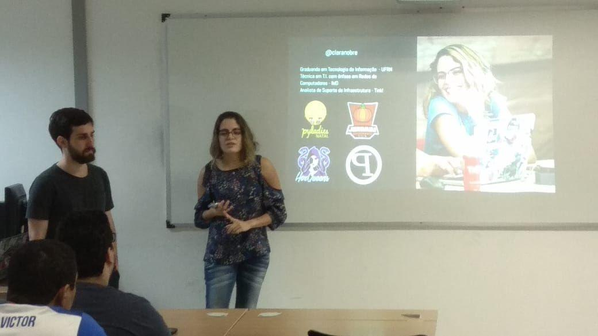
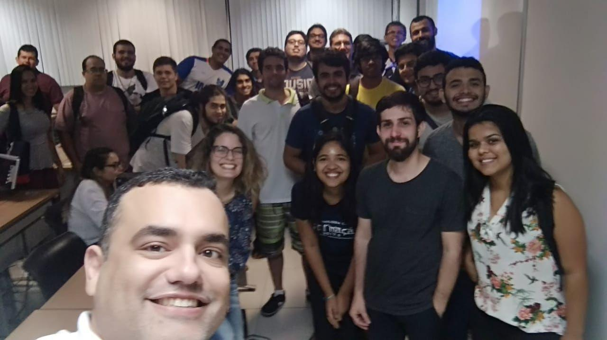
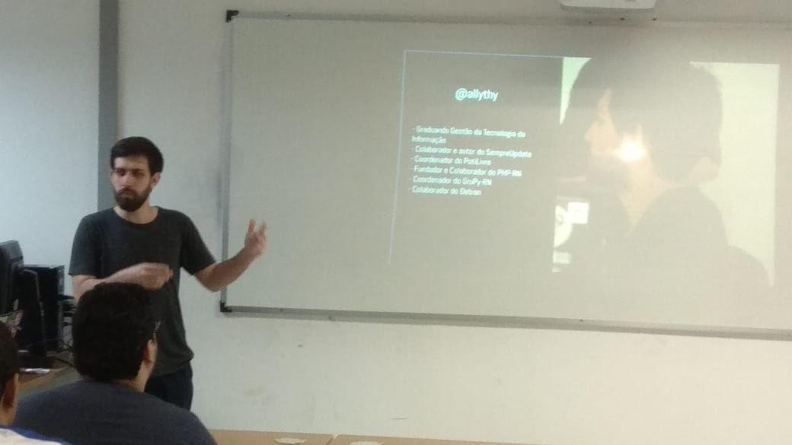
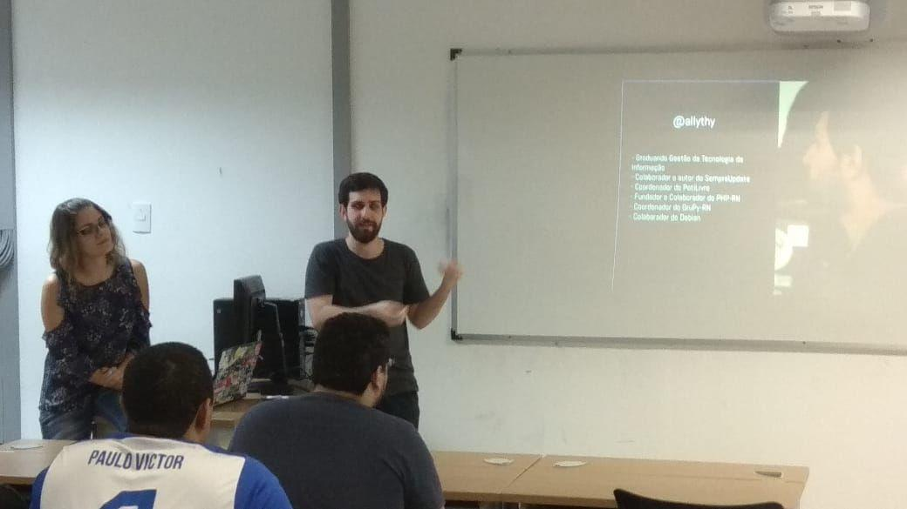

No dia 13 de Agosto a Comunidade PotiLivre foi convidada a participar da disciplina “Software Livre, Educação e Cultura”, no Instituto Metrópole Digital (IMD), que é ministrada pelo Prof. Dr. Dennys Leite Maia, com o objetivo de apresentar a Comunidade e a filosofia do Software Livre aos alunos. Uma disciplina muito importante, tendo em vista que algumas universidades negligênciam o tema, ficamos muito felizes com o convite do professor Dennys que cedeu o horário da sua disciplina para nós.

## Fotos

