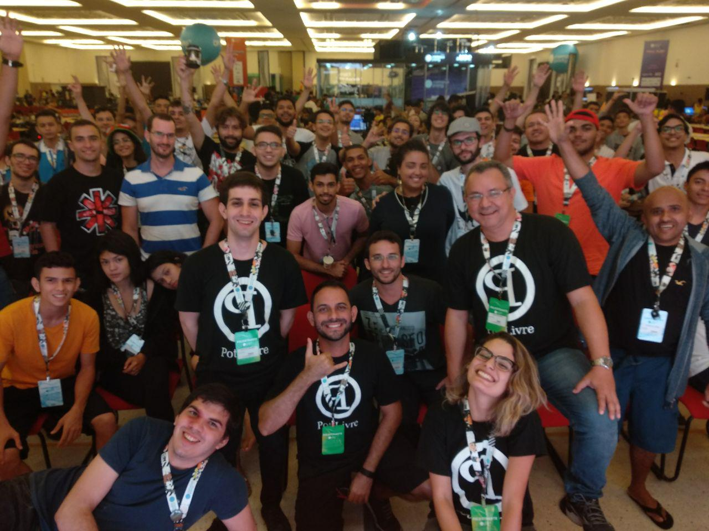
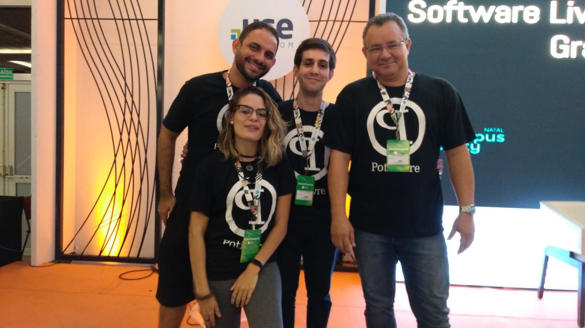
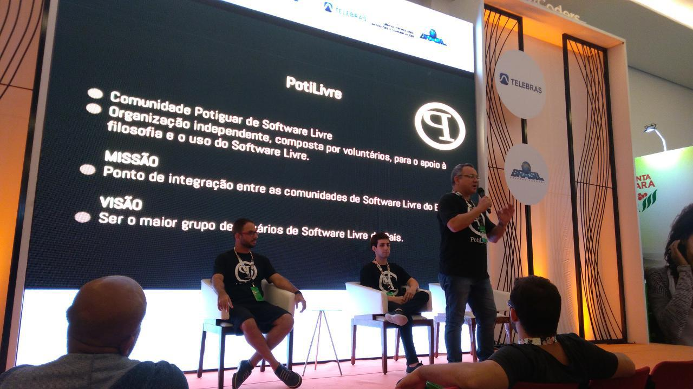
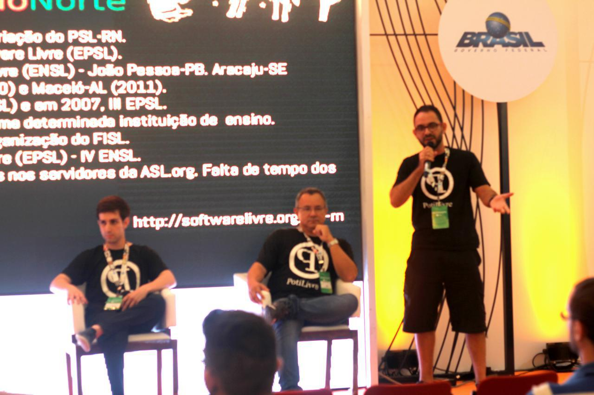
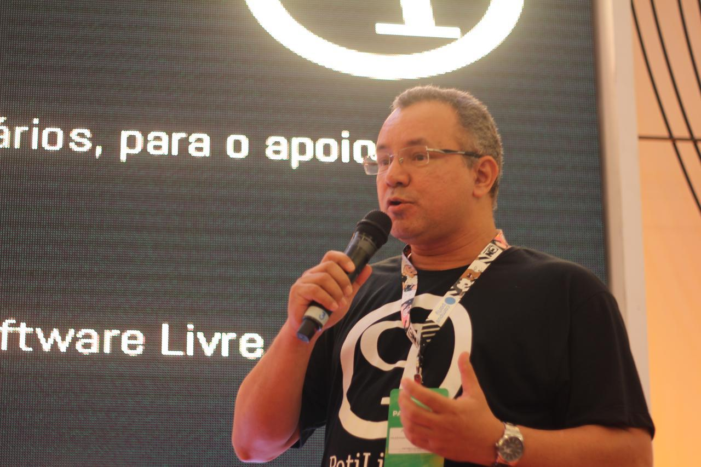
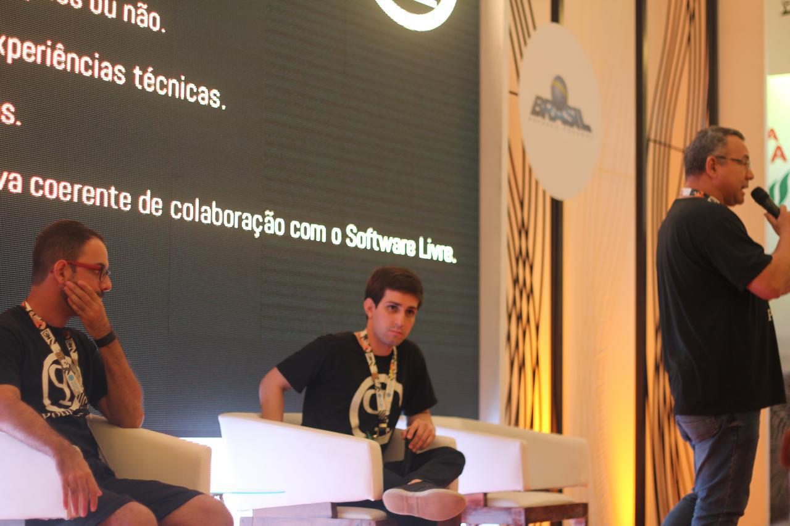
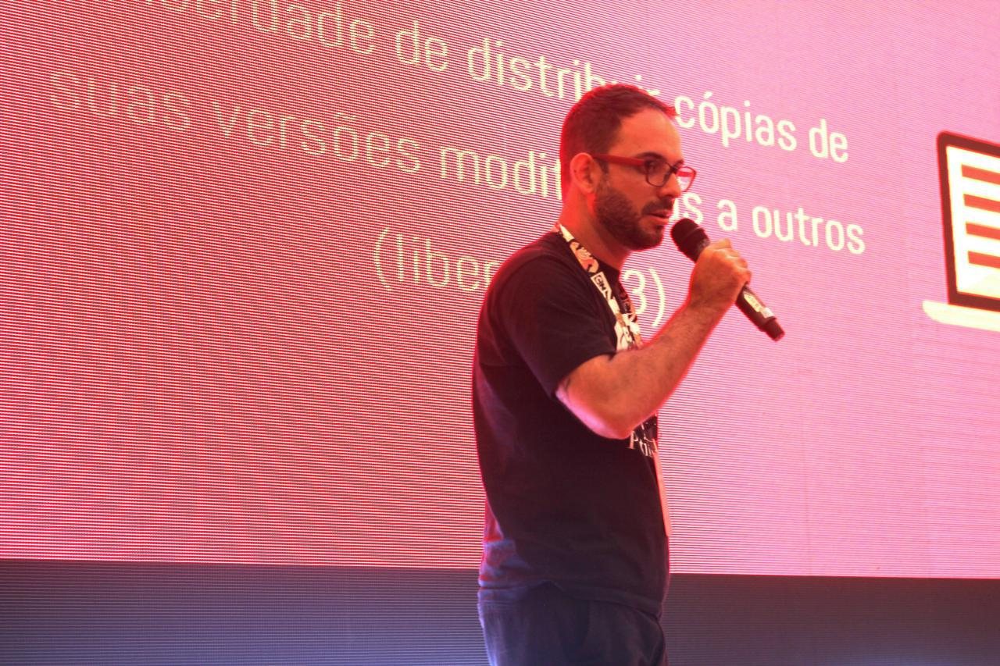
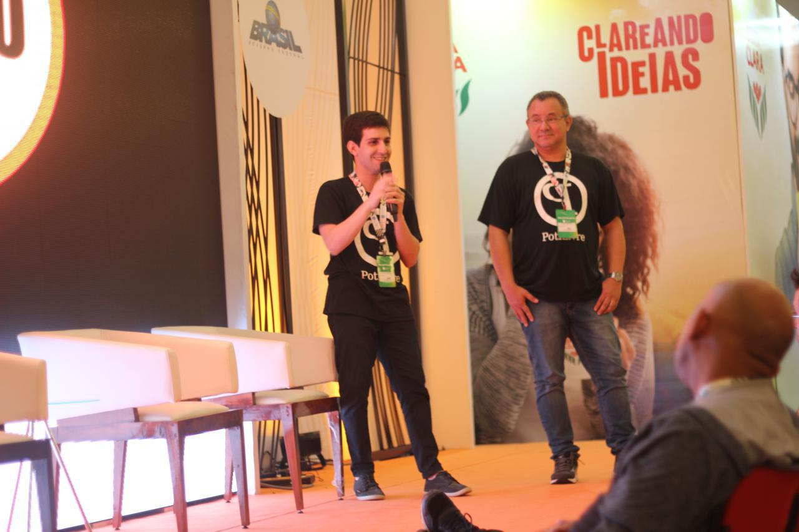

A Comunidade Potiguar de Software Livre participou da 1ª edição da Campus Party Natal no Centro de Convenções de Natal (RN). Para os membros da coordenação da PotiLivre com certeza foi uma experiência incrível ter participado de um dos maiores eventos de tecnologia e inovação do mundo. Ana Clara Nobre, Allythy Renan, Pedro Baesse e José Roberto apresentaram no dia 13 de abril de 2018 a palestra "[O desafio de levar a filosofia do Software Livre para o interior do Rio Grande do Norte](https://www.slideshare.net/potilivre/o-desafio-de-levar-a-filosofia-do-software-livre-para-o-rio-grande-do-norte)".

Pedro Baesse iniciou a palestra falando primeiro sobre a PSL-RN (Projeto Software Rio Grande do Norte) como os grandes precursores em levar a filosofia do software livre para o estado com diversos eventos entre 2005 e 2010 como os Encontros Potiguares de Software Livre (EPSL), Encontros Nordestinos de Software Livre (ENSL) e os Dias Livres.

José Roberto explanou o que é a PotiLivre, informando principalmente que é formada por voluntários, onde a comunidade tem como missão o ponto de integração entre as outras comunidades de software livre, além de ter visão bem interessante, ser o maior grupo de usuários de software livre do país.

Allythy Renan explanou os conceitos principais sobre software livre, como as quatro liberdades. Foram mostrados os diversos eventos realizados pela PotiLivre, como FLISOL, Software Freedom Day e PotiCon, além da participação da comunidade em outros eventos organizados por diversas instituições de ensino, inclusive no interior do Ceará em Russas.

Pedro Baesse ainda relatou que tomando como base a estrutura da Rede IFRN, a ideia é aproveitar esta estrutura para divulgar o software livre para estas cidades, lembrando que pode ser qualquer instituição de ensino de qualquer cidade potiguar que tiver o interesse sobre software livre, a PotiLivre está de portas abertas para conversar. 

Ana Clara Nobre citou as principais dificuldades que a PotiLivre encontra até hoje para o gerenciamento da comunidade, dentre delas, a falta de tempo dos voluntários e Pedro Baesse ainda reforçou: "Não existe falta de tempo, existe falta de prioridade". Ana Clara Nobre ainda relatou que existem muitas disputas sobre qual é o melhor sistema, mas para ela "Você deve usar o que lhe agrada mais, porém conheça outras ferramentas para poder argumentar o que é bom ou ruim nela, e o que for ruim, e você tiver a capacidade de arrumar, colabore, melhorando a ferramenta".

José Roberto listou os principais recursos oferecidos pela comunidade para quem precisa organizar um evento. No final os palestrantes agradeceram os participantes pela presença e pelo interesse em conhecer um pouco mais das atividades desenvolvidas pela PotiLivre.

Para quem não conseguiu acompanhar a palestra no dia, abaixo segue o vídeo:

IkOAsqV0rxY

## Fotos

*Amostra de 8 fotos das 37 registradas neste evento.*

