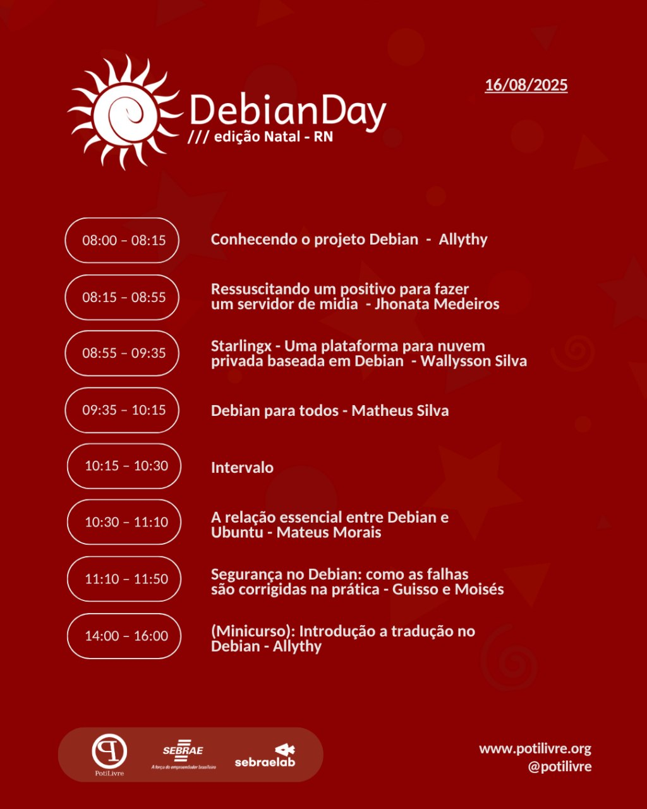

🎉 O **Debian Day Natal 2025** já tem data marcada! No dia **16 de agosto**, vamos comemorar juntos o aniversário do projeto Debian, uma das distribuições mais importantes do mundo do **Software Livre**, com um encontro cheio de conhecimento, colaboração e celebração.

O evento acontecerá no **SEBRAE**, e contará com **palestras e oficinas** para todas as pessoas interessadas em tecnologia, liberdade e comunidade.

**Lembrete importante! Para participar do  minicurso, é preciso levar o seu notebook ou fazer par com alguém que esteja com um notebook.**

---

## 🌀 O que é o Debian Day?

O **Debian Day** é um evento internacional que celebra a fundação do projeto Debian e o impacto que ele tem no ecossistema de Software Livre. Acontece todos os anos em diversas cidades do mundo, com o objetivo de:

- Apresentar o Debian a novos usuários
- Reunir a comunidade local
- Compartilhar experiências e aprendizados
- Incentivar contribuições ao projeto

Se você já usa Debian ou quer começar a explorar essa poderosa distribuição GNU/Linux, este evento é para você!

---

## 📅 Programação

    
    
&nbsp;

 [Abertura] - Conhecendo o projeto Debian

<ul>
<li>🧑‍💻 Palestrante: Allythy</li>
<li>📚 Sobre: Nesta sessão de abertura, vamos apresentar o Debian, um dos sistemas operacionais livres mais respeitados e influentes do mundo.</li>
</ul>

[Palestra] Ressuscitando um positivo para fazer um servidor de midia

<ul>
<li>🧑‍💻 Palestrante: Jhonata</li>
<li>📚 Sobre: "Nesta palestra, compartilho minha experiência ao transformar um modesto computador de R$300, adquirido na OLX, em um servidor de mídia funcional usando Debian. Vou abordar os desafios enfrentados, as escolhas técnicas feitas, o uso de ferramentas de código aberto, e como o Debian se mostrou uma base sólida e confiável para esse projeto caseiro — que virou um verdadeiro laboratório de aprendizado. Ideal para quem quer montar seu próprio servidor com poucos recursos e muito Debian no coração".
</li>
</ul>

[Palestra] Starlingx - Uma plataforma para nuvem privada baseada em Debian

<ul>
<li>🧑‍💻 Palestrante: Wallysson</li>
<li>📚 Sobre: Starlingx é uma plataforma de nuvem privada completa, baseada em Debian, escalável para centenas de máquinas locais e milhares em um ambiente distribuído. Nessa palestra você entenderá como o Starlingx funciona e como as clouds são construídas "por baixo dos panos".
</li>
</ul>

[Palestra] Debian para todos

<ul>
<li>🧑‍💻 Palestrante: Matheus Silva</li>
<li>📚 Sobre: Nesta palestra introdutória, você vai conhecer o que é o Debian, por que ele é uma das distribuições Linux mais influentes do mundo, e como utilizá-lo até mesmo no seu Windows com WSL. Uma jornada do open source ao seu terminal!
</li>
</ul>

[Palestra] A relação essencial entre Debian e Ubuntu

<ul>
<li>🧑‍💻 Palestrante: Mateus Morais</li>
<li>📚 Sobre: Você já se perguntou por que o Ubuntu e o Debian compartilham tantas semelhanças? Nesta apresentação, vamos além da superfície para explorar a fundação do Ubuntu. Abordaremos como o Ubuntu se baseia no trabalho do Debian, como os pacotes são adaptados e as razões por trás das diferenças que encontramos. O objetivo é desmistificar essa relação e oferecer uma compreensão aprofundada de como ela funciona na prática
</li>
</ul>

[Palestra]  Segurança no Debian: Como as Falhas São Corrigidas na Prática

<ul>
<li>🧑‍💻 Palestrantes: Guisso e Moisés</li>
<li>📚 Sobre: Você já se perguntou como o Debian lida com vulnerabilidades de segurança? Nesta palestra, vamos explorar os bastidores da correção de CVEs no Debian: desde a descoberta e análise da falha até a criação do patch e a entrega da atualização para o usuário. Vamos falar sobre backports, embargos, suporte de 10 anos, e como você pode investigar vulnerabilidades por conta própria usando o Security Tracker.
</li>
</ul>

[Minicurso] Introdução a tradução no Debian

<ul>
<li>🧑‍💻 Palestrante: Allythy</li>
<li>📚 Sobre: Neste minicurso introdutório, vamos mostrar como funciona o processo de tradução no Debian, o papel time de tradução, as ferramentas utilizadas e como você pode começar a contribuir de forma prática. Ideal para quem quer fazer parte da comunidade e tornar o software livre mais acessível para todos.
</li>
</ul>

---

## 🚪 Entrada para o evento no SEBRAE

Segue abaixo o vídeo com orientações para chegar até a entrada do evento no SEBRAE e acessar o local das atividades.

https://drive.proton.me/urls/DHR2KKQGSM#0l5elxn1r6Hm

---

## 🤝 Apoio e parceria

O evento conta com o apoio da comunidade **Debian**, **PotiLivre** e do **SEBRAE**. Se sua empresa ou organização quer apoiar o Debian Day Natal 2025, entre em contato!

---

## 🙌 Participe

O Debian Day é feito por e para a comunidade. Sua presença fortalece o ecossistema livre e ajuda a construir um ambiente mais colaborativo, ético e acessível na tecnologia.

🎟️ Inscreva-se: <https://evento.potilivre.org/event/5/debian-day-natal-2025>

🎂🐁 Nos vemos dia **16 de agosto de 2025** no **Debian Day Natal**! 