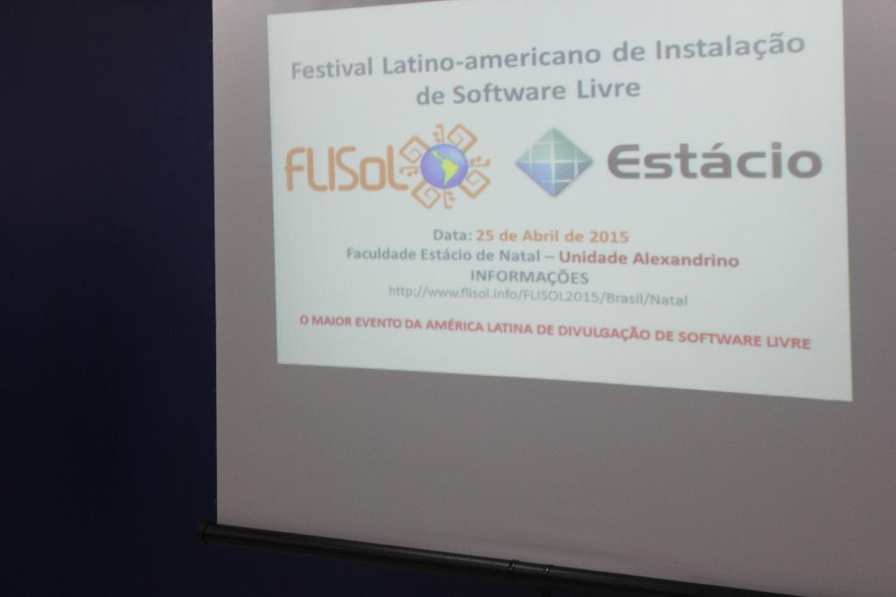
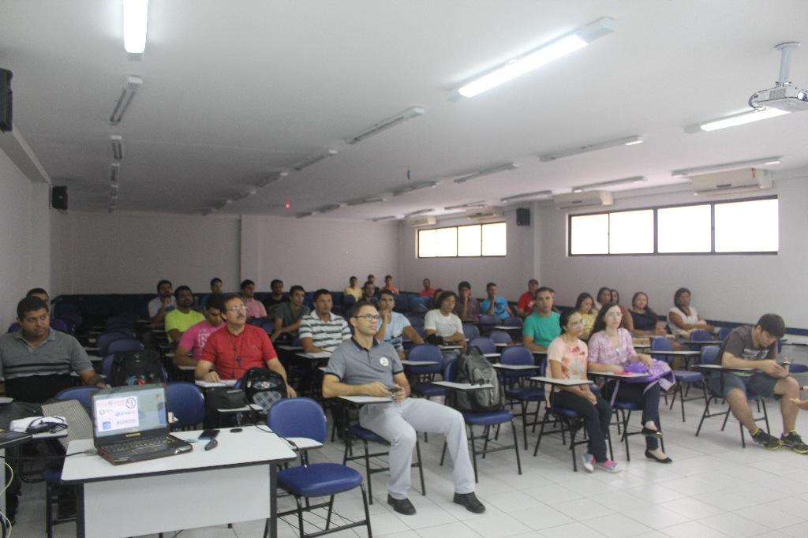
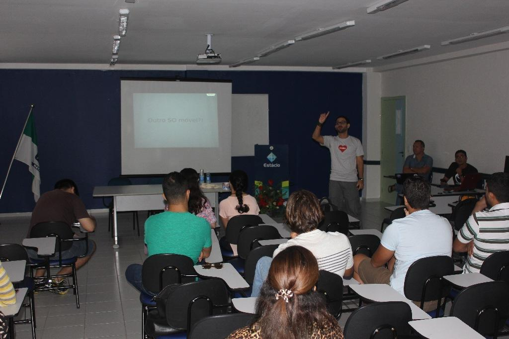
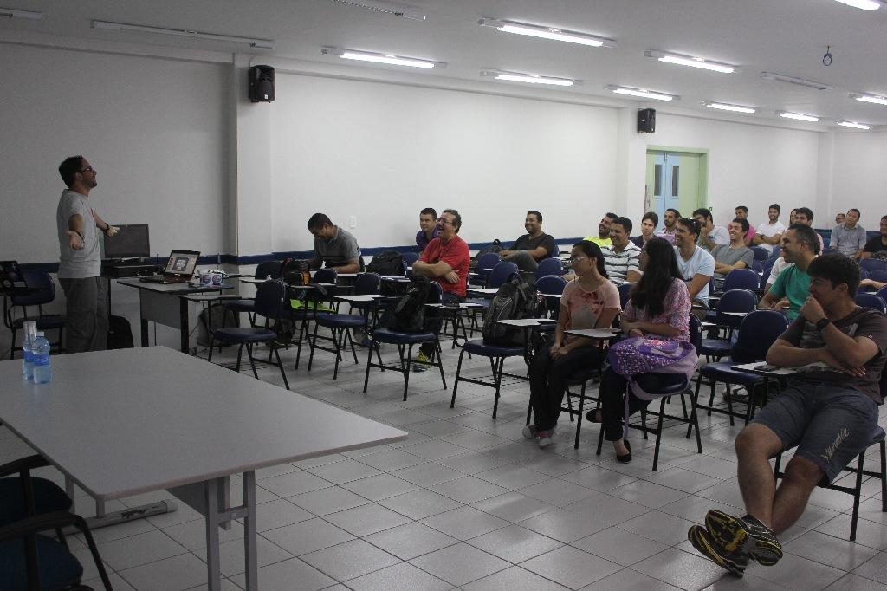
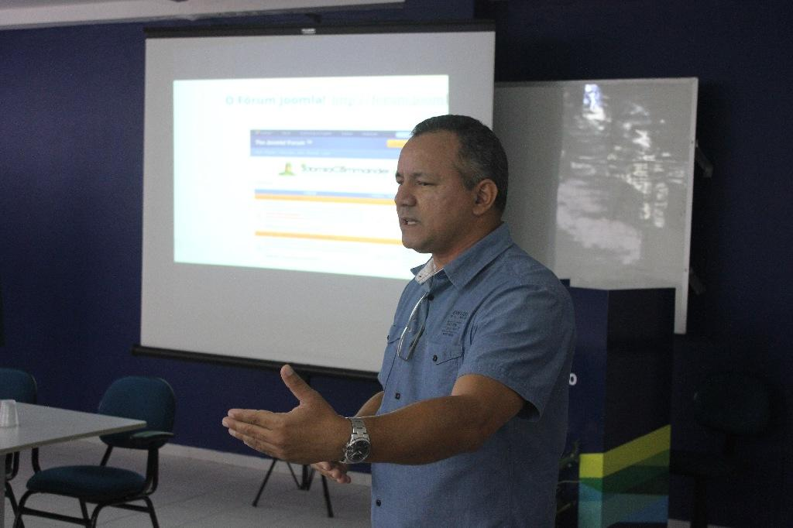
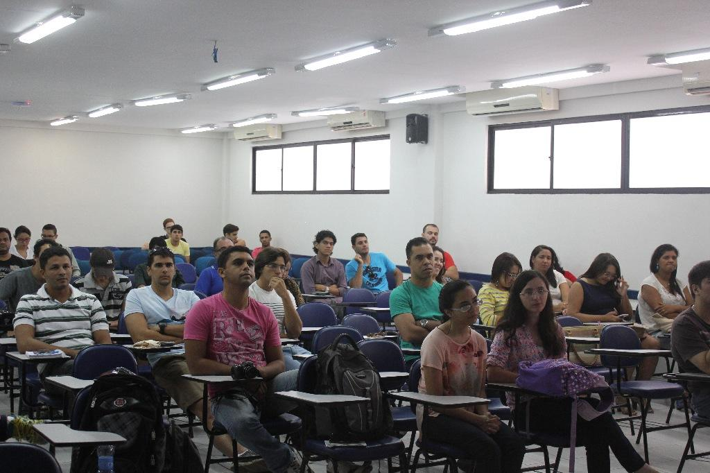
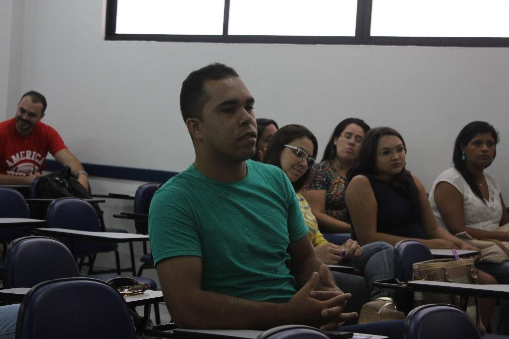
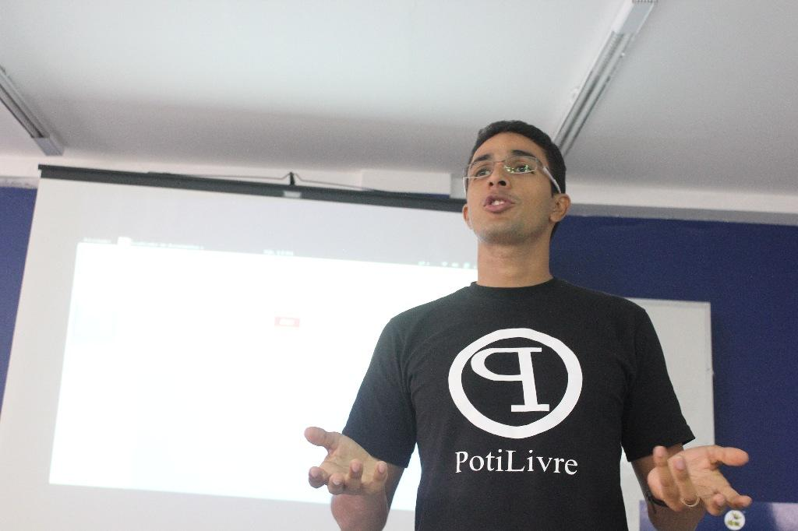

Natal recebeu no dia 25 de abril, a edição 2015 do Festival Latino-Americano de Instalação de Software Livre (FLISOL), que aconteceu simultaneamente em diversos países da América Latina, incluindo o Brasil. O objetivo do evento é promover o uso de software livre em geral, além de criar interações entre usuários e desenvolvedores. Em Natal, a programação foi realizada na Faculdade Estácio de Natal, Unidade Alecrim.

O FLISOL 2015 contou com as seguintes palestras:

- "[Quem é a Mozilla e o Firefox OS](http://pt.slideshare.net/potilivre/quem-eamozillaeofxosbaesse)" e "[Partido Pirata](http://pt.slideshare.net/potilivre/partido-piratabaesse)" por [Pedro Baesse](https://www.facebook.com/pBaesse);
- "[Participe da Comunidade Joomla](http://pt.slideshare.net/potilivre/participe-dacomunidadejoomlajoseroberto)" por [José Roberto da Costa Ferreira](https://www.facebook.com/josehroberto);
- "[Profissão e Mercado Gestão de TI](http://pt.slideshare.net/potilivre/gestao-de-ti-joaz-viera)" por [Joaz Vieira](https://www.facebook.com/joaz.vieira.7);
- [Docker um Linux container engine](http://pt.slideshare.net/potilivre/docker-um-linuxcontainerenginehudson)" por [Hudson Brendon](https://www.facebook.com/hudson.brendon) e
- [2015 Linux Jobs Report](http://pt.slideshare.net/potilivre/linux-jobsreport2015eduardobarros)" por [Eduardo Santos](https://www.facebook.com/eduardobarros.santos).

A equipe de organização da edição 2015 do Flisol Natal foi composta pela comunidade de software livre PotiLivre, com membros de diversos segmentos das carreiras de TI de Natal e do RN em geral.

## Fotos

*Amostra de 8 fotos das 43 registradas neste evento.*

