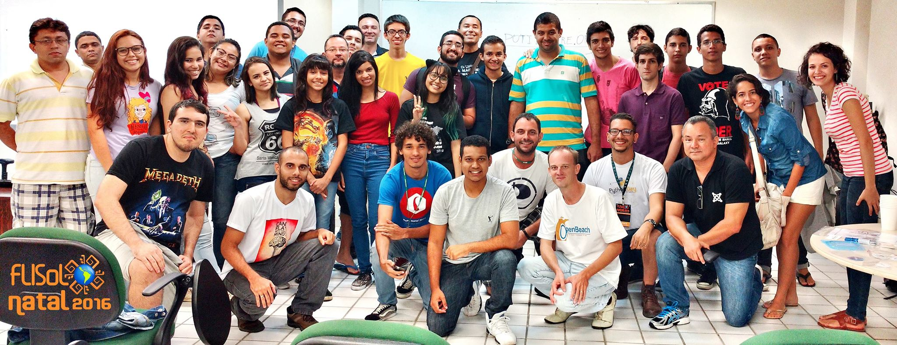
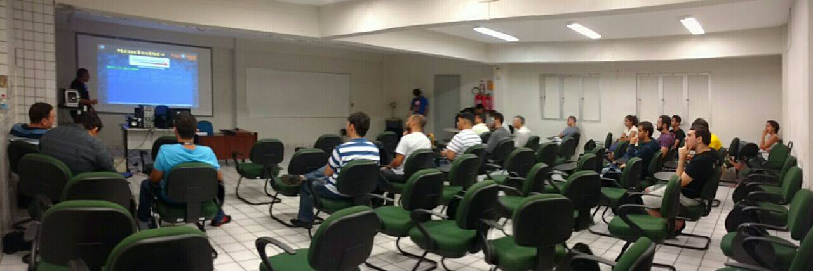
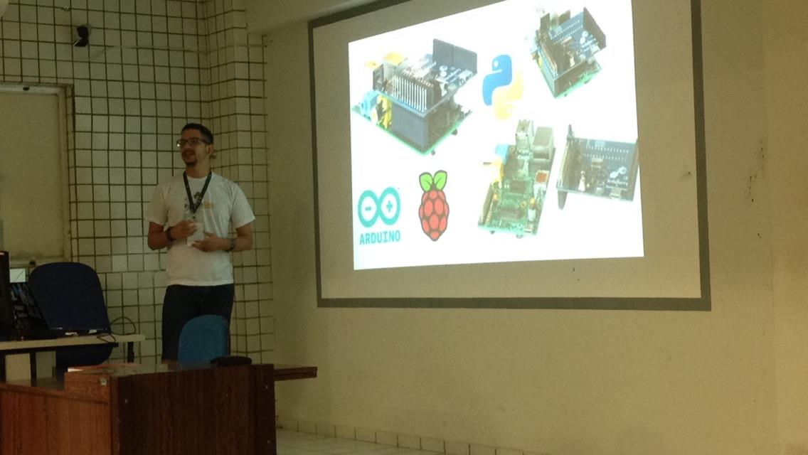
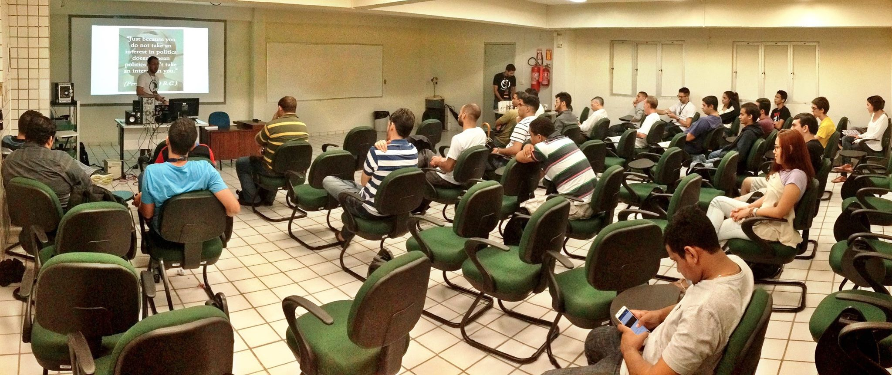
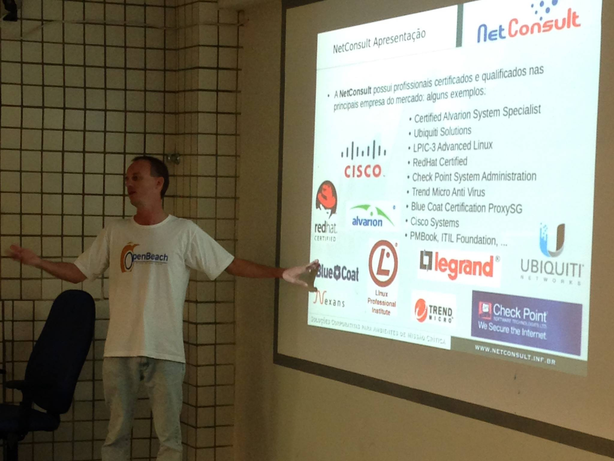
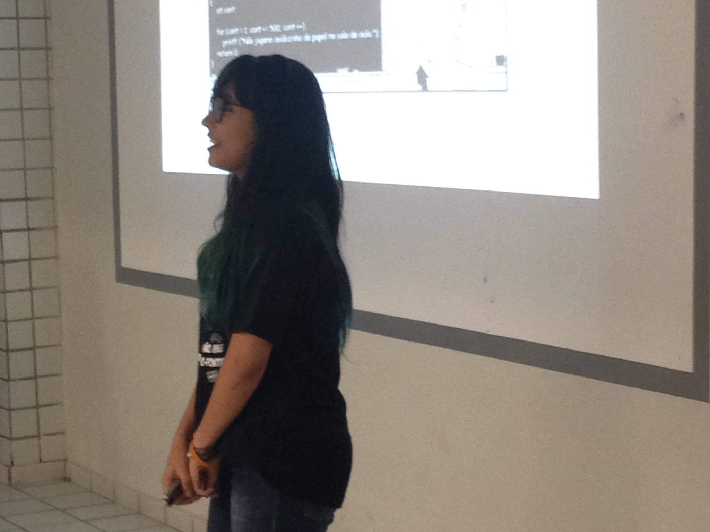
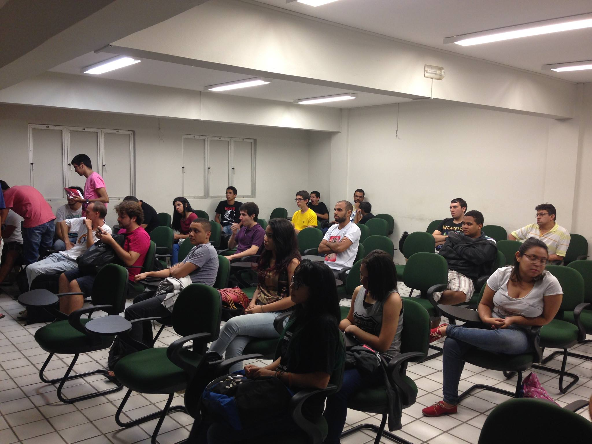
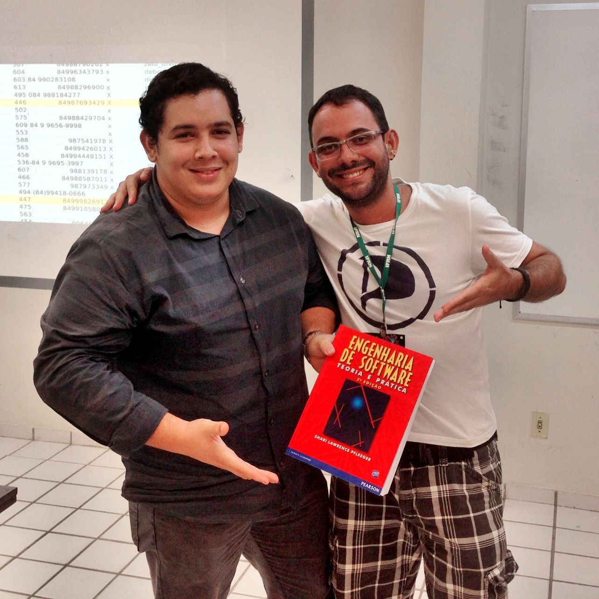

Foi realizado mais uma vez, no dia 16 de abril, em Natal, o FLISOL (Festival Latinoamericano de Instalação de Software Livre).\
O evento foi organizado pelo Grupo de Usuários de Software Livre do Rio Grande do Norte (PotiLivre) com o apoio do Instituto Federal de Educação, Ciência e Tecnologia Rio Grande do Norte (IFRN), Campus Natal Central, que cedeu as instalações para a realização das atividades.

Apesar da chuva, estiveram presentes no evento, de 8 às 18 horas, cerca de 40 pessoas, além dos palestrantes, voluntários e da equipe da organização. Os participantes tiveram a oportunidade de assistir a interessantes palestras, além de poderem ter contato com a comunidade de software livre de Natal. Foi aberto, também, espaço para palestras rápidas para os interessados em ocupar os espaços vagos da programação.

O evento teve as seguintes atividades:

"[Suporte em TI com Software Livre](http://pt.slideshare.net/potilivre/suporte-em-ti-com-software-livre)" por [José Roberto](https://www.facebook.com/josehroberto)\
"[Python na Internet das Coisas](https://speakerdeck.com/hudsonbrendon/python-na-internet-das-coisas)" por [Hudson Brendon](https://www.facebook.com/hudson.brendon)\
"[Como Piratear a Política Brasileira?? E no bom sentido!](http://pt.slideshare.net/potilivre/como-piratear-a-poltica-brasileira-e-no-bom-sentido)" por [Pedro Baesse](https://www.facebook.com/pBaesse)\
"[Docker: Do Desenvolvedor ao Ambiente em Produção Escalável](http://slides.com/jonhnathatrigueiro/docker/fullscreen#/)" por [Jonhnatha Trigueiro](https://www.facebook.com/joepreludian)\
"[Proxy 20k clientes](http://pt.slideshare.net/potilivre/proxy-20k-clientes)" por [Maicon Wendhausen](https://www.facebook.com/maicon.wendhausen)\
"[A Jornada de uma Padawan](http://emmanuellerichard.onbit.com.br/2016/04/a-jornada-de-uma-padawan/)" por [Emmanuelle Richard](https://www.facebook.com/emmanuelle.richard.0)\
"O Papel Social do Software Livre: Precisamos resgatar isso!" por [Leonidas Kirotawa](https://www.facebook.com/kirotawa)\
"[Microsoft e Linux: Como e Porquê a Microsoft se aliou ao Software Livre](http://pt.slideshare.net/potilivre/microsoft-e-linux-como-e-porqu-a-microsoft-se-aliou-ao-software-livre)" por [Mário Araújo Xavier](https://www.facebook.com/marioiurd3)

Lightning talks:

"Pesquisa social sobre a comunidade software livre" por [Ana Eliza Trajano](https://www.facebook.com/anaeliza.trajano)

"Projeto de fomentar a programação em Caraúbas" por [Allan Kardec](https://www.facebook.com/kaardeco)

O FLISOL em Natal já faz parte da agenda do PotiLivre e conta com um público que tem bastante interesse em conhecer a filosofia do software livre, além de ser bastante participativo. Fica o convite para quem perdeu, não deixar de conferir a próxima edição deste evento e também a sugestão para a realização em mais cidades do Rio Grande do Norte.

## Fotos

*Amostra de 8 fotos das 58 registradas neste evento.*

