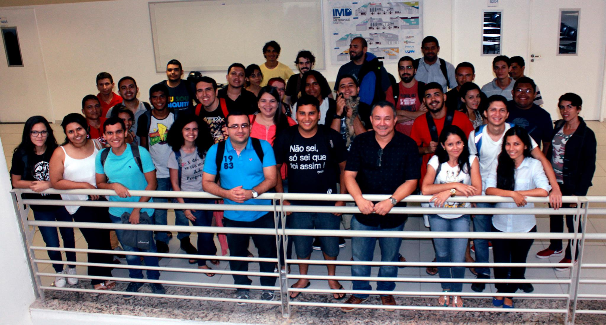
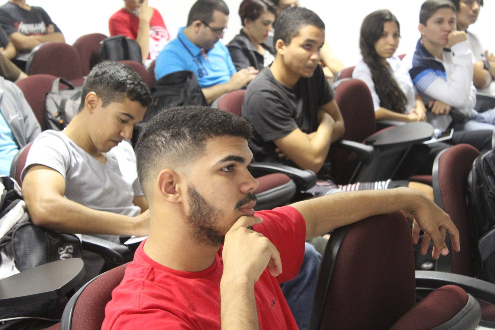
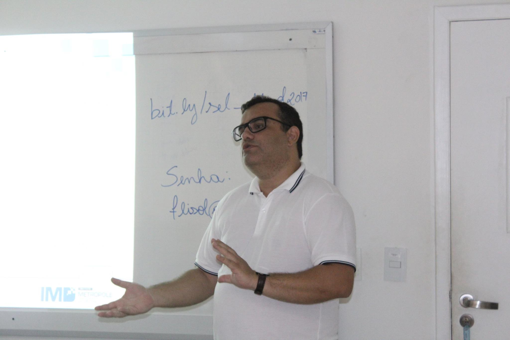
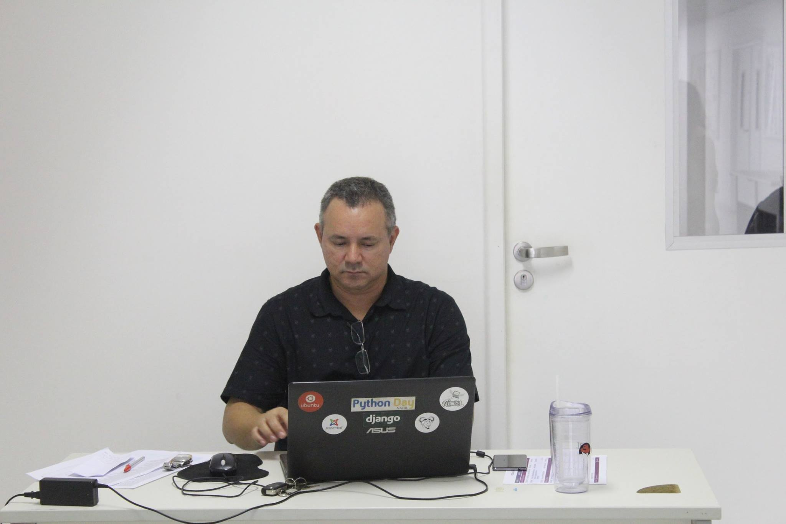
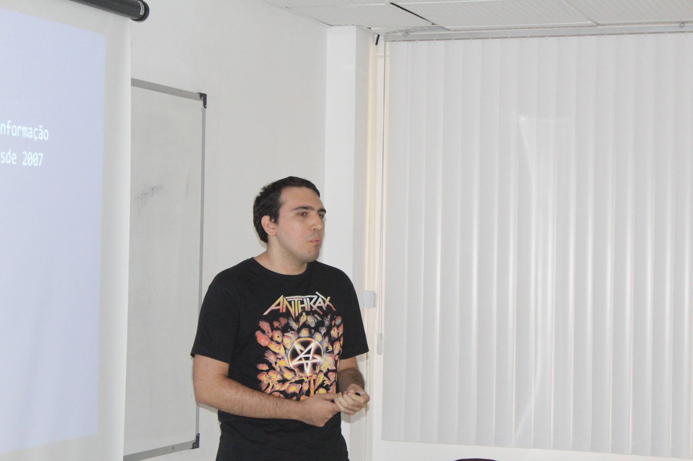
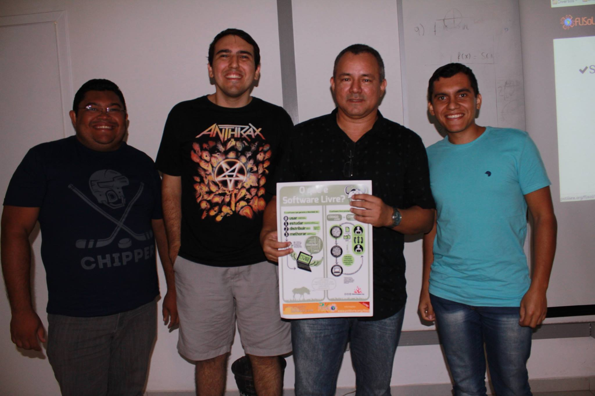
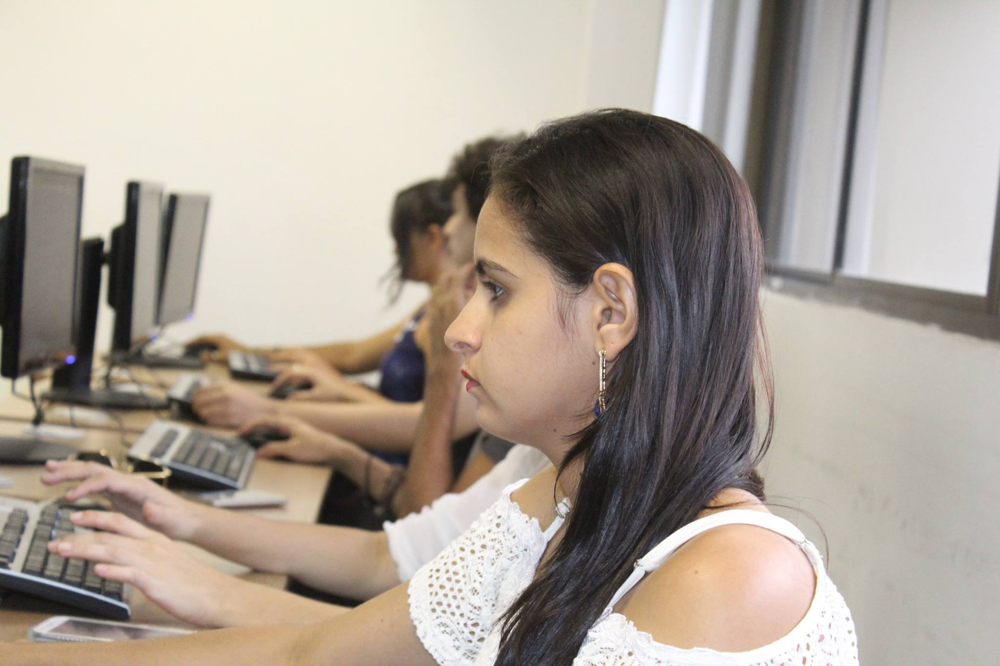
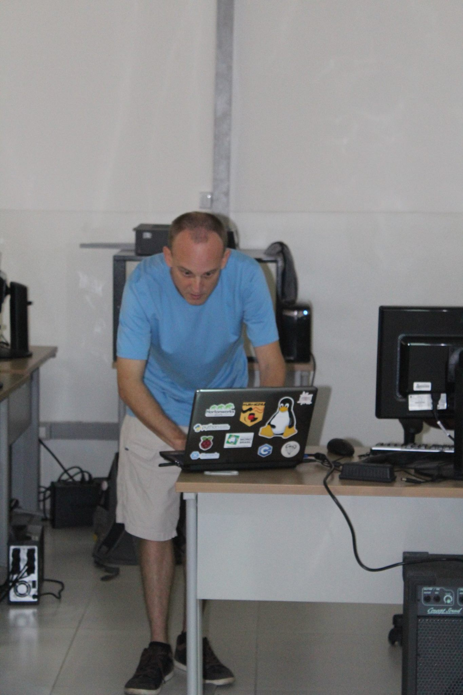

A cidade de Natal vem recebendo há anos as edições do Festival Latino-Americano de Instalação de Software Livre (FLISOL). Na manhã do sábado, 8 de abril de 2017, pela primeira vez, o Instituto Metrópole Digital (IMD) realizou o evento que, mais uma vez, foi organizado pelo Grupo de Usuários de Software Livre do Rio Grande do Norte (PotiLivre). O FLISOL tem como principal objetivo a promoção do uso de Software Livre, mostrando ao público em geral sua filosofia, abrangência, avanços e desenvolvimento.

O evento recebeu aproximadamente 70 pessoas entre alunos, professores, pessoas da comunidade, além de uma caravana do IFRN Campus Ipanguaçu, tínhamos palestrantes, voluntários e a equipe da organização, todos interessados em conhecer mais sobre a filosofia do Software Livre.

O evento contou com as seguintes atividades:

Palestras:\
- "[Afinal de contas, o que é Software Livre?](https://pt.slideshare.net/potilivre/afinal-de-contas-o-que-e-software-livre-allythy-souza-flisol-natal-2017)" por [Allythy Souza](https://www.facebook.com/allythy.souza);\
- "[Gerenciamento de TIC - Complexidades de Evolução e Práticas](https://pt.slideshare.net/potilivre/gerenciando-ti-complexidades-de-evolucao-e-praticas-maicon-wendhausen-flisol-natal-2017)" por [Maicon Wendhausen](https://www.facebook.com/maicon.wendhausen) e\
- "[jMetal - a contribuição de um headbanger a um projeto Open Source](https://pt.slideshare.net/potilivre/jmetal-a-contribuicao-de-um-headbanger-para-um-projeto-open-source-inacio-medeiros-flisol-natal-2017)" por [Inacio Medeiros](https://www.facebook.com/inaciomdrs).

Minicursos:\
- "[Softwares Educativos Livres e Recursos Educacionais Abertos para Matemática](http://bit.ly/sel_flisol2017)" por [Dennys Leite Maia](https://www.facebook.com/dennysleite);\
- "[PHP para iniciantes](https://pt.slideshare.net/potilivre/php-iniciantes-marioaraujoxavierflisolnatal2017)" por [Mário Araújo Xavier](https://www.facebook.com/marioiurd3);\
- "[Virtualização e Containers com Proxmox](https://pt.slideshare.net/potilivre/minicurso-virtualizacao-com-proxmox-maicon-wendhausen-flisol-natal-2017)" por [Maicon Wendhausen](https://www.facebook.com/maicon.wendhausen);\
- "[Desenvolvendo jogos e animações de forma criativa com o Scratch](https://pt.slideshare.net/potilivre/desenvolvendo-jogos-e-animacoes-de-forma-criativa-com-o-scratch-matheus-barbosa-de-farias-e-carlos-henrique-pires-dos-santos-flisol-natal-2017)" por [Matheus Barbosa de Farias](https://www.facebook.com/matheuzinhob994) e [Carlos Henrique Pires dos Santos](https://www.facebook.com/carlos.ti.henrique);\
- "[Processamento Digital de Imagens com GNU Octave](https://pt.slideshare.net/potilivre/processamento-digital-de-imagens-com-gnu-octave-jotacisio-araujo-oliveira-flisol-2017-natal)" por [Jotacisio Araújo Oliveira](https://www.facebook.com/jotacisio.araujo) e\
- "Desenvolvimento de Sites com CMS JOOMLA" por [José Roberto Ferreira](https://www.facebook.com/josehroberto).

Parceria, comprometimento, busca e compartilhamento de conhecimentos marcaram o FLISOL 2017 em Natal. Agradecemos ao [Instituto Metrópole Digital](http://portal.imd.ufrn.br/) pela cessão do miniauditório para as palestras e dos laboratórios para os minicursos, [Hybrid](https://www.hybriddc.com.br/) com a hospedagem do site do evento, [OYS Technology](http://www.oys.com.br/) e [Julio Coutinho](https://www.facebook.com/cout45), autor do livro [Joomla Guia de Consulta Rápida](http://livrodejoomla.com.br/), pela disponibilização de brindes para sorteios. Aos palestrantes que se dispuseram a dividir seus conhecimentos, aos novos voluntários que ajudaram a organização do evento e claro, aos participantes, destacando a força de vontade da caravana de alunos e professores do IFRN Ipanguaçu que aproveitaram o sábado para aprender um pouco mais sobre liberdade com Software Livre.

Confira as fotos do evento clicando aqui.

Fique por dentro do que aconteceu no FLISOL 2017 em Natal/RN no vídeo produzido por [Moisés Abraão](https://www.facebook.com/moises.abraao.9):

# Ocorreu um erro.

Não é possível executar o JavaScript.

## Fotos

*Amostra de 8 fotos das 90 registradas neste evento.*

