O Festival Latino-americano de Instalação de Software Livre (FLISoL) realizado no Rio Grande do Norte no dia 28 de abril de 2018 teve um fator especial: pela primeira vez três cidades potiguares conseguiram realizar este evento no mesmo dia, Natal, Pau dos Ferros e Ceará-Mirim. A Comunidade Potiguar de Software Livre (PotiLivre) conseguiu organizar o FLISoL em Natal e enviar seus coordenadores para as outras duas cidades.\
O FLISoL é o maior evento de divulgação de Software Livre na América Latina. Seu principal objetivo além de promover o uso do Software Livre, esclarecer sua filosofia, avanços, viabilidade técnica, social e econômica.

Em Natal o FLISoL foi realizado nas instalações do Centro Universitário do Rio Grande do Norte (UNI-RN). Em Pau dos Ferros e em Ceará-Mirim foram utilizadas os campus do Instituto Federal de Educação, Ciência e Tecnologia do Rio Grande do Norte (IFRN) de suas respectivas cidades. Os três locais realizaram o mesmo esquema de organização, pela parte matinal foram realizadas as palestras e na parte vespertina, os minicursos.

Em Natal tivemos as seguintes atividades:

- [O que é Software Livre, Comunidade PotiLivre e FLISoL](https://pt.slideshare.net/potilivre/o-que-e-software-livre-comunidade-potilivre-e-flisol-flisol-natal-2018) por Ana Clara Nobre e José Roberto Ferreira;
- [Libreflix.org](https://pt.slideshare.net/potilivre/libreflixorg-flisol-natal-2018) por Julio Pedro de Lira Neto;
- [Mudando para o Software Livre sem complicação](https://pt.slideshare.net/potilivre/mudando-para-o-software-livre-sem-complicacao-diogenes-dantas-flisol-natal-2018) por Diógenes Dantas;
- [Como ganhar dinheiro com Software Livre](https://pt.slideshare.net/potilivre/como-ganhar-dinheiro-com-software-livre-matheus-oliveira-flisol-natal-2018-96443546) por Matheus Oliveira;
- [Distribuição de Sistemas WEB com NGINX](https://pt.slideshare.net/potilivre/implementando-distribuicao-de-sistemas-web-com-nginx-fernando-henrique-eisele-bellincanta) por Fernando Henrique Eisele Bellincanta;
- [Security Updates - Por que você deveria aceitar os Updates da sua distro?](https://pt.slideshare.net/potilivre/security-updates-por-que-voce-deveria-aceitar-os-updates-da-sua-distro-leonidas-s-barbosa-flisol-natal-2018) por Leonidas S. Barbosa;
- DevOps na prática: Introdução a integração contínua com Jenkins e Vagrant por Matheus Barbosa de Farias;
- Machine Learning com ferramentas Open Source por José Estevam de Andrade Junior e
- Modularizando ambientes de Desenvolvimento com Docker por Thayron Arrais Vieira da Cruz.

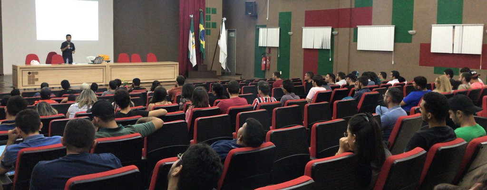

*Figura 2: FLISOL em Pau dos Ferros no IFRN*

Já em Pau dos Ferros tivemos:

- O que é Software Livre, Comunidade PotiLivre por Allythy Rennan (Coordenador da PotiLivre);
- Ferramentas livres para testes de intrusões por Anderson Cirilo Valentim;
- Como se envolver com software livre por Marco Diego (UFERSA);
- Cybermundo e a (in)segurança por Rubens Santos;
- CTF & WarGames: Que comecem os jogos... por Allan Kardec Cunha;
- Como e porque adotei Python utilizando software Livre por Carlos Fran Ferreira Dantas;
- Minicurso de Git e Github por Allythy Rennan Medeiros de Souza;
- Introdução ao GNU/Linux por Bruno Morais Pinheiro;
- Introdução a Programação utilizando Software Livre por Wanderson Rego Oliveira e
- Introdução ao Vim por Tallys Cesar.

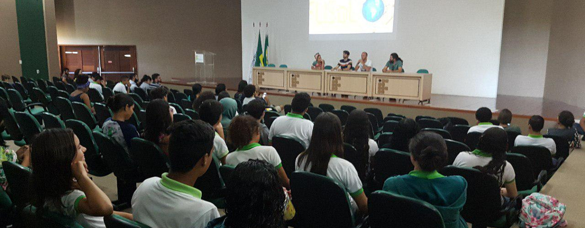

*Figura 3: FLISOL em Ceará-Mirim no IFRN\*

E em Ceará-Mirim os trabalhos apresentados foram:

- O que é Software Livre, Comunidade PotiLivre e FLISoL por Pedro Baesse (Coordenador da PotiLivre);
- Segurança na Web - Emylle Varela (SaferNet), Sávyo (SaferNet e Servidor do IFRN) e Gustavo Paiva (Membro da Comissão de Direito e Tecnologia da Informação da OAB);
- Experiência Campus Party por Brunna, William, Gabriel Félix, Anderson e Alexsandro (Alunos do IFRN Ceará-Mirim);
- A revolução da web com software livre e seu impacto no mercado de trabalho por Jhonny Michel (ex-aluno do IFRN e funcionário da Evolux);
- Roda de Conversa sobre Software Livre por usuários fora da área de TI por Ana Eliza (Socióloga), Ricardo Gentil (Filósofo), Stanley (Filósofo) e Ricardo Vilar (Historiador) e
- Como o software livre afeta o desenvolvimento e o mercado de jogos digitais por Tainá Medeiros (Coordenadora do Meninas que Jogam).

Como foi observado foram muitas atividades desenvolvidas nas três cidades tendo como tema o Software Livre. Vale destacar que a ida dos coordenadores da PotiLivre, Allythy Renan para Pau dos Ferros e Pedro Baesse para Ceará-Mirim, serviram de apoio para que os coordenadores locais, Matheus Ricelly e Aluísio Igor Rego Fontes em Pau dos Ferros e Adorilson Bezzera em Ceará-Mirim obtivessem êxito e levando a experiência da Comunidade Potiguar de Software Livre na realização de eventos. Vale a pena também citar o sucesso dos três eventos pelo apoio e patrocínio das seguintes empresas/instituições: Em Natal: UNI-RN, AutoForce Performance e Resultados, DAE Networks e Hybrid Data Center. Em Pau dos Ferros: IFRN Pau dos Ferros, Cores Comunicação Visual, NetOnLine, Multilocadora Pauferrense, Grupo Saruê, UTI dos Capacetes e JP Borrachas e Parafusos. Em Ceará-Mirim: IFRN Ceará-Mirim.

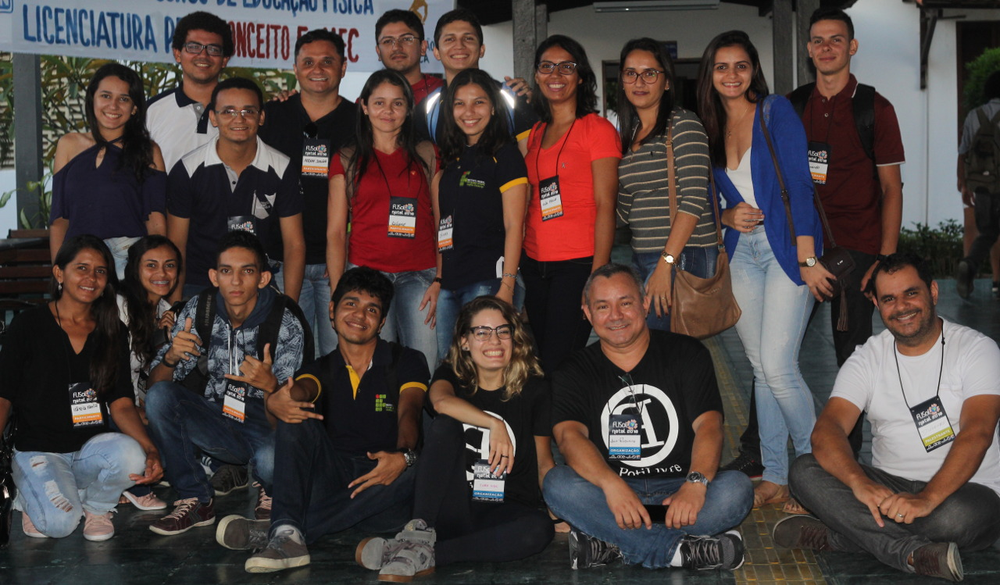

*Figura 4: Caravana de alunos do IFRN Ipanguaçu com a coordenação da PotiLivre*

Em Natal ainda tivemos a participação da caravana de alunos do IFRN Ipanguaçu que trouxe alunos de cidades vizinhas como Angicos, Assu, Santana dos Matos, Alto do Rodrigues, Itajá, Macau e São Rafael.

## Fotos

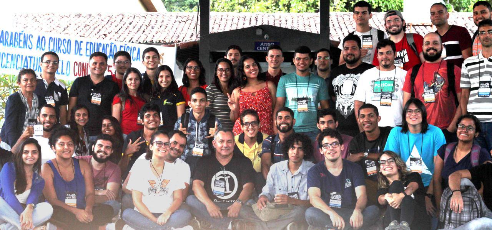
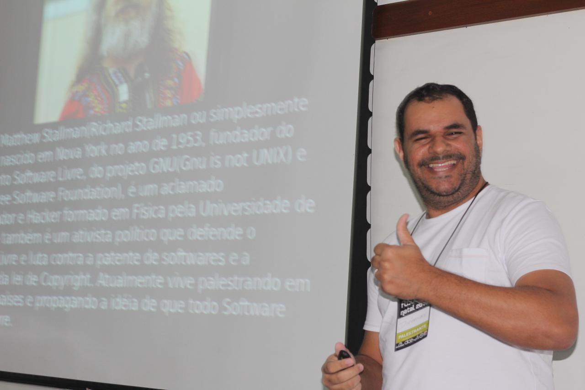
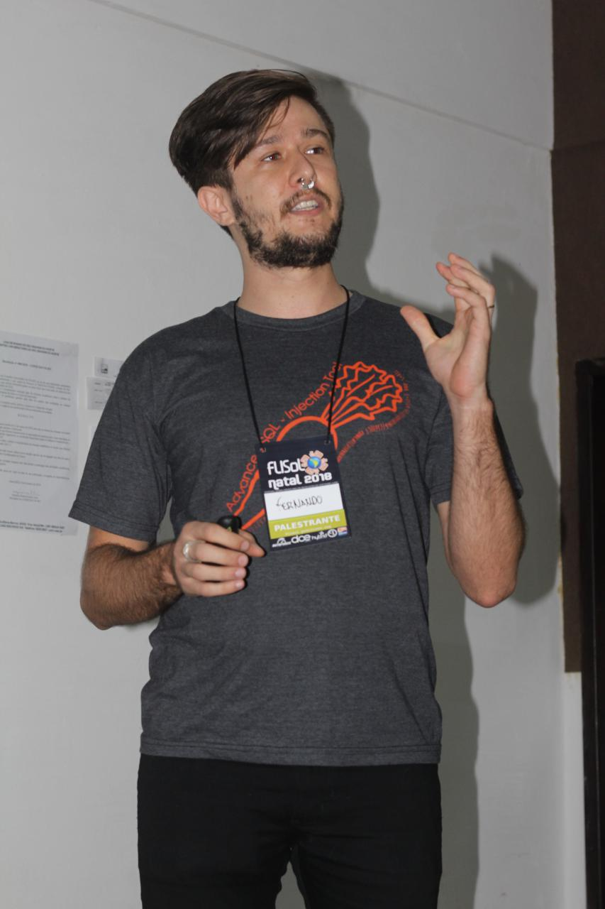
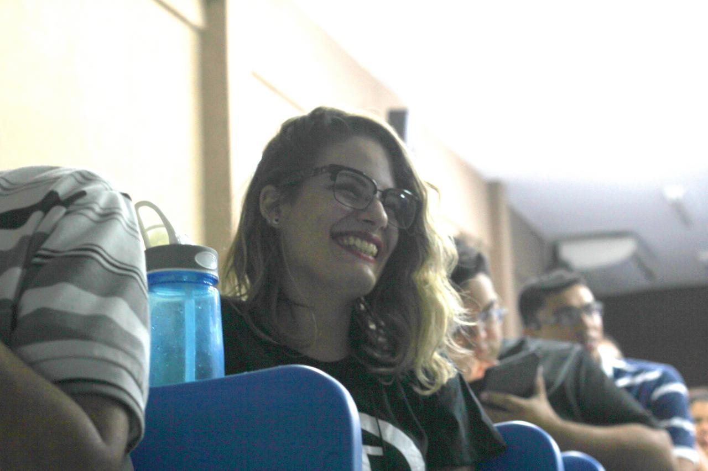
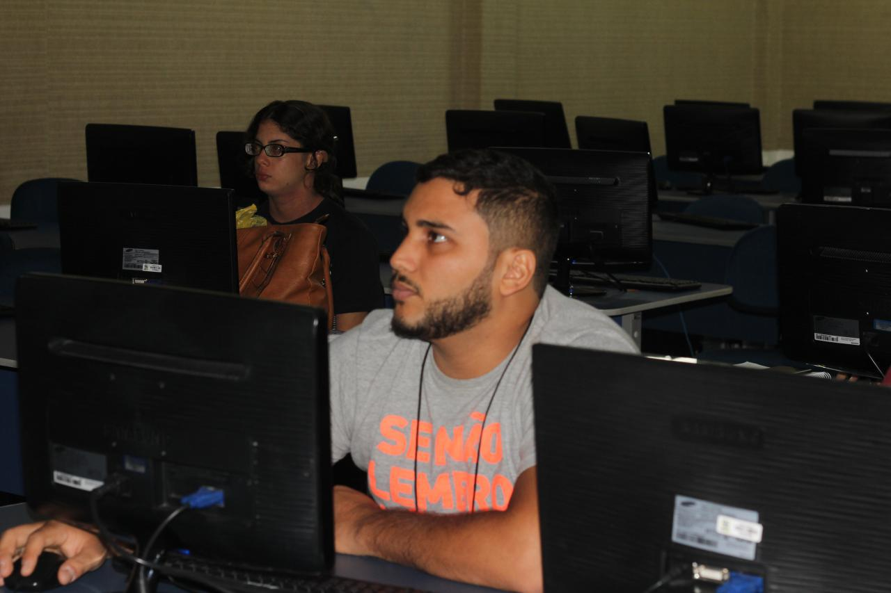
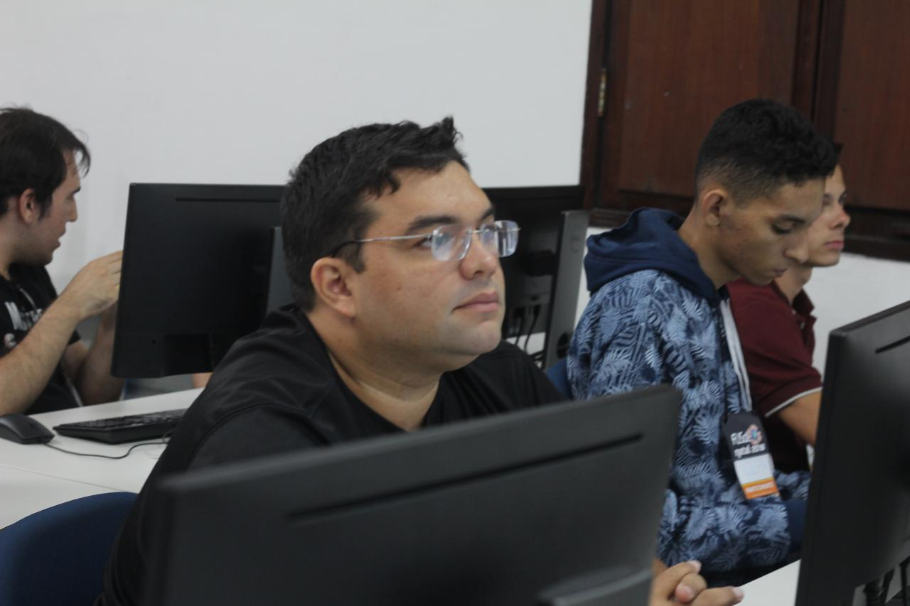
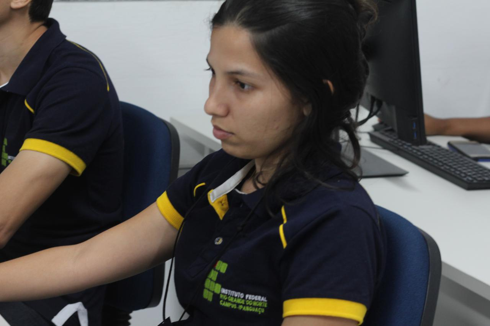
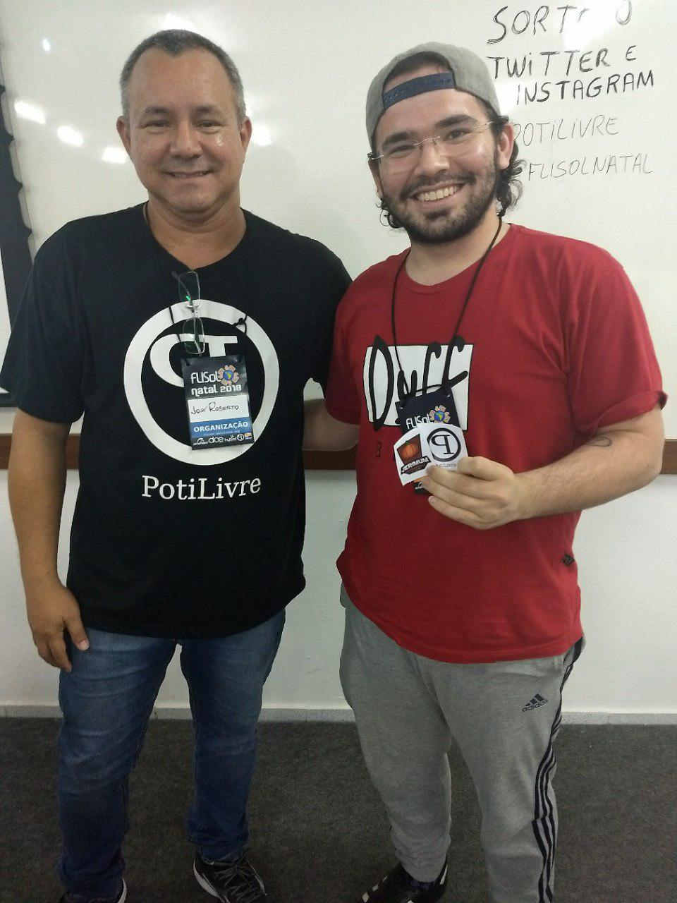

*Amostra de 8 fotos das 103 registradas neste evento.*

