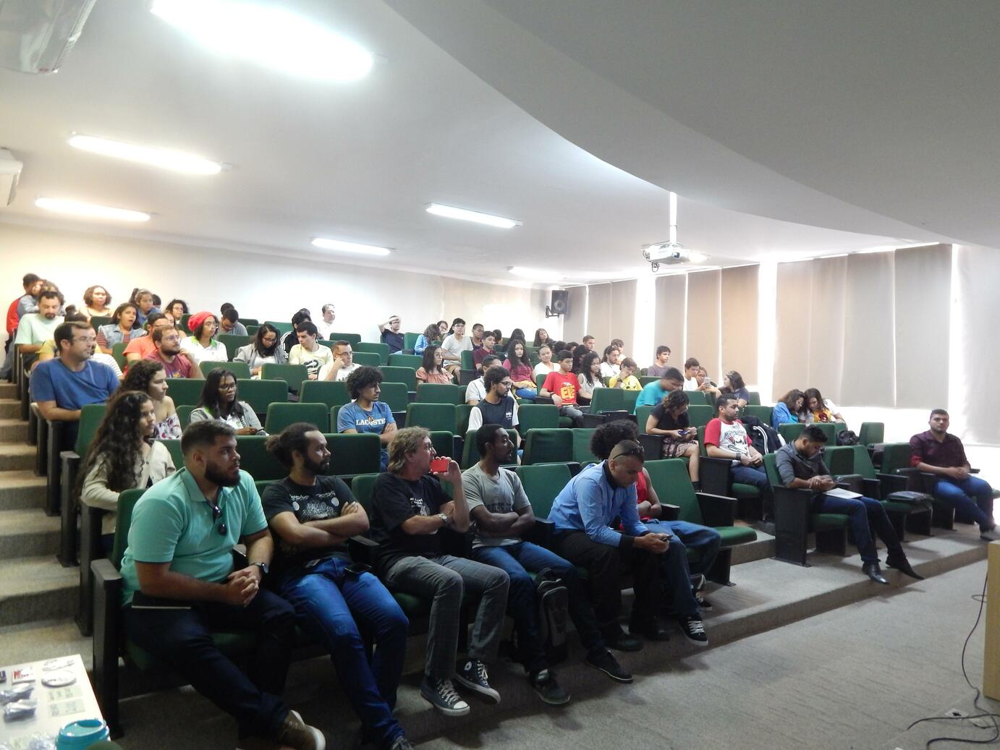
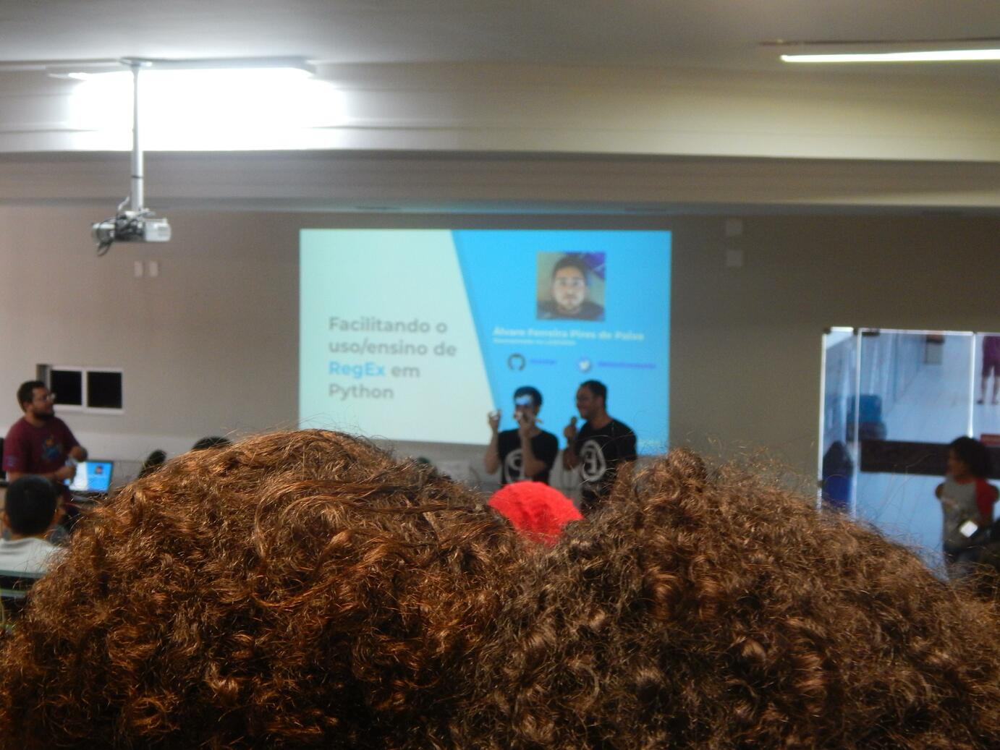
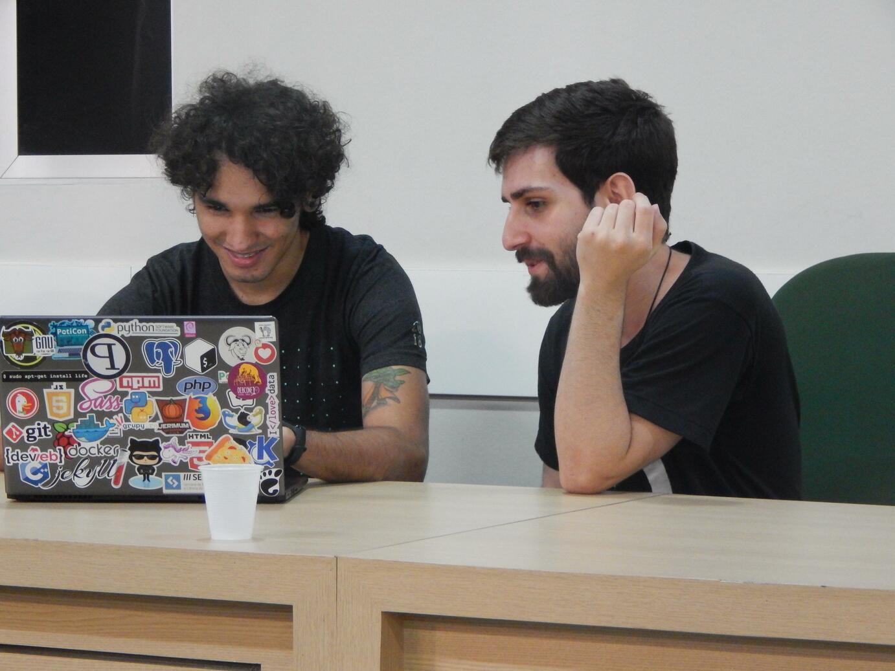
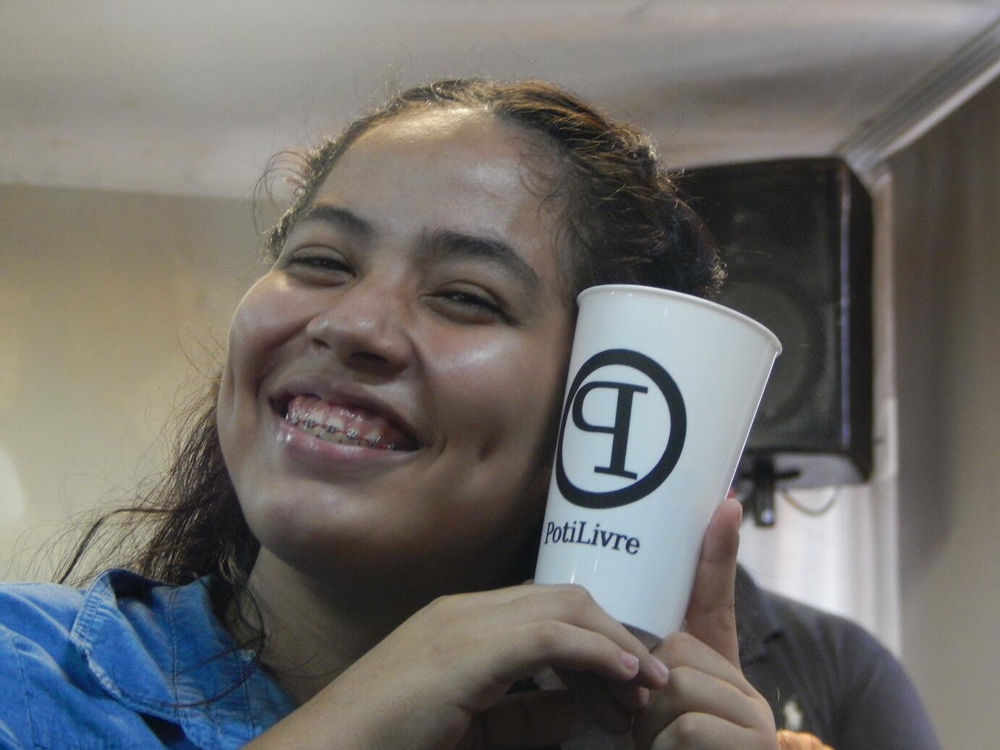
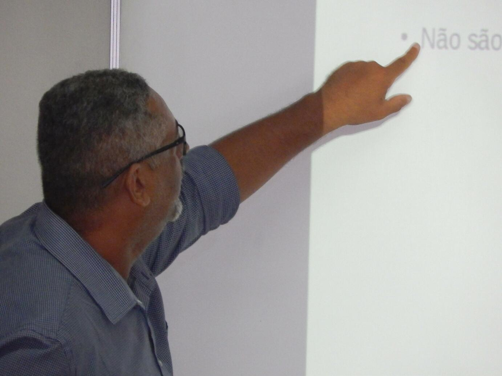
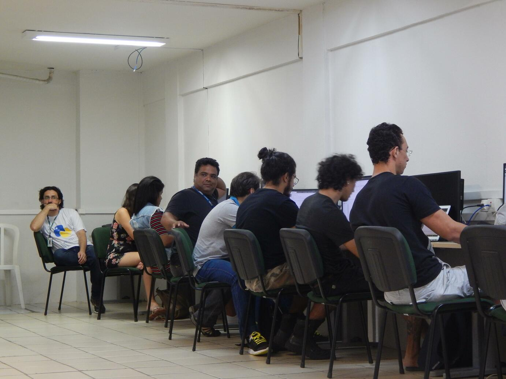
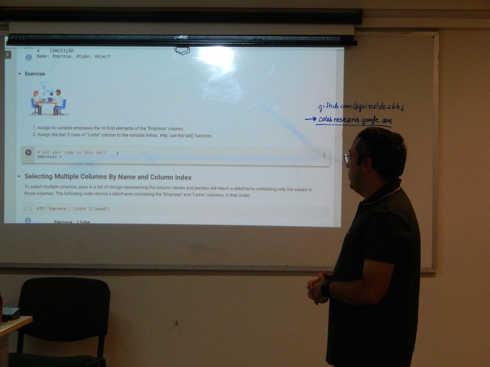
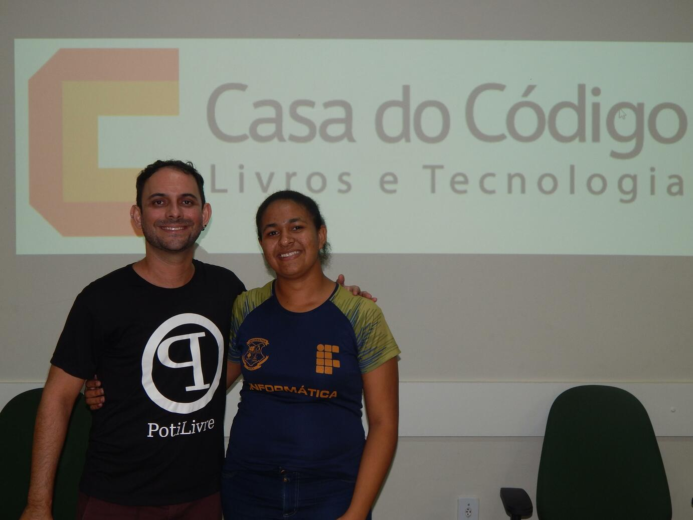

O Festival Latino-americano de Instalação de Software Livre (FLISoL) realizado no Rio Grande do Norte no dia 27 de abril de 2019. O FLISoL é o maior evento de divulgação de Software Livre na América Latina. Seu principal objetivo além de promover o uso do Software Livre, esclarecer sua filosofia, avanços, viabilidade técnica, social e econômica. Em Natal o FLISoL foi realizado nas instalações IFRN Campus Natal Central, organizado pela comunidade Potiguar de Software Livre, PotiLivre.

**Palestras**:

- O que Software Livre e a comunidade PotiLivre - Allythy Rennan e Pedro Baesse.
- Alternativas livres para mapas e rotas com OSM e OSRM - Sedir Morais.
- Facilitando o uso de RegEx em Python através de um pacote de código aberto - Álvaro Ferreira.
- Usando Software Livre para Gerenciar Resposta a Incidentes de Segurança - Eduardo Santos.
- Ferramentas Livres para testes de Intrusão - Anderson Cirilo.
- Você é espionado todos os dias: Saiba como se defender \| TOR project - Julio Lira

**Minicursos**:

- Geoprocessamento, com a utilização dos Softwares Livres QGIS, SAGAGIS, GRASS e PostgreSQL/PostGIS - Pedro Junior.
- Python para Open Data - Gisliany Alves e Aguinaldo Bezerra

## Agradecimentos

A PotiLivre gostaria de agradecer a todos que colaboraram para a realização deste encontro: IFRN Campus Natal Central, pela cessão dos auditórios e laboratórios para as palestras e minicursos; aos palestrantes que se dispuseram a dividir seus conhecimentos; aos voluntários que ajudaram na organização do evento; a caravana: IFRN de Ceará-Mirim, que mesmo com a distância entre as cidades conseguiram estar presentes e, claro, a todo o público que prestigiou o FLISol 2019. Agradecemos também o apoio da Evolux, Casa do Código, Natal Makers e Hybrid.

## Fotos

*Amostra de 8 fotos das 55 registradas neste evento.*

