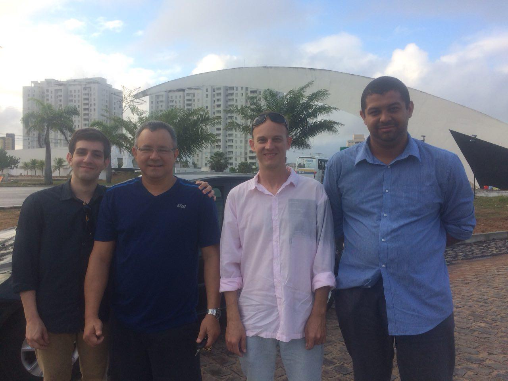
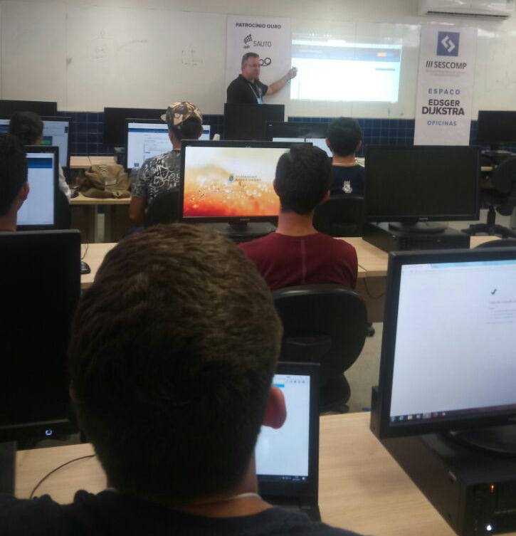
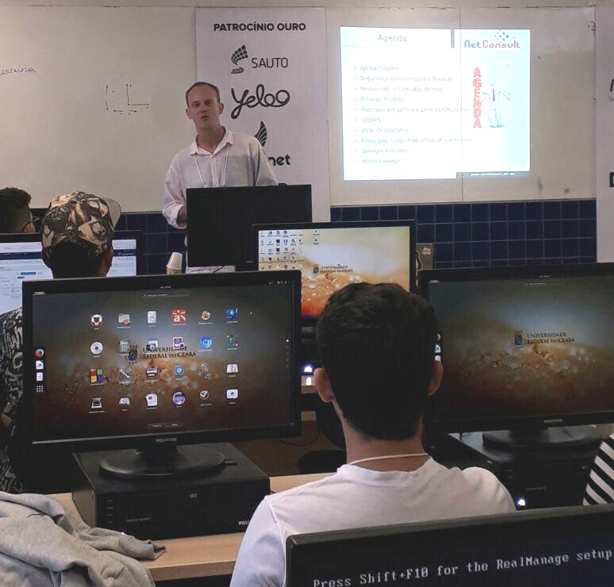
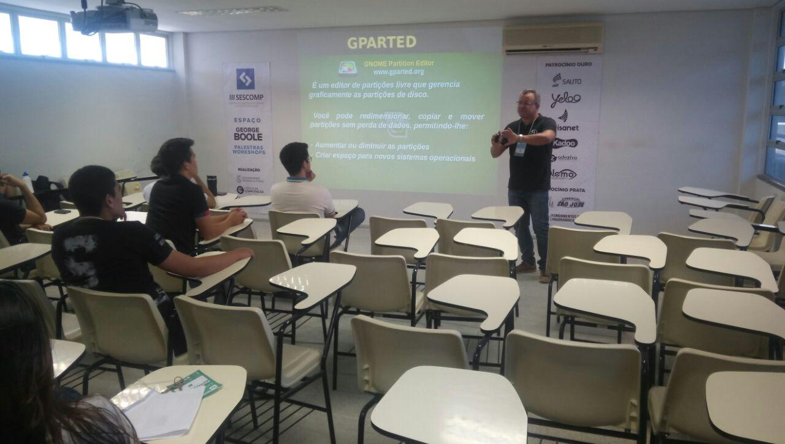
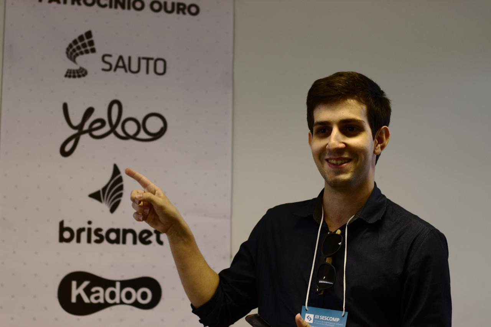
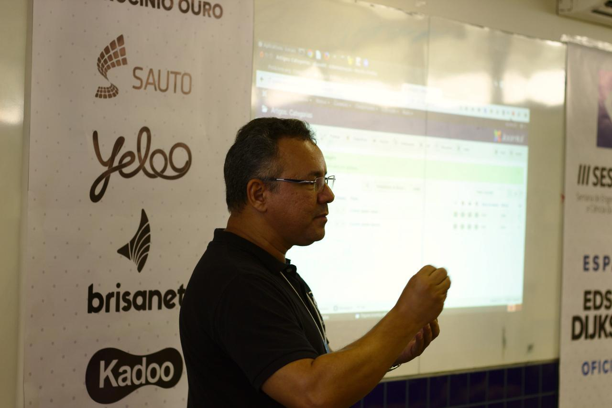
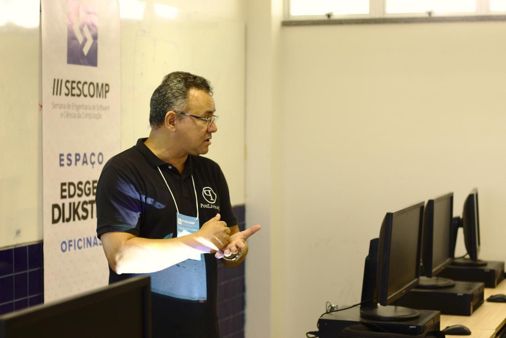
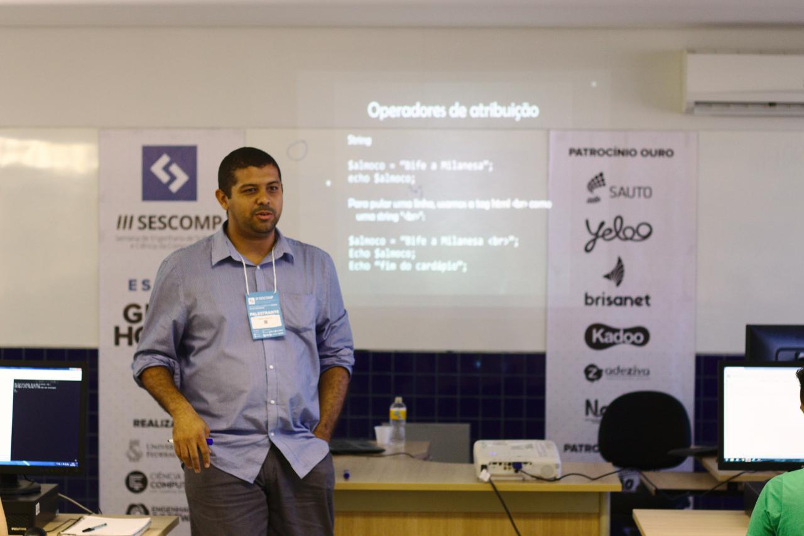

Nos dias 18 e 20 de outubro de 2017 a Comunidade PotiLivre participou ativamente de dois grandes eventos realizados em cidades diferentes. No dia 18 de outubro de 2017 aconteceu a IV Semana de Ciência e Tecnologia do IFRN Campus Parnamirim, evento que foi marcado por uma variedade de atividades envolvendo a comunidade acadêmica do campus e a Comunidade PotiLivre colaborou com as seguintes atividades:

- Minicurso de Desenvolvimento de Sites com Joomla por José Roberto da Costa Ferreira;
- Palestra Softwares e Sistemas Operacionais livres na busca pela inovação e o Minicurso Recuperando arquivos excluídos usando ferramentas simples por Felipe Alison Jerônimo de Lima;
- Minicurso básico de linha de comando do Sistema GNU e a Palestra O que é Debian por Allythy Rennan Medeiros de Souza;
- Configurando um servidor Proxy com Squid por Matheus Barbosa de Farias e
- Palestra Hackers, os artífices do Ciberespaço: quando a ideia dialoga com a prática concreta por Ana Eliza Trajano.

Já no dia 20 de outubro de 2017 a Comunidade PotiLivre colaborou com a SESCOMP, Semana de Engenharia de Software e Ciência da Computação, evento anual da Universidade Federal do Ceará no Campus de Russas, que teve como objetivo principal complementar a formação profissional e acadêmica dos alunos dos cursos de Engenharia de Software e de Ciência da Computação. Os integrantes da PotiLivre foram muito bem recebidos pela coordenação do evento e observou-se também o grande respeito e interesse dos acadêmicos daquela instituição pelos assuntos abordados pelos integrantes da PotiLivre, que eram justamente voltados ao software livre e foram os seguintes:\
\
Palestras

- Gerenciamento de Tecnologia da Informação e Comunicação por Maicon Wendhausen;
- O que é Software Livre e Comunidade PotiLivre por Allythy Rennan Medeiros de Souza;
- Suporte em TI para Desktop com Software Livre por José Roberto da Costa Ferreira e
- Software Livre no Banco do Brasil: como o BB economizou 50 milhões de reais com ferramentas livres por Mario Araujo Xavier

Minicursos

- PHP para iniciantes por Mario Araujo Xavier;
- Linha de comando do Sistema GNU por Allythy Rennan Medeiros de Souza;
- CMS Joomla: Instalação e Configuração por José Roberto da Costa Ferreira e
- Segurança de Redes com Software Livre por Maicon Wendhausen

## Fotos

*Amostra de 8 fotos das 49 registradas neste evento.*

