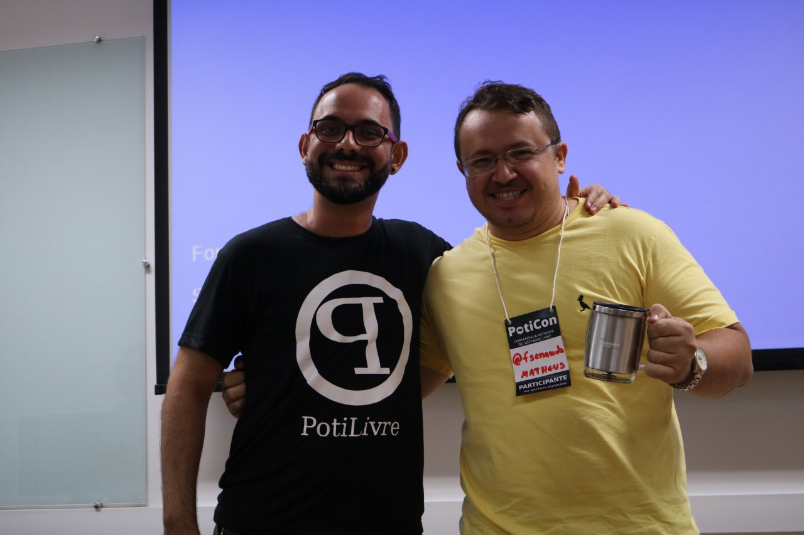
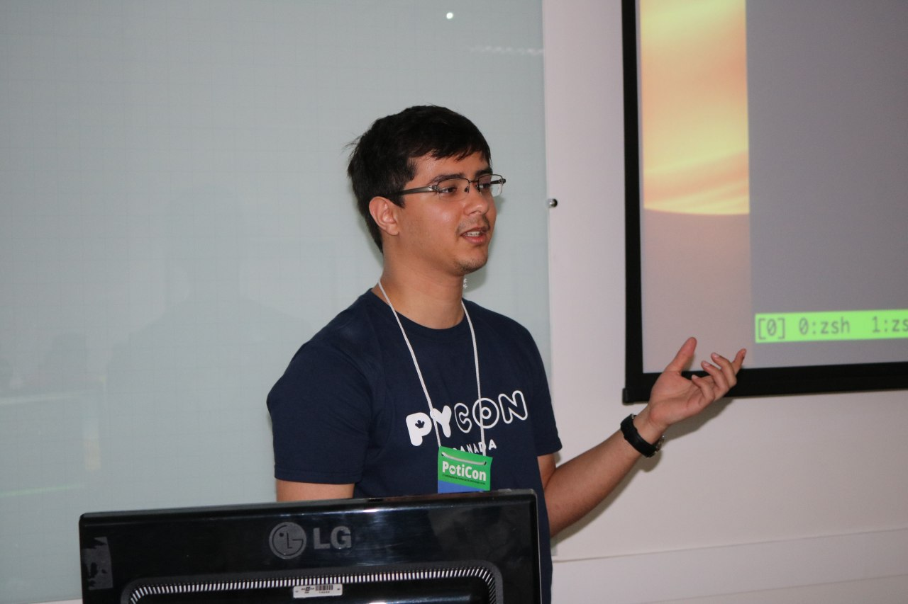
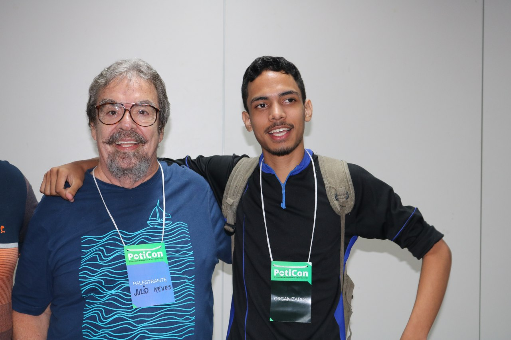
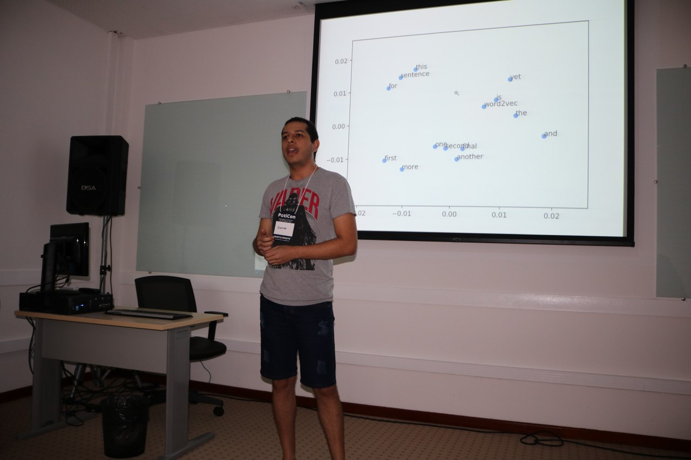
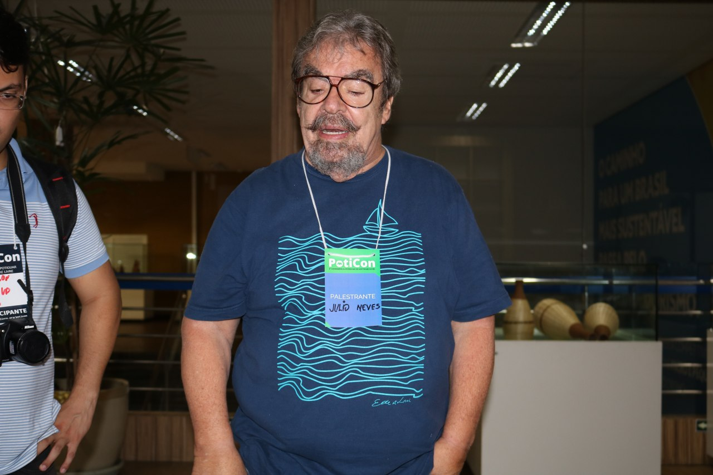
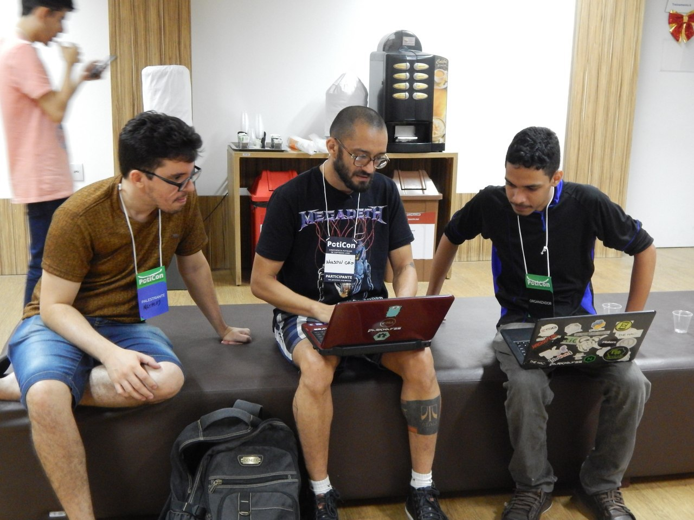
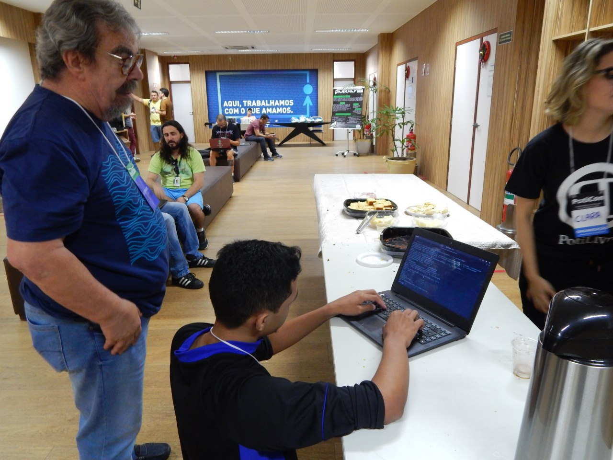
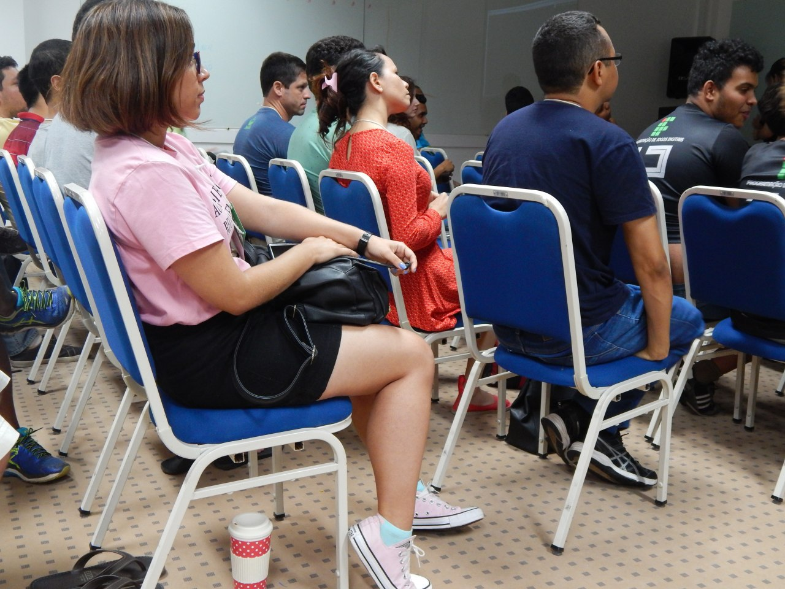

Nos dias 24 e 25 de novembro de 2018, a Comunidade Potiguar de Software Livre (PotiLivre) organizou a 3ª Conferência Potiguar de Software Livre (PotiCon) nas instalações do Sebrae. Seu objetivo era ampliar os conhecimentos dos participantes sobre as diversas ferramentas livres desenvolvidas, distribuições GNU/Linux e a situação do mercado atual do Software Livre, com isso o público pode trocar experiências e impressões sobre os projetos livres existentes no país.

A proposta do PotiCon é reunir um amplo conteúdo e informações para que estudantes, professores, pesquisadores, profissionais e especialistas compartilhem os seus conhecimentos no mesmo ambiente.

## Palestras

PotiLivre, Poticon e Software Livre: Já nos conhecemos? - Pedro Baesse\
Proxmox Ve: Uma Solução Livre De Virtualização - Matheus Oliveira\
Arduino: Que O Lado Python Do Firmata Esteja Com Você - Alex Aquino\
25 Anos De Debian, Uma Viagem No Tempo De Umas Das Distros Mais Importantes Da História - Marney Rocha\
Pegadinhas De Segurança, Por Que Você Deve Estar Sempre Atento - Kirotawa\
Big Data: Ferramentas Open Source Para Análise E Processamento De Dados. - João Marcos\
Ferramentas livres pra sincronização de arquivos e colaboração online - Sedir Morais\
Desenvolvendo Uma Api Para Consulta De Veículos Através De Placas Em Python - Victor Torres\
Postgresql: Lá E De Volta Outra Vez Uma História De Backup E Recuperação - Alysson Oliveira\
O que é FIWARE e como usá lo para proteger minhas aplicações ? I- rene Ginani\
Assim na Terra como no Shell - Julio Cesar Neves

## Minicursos

Introdução ao mundo Cloud: Montando Servidores Web - Thayron Arrais\
Primeiros passos com Scrapy - Victor Torres\
Puppet para iniciante - Igor Bezerra\
Análise de dados com Python: do básico até onde conseguirmos chegar - Pedro Arthur Duarte (aka JEdi)\
Docker para Desenvolvedores - Rafael Gomes (Gomex)

## Agradecimento

A comunidade PotiLivre gostaria de agradecer a todos os participantes que contribuíram para o evento acontecer, sem vocês o evento não seria possível. Muito obrigado : Alysson Oliveira, Amós Da Silva Gonçalves, Ana Eliza Trajano, Angélica Albano De Souza Silva, Anny Confessor, Antonio Júlio Garcia Freire, Ariane Silveira, Artur Rodrigues, Bledson Kivy Do Nascimento Bezerra, Bruno Luiz Santana De Araujo, Carlos Eduardo Pereira, Carlos Fran, Davi Carvalho Feitosa Goncalves, Damiano Alves De Lima, Danilo De Souza Braga Aciola, Davison Silva, Diego Silva De Araujo, Diogo Américo Gomes Diógenes, Elder Masterson De Lima Genuino, Elionai Moura, Esther Aragão Da Silva Santana , Felipe Barbosa Nicolau Fernandes, Felipe Caridade Fernandes, Francisco Bento Da Silva Júnior, Francisco Ewerton De Araújo Silva, Francisco Matheus Ricelly, Gabriela Medeiros Dos Santos, Genilson Filho, Giancarlo Lima Da Silva, Guilherme Egle, Hedwing Bruno Dos Santos Silva, Helenita Maciel Gurgel, Isadora De Figueiredo Moreira, Igor Bezerra De Oliveira, Inacio Medeiros, Isaias Batista Da Silva, Ivana Vitória De Araújo Soares, Izanderson Florencio, Jailson Silva De Oliveira, Jessica Lohhayne , Jilcimar Fernandes, Jotacísio Araújo De Oliveira, João Tiago Arruda De Oliveira, Juarez Valério Dos Santos Junior, Juliana Barbosa, Júlio César Silva Aprígio, Leonardo Ataíde Minora, Leonidas S. Barbosa, Letícia Moura Pinheiro, Lucas Castro, Lucianderson Alves Gmes, Luis Henrique, Lukas Pol Dos Santos Paes, Milton Cassiano De Oliveira Junior, Maradona Morais, Marcelo Victor De Lima, Marconi Alves, Marcus Nunes, Maria Clara Carvalho Coutinho, Mariaelena Silveira, Mariel Fonseca De Moura, Matheus Fernandes Campos Pereira, Matheus Henrique De Souza, Natanael De Freitas Neto, Noilson Caio Teixeira, Pablo Erick, Pablo Pierre Ferreira Terdulino Da Silva, Pedro Arthur Duarte, Pedro Baesse Alves Pereira, Pedro Henrique Godeiro Pinheiro, Pedro Henrique Gomes Aguiar, Pedro Osvaldo Alencar Regis, Philippi Sedir Grilo De Morais, Roberta Flaviane Soares Paixão, Rodrigo Araújo Valente, Rodrigo Emereciano, Rodrigo Honorio, Rodrigo Rodrigues, Rodrigo Xavier, Sergio Paulo Albuquerque De Souza Melo, Simei Thander De Assis Silva, Talles Alencar, Tell Marcus De Souza Moitas, Tereza Cristina Martins, Thiago Galeno, Vitor Blondin Pires, Wanderson Douglas Souza Vasconcelos, Welligton Miguel Silva, Werneck Bezerra Costa, Wesllen Matias, Zelani Paulino Dos Santos, Jonas Arthur Da Silva Camara, José Lucas De Morais Soares, Magno Odilon Xavier Da Silva.

E também a todos os palestrantes que compartilharam os seus conhecimentos e o apoio que o Sebrae deu para o evento.

## Fotos

*Amostra de 8 fotos das 397 registradas neste evento.*

