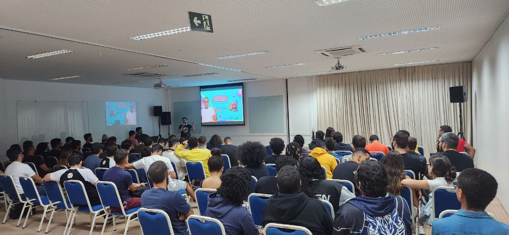
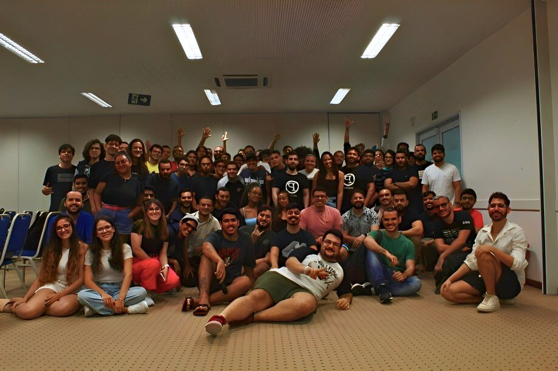
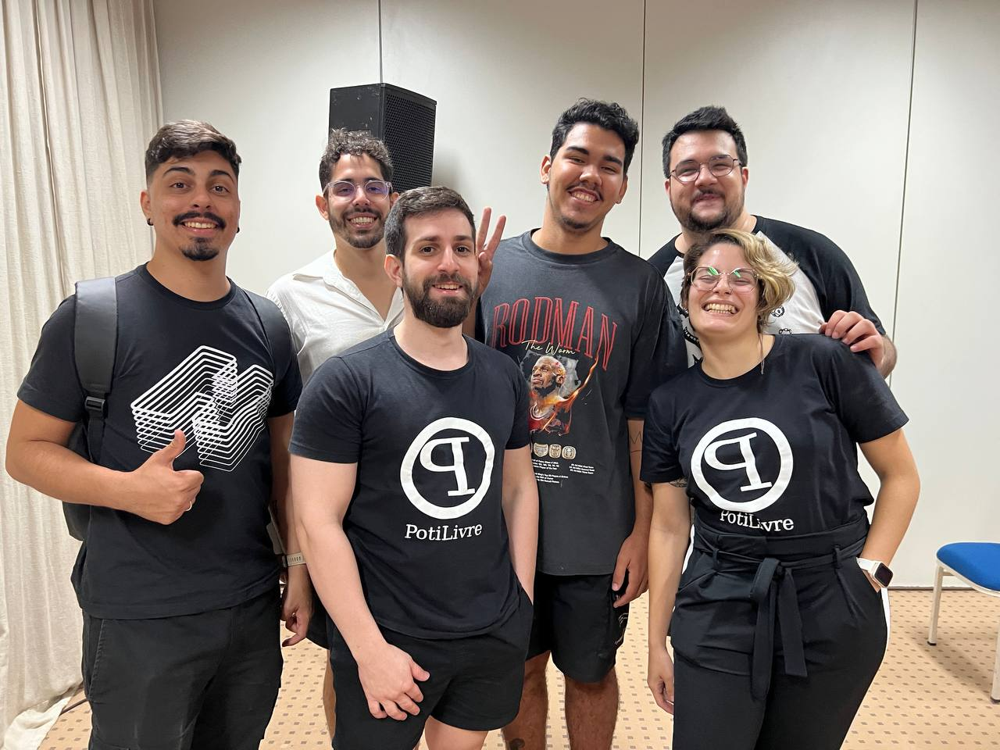
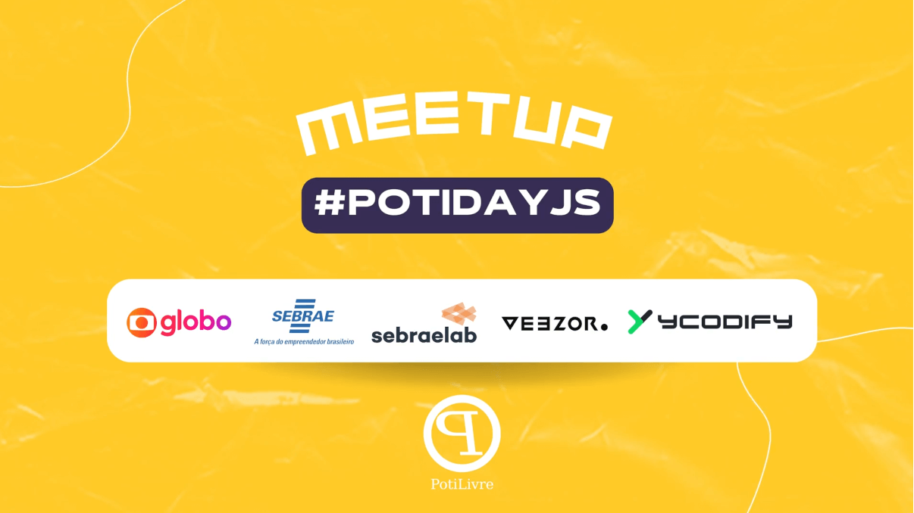

Para quem não conhece, o PotiDay são encontros realizados pela comunidade potiguar de software livre([PotiLivre](https://potilivre.org/)) para discutir determinado tema e sua relação com o Software Livre. O primeiro PotiDay foi com a temática de dados aberto(PotiDay Dados), vocês podem ler o que aconteceu [acessando essa postagem](https://www.potilivre.org/noticias/559-encontro-potiday-dados) no site da PotiLivre . Dessa vez, organizamos PotiDay com o tema de Javascript(PotiDay JS).

O PotiDay JS ocorreu em 01 de julho de 2023, no Sebrae RN. Contamos com 133 inscritos, dos quais 72 estiveram presentes. O evento foi completamente gratuito, com o intuito de atender às necessidades alimentares de todos os participantes, incluindo restrições a glúten e lactose, além de opções veganas.

Foi um evento incrível, repleto de apresentações realizadas pela própria comunidade, com o propósito de compartilhar conhecimentos e experiências enriquecedoras. Queremos agradecer a cada pessoa que contribuiu para o sucesso do nosso encontro.

## Agradecimento aos palestrantes

Muito obrigado aos palestrantes que compartilharam seus conhecimentos e por dedicarem seu tempo e compartilharem suas experiências valiosas. Suas apresentações foram fascinantes, proporcionando uma visão interessante sobre cada  tema abordado.

\
\
Abaixo está o título da atividade o link para acessar o slide:\
\
DevSec - Entendendo e corrigindo vulnerabilidades de Sessão e XSS  - Fernando Guisso [Link do slide](https://guisso.dev/talks/xss-session)\
Template Methods na prática - Isaac Batista [Link do slide](template-methods-na-pratica.pdf)\
Desvendando Padrões de Renderização de Aplicações Web - Maurício Bruno  [Link do slide](desvendando-padroes-de-renderizacao-de-apps-web.pdf)\
Testes unitários: por que os escrever no front-end? - Antony Lemos [Link do slide](testes-no-front-end.pdf)\
Criando sua primeira lib com JS - Um guia para democratizar a Web - Anderson Santos [Link do slide](criando-sua-primeira-lib-com-js.pdf)\
\

## Agradecemos principalmente a sua participação

Agradecemos imensamente a todos que participaram do PotiDay JS. Sua presença foi fundamental para o sucesso deste evento, estamos muito gratos por fazerem parte dessa jornada. Esperamos contar com vocês em futuros encontros, continuando a fortalecer e inspirar nossa comunidade, tornando o PotiDay um momento de aprendizado e crescimento coletivo.

## Agradecimento aos organizadores 

Fazemos aqui um agradecimento especial à nossa equipe de organização dedicada. Vocês trabalharam incansavelmente nos bastidores para garantir que cada detalhe do evento fosse perfeito. Desde o planejamento inicial, reuniões com patrocinadores, organização dos horários, reserva das salas, coffeebreak com alimentação gratuita e com suporte para pessoas com restrições, emissão de certificados, criação das artes e gestão das redes sociais e muito mais! Vocês mostraram profissionalismo e comprometimento com a comunidade. O sucesso do evento não seria possível sem vocês. 

## Agradecimento aos Patrocinadores 

Queremos expressar também a nossa sincera gratidão aos nossos patrocinadores. Seu apoio foi fundamental para a realização do PotiDay JS. Agradecemos por acreditar na nossa visão e por contribuir para o sucesso do evento pois nos permite continuar trazendo experiências enriquecedoras para a comunidade.

**Veezor** - "Com mais de 20 anos de experiência no mercado de TI, a Veezor arquiteta e constrói sua infraestrutura digital na nuvem. São vários clientes beneficiados e diversos serviços ofertados: execução e provisionamento de workloads e/ou aplicações, planejamento e migração, operação assistida, monitoramento, sustentação e suporte técnico”

**Globo** - “A globo é feita de gente que quer fazer diferente, fazer junto, fazer o futuro. Gente espalhada por  todo o país (e mundo!) trabalhando com conteúdo, notícias, negócios, tecnologia e brasilidade de sobra. Canais na TV aberta e por assinatura, produtos digitais como globoplay, Cartola, g1, ge, gshow e outros serviços estão reunidos no mesmo lugar, na mesma globo.”

**Ycodify** - "A Ycodify é uma plataforma Low Code, de BaaS (Backend as a Service), para otimizar o desenvolvimento de softwares e focar no que é relevante para o seu cliente! Com a Ycodify, você ganha mais tempo e oportunidades para investir no que realmente importa: concentrar sua atenção no seu negócio ou no negócio dos seus clientes. Desenvolva softwares com mais rapidez, economia e escalabilidade com a Ycodify. Saiba mais acessando nosso site: https://ycodify.com/"\
\
**Sebrae RN** e **Sebrae Lab** - Consultoria para empreendedores, há 49 anos apoiando o empreendedorismo no RN!

\
\
