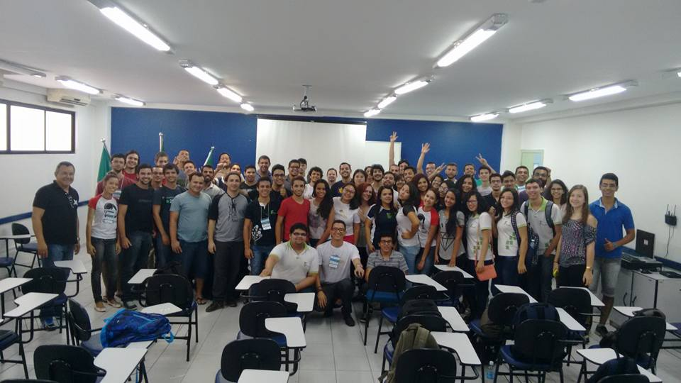
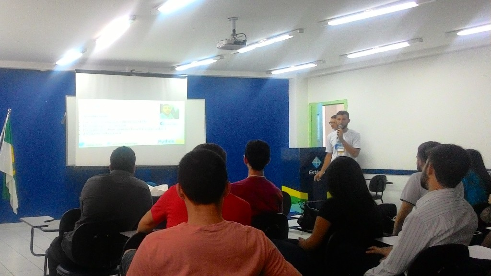
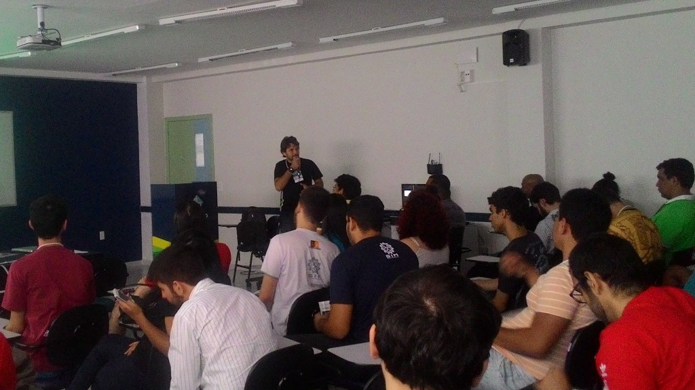
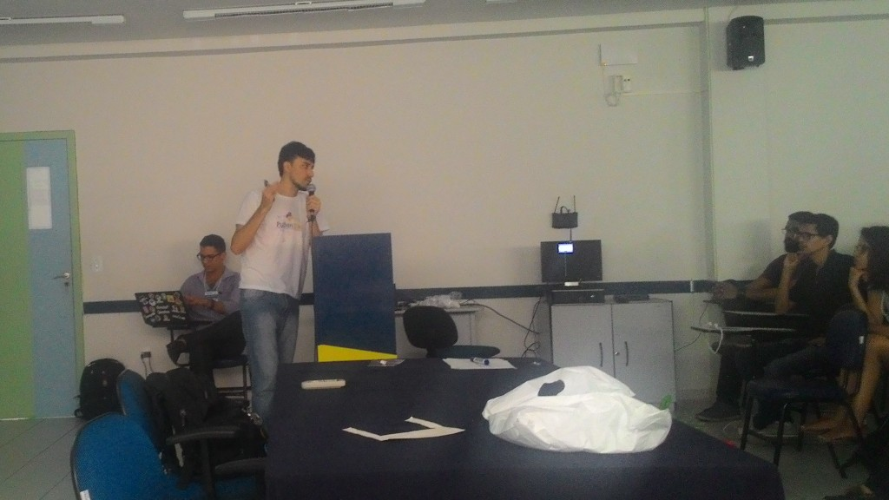
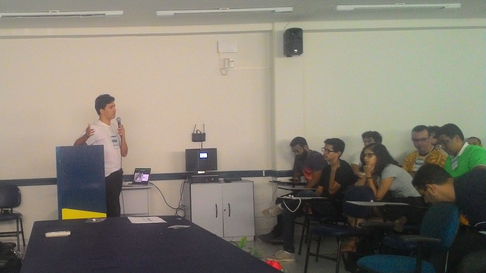
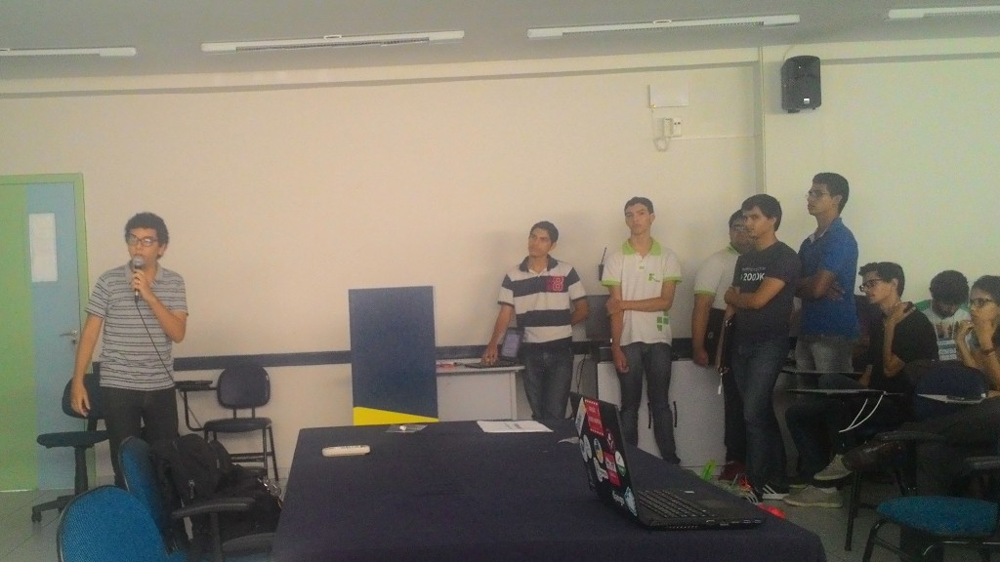
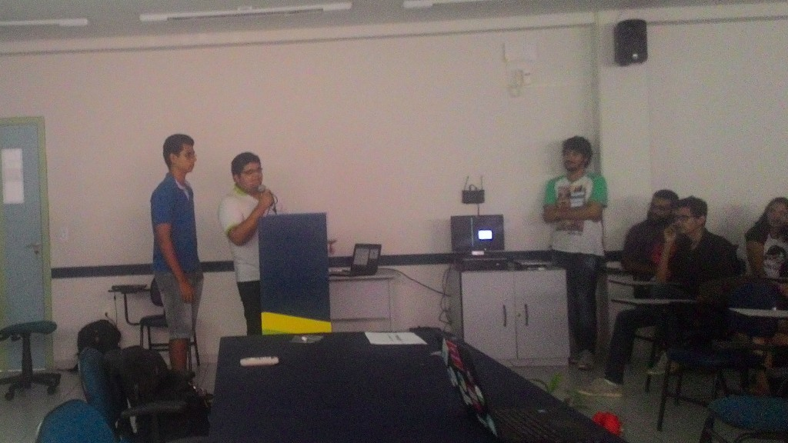
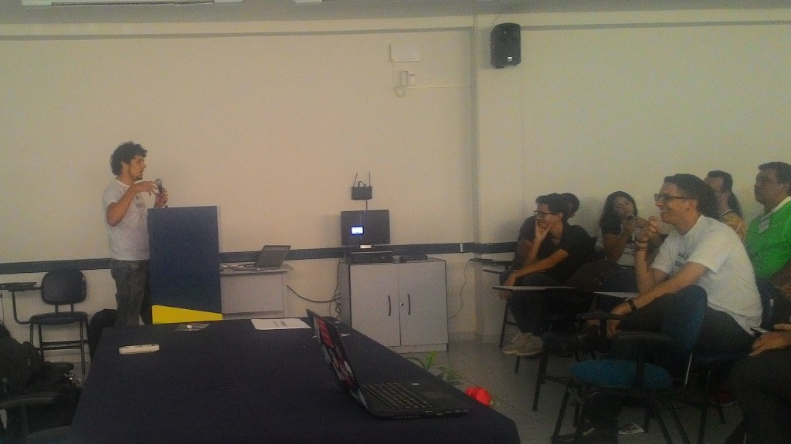

No dia 12 de dezembro de 2015 aconteceu em Natal nas instalações da Faculdade Estácio de Natal a primeira edição do Python Day Natal organizado pelo Grupo de usuários Python do Estado do Rio Grande do Norte (GruPy-RN).

O evento teve o objetivo de levar mais informações sobre a plataforma de desenvolvimento Python aos programadores e estimular esta linguagem no mercado local. O evento ainda teve a participação de uma caravana de estudantes do IFRN Campus João Câmara.

O Python Day Natal teve dia inteiro de atividades relacionadas à linguagem de programação Python com palestras, a hora do código e troca de experiências, além de sorteio de brindes.

As palestras ministradas no evento foram:

\- ["Import Python"](http://pt.slideshare.net/josenildoaf/import-python) por [Júnior Farias](https://www.facebook.com/juniorfarias22);

\- "Diversidade na Comunidade Python" por [Emilly Leão](https://www.facebook.com/emilly.leao.3);

\- "[O Python na saúde pública brasileira](http://pt.slideshare.net/potilivre/python-na-sade-pblica-brasileira-marcel-ribeiro-dantas)" por [Marcel Ribeiro](https://www.facebook.com/ribeirodantasdm);

\- "[Python para WEB com Django](http://slides.com/jonhnathatrigueiro/deck#/)" por [Jonhnatha Trigueiro](https://www.facebook.com/joepreludian);

\- ["SUAP: Caso de Sucesso utilizando Python e Django no Serviço Público Federal"](http://pt.slideshare.net/allysonbarros/suap-caso-de-sucesso-utilizando-python-e-django-no-servio-pblico-federal) por [Allyson Barros](https://www.facebook.com/allysonbarrosrn);

\- "Criptografia com Python" por [Leo Kirotawa](https://www.facebook.com/kirotawa);

\- ["Conteinerizando suas Aplicações com Python"](https://speakerdeck.com/hudsonbrendon/conteinerizando-suas-aplicacoes-python) por [Hudson Brendon](https://www.facebook.com/hudson.brendon);

\- ["Flask: O pequeno príncipe"](https://speakerdeck.com/diegotoral/flask-o-pequeno-principe) por [Diego Toral](https://www.facebook.com/diegootoral).

Após as palestras aconteceram ainda as "lightning talks" que foram a hora mais democrática do evento, onde os participantes tiveram 5 minutos para apresentar suas ideias ou projetos, entre elas [José Roberto](https://www.facebook.com/josehroberto) aproveitou e apresentou como funciona a [Comunidade PotiLivre](http://pt.slideshare.net/potilivre/participe-da-comunidade-potilivre).

Finalizando o evento aconteceu no laboratório de redes a Hora do Código.

## Fotos

*Amostra de 8 fotos das 15 registradas neste evento.*

