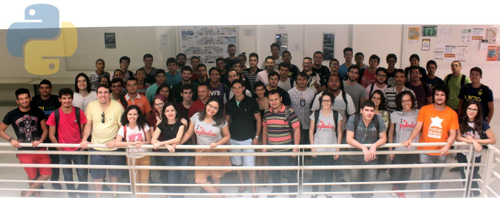
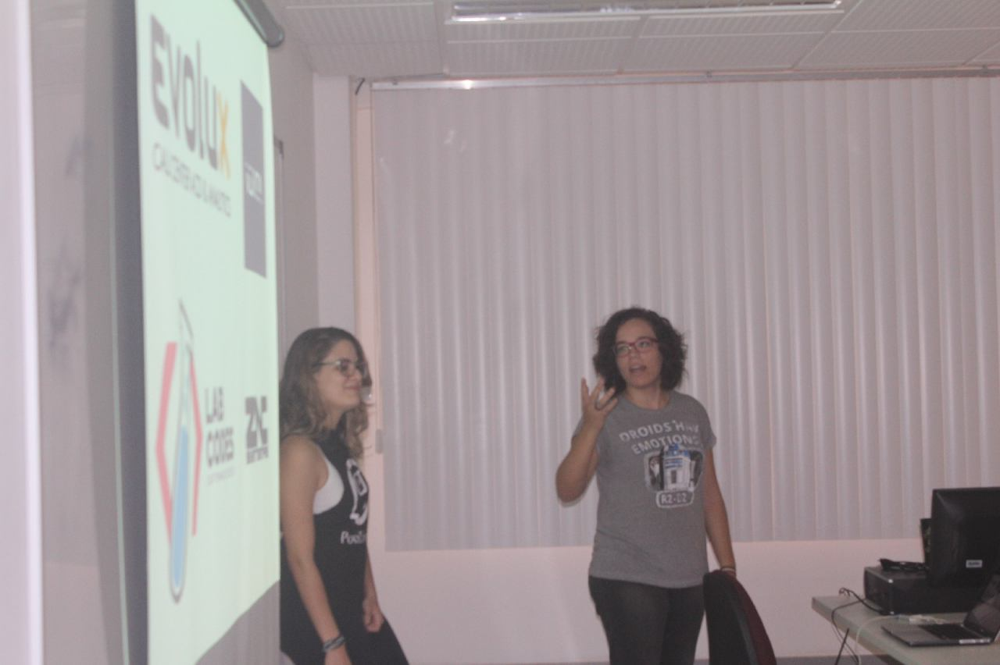
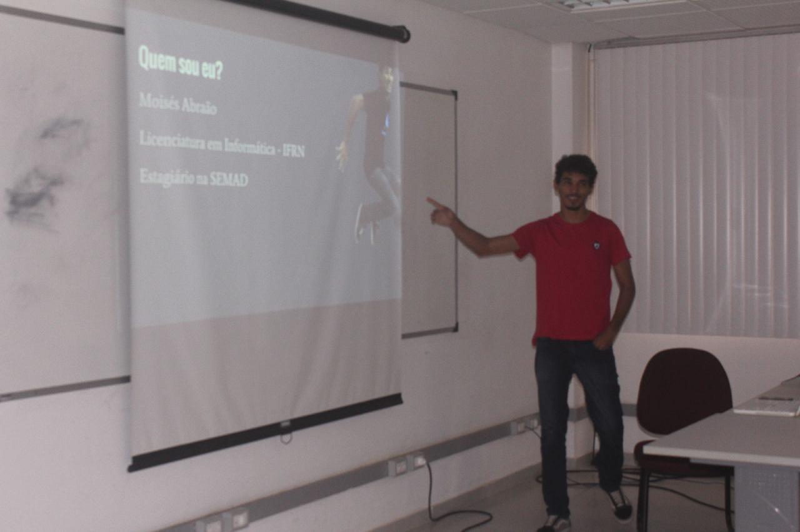
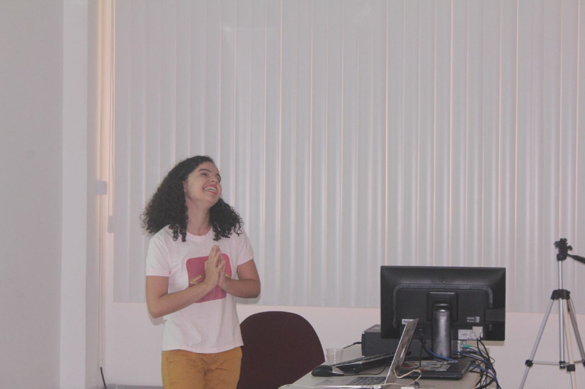
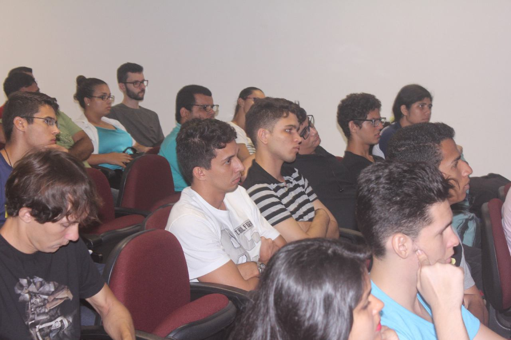
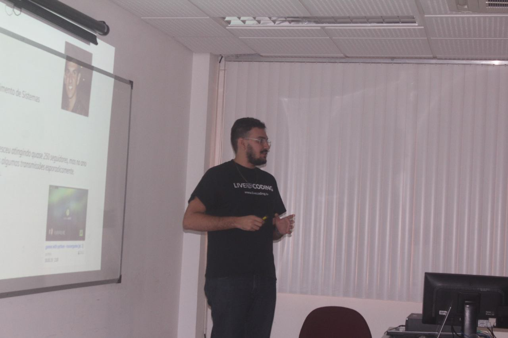
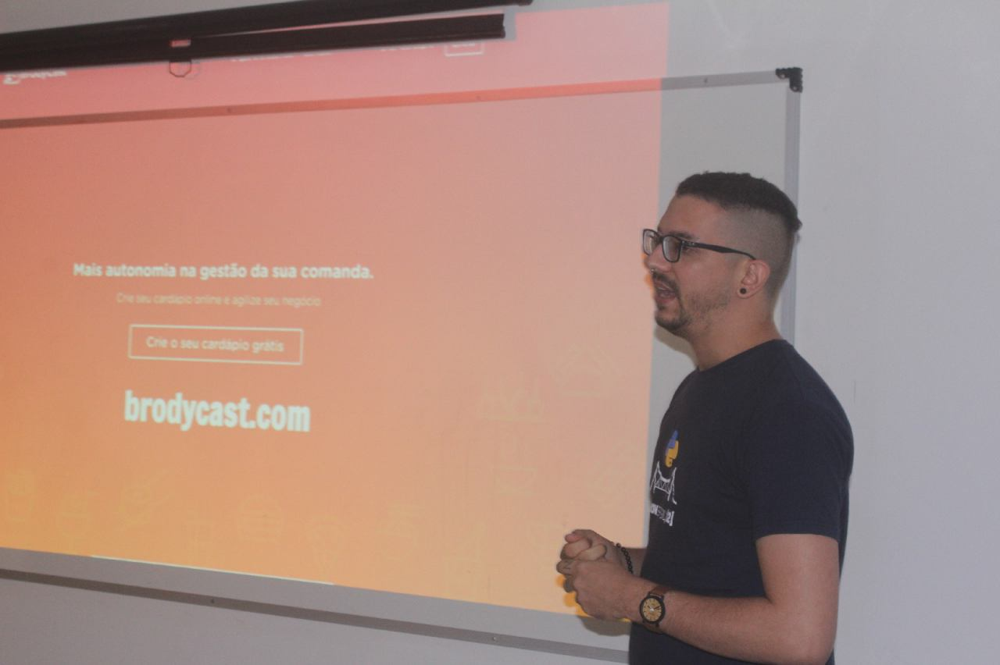
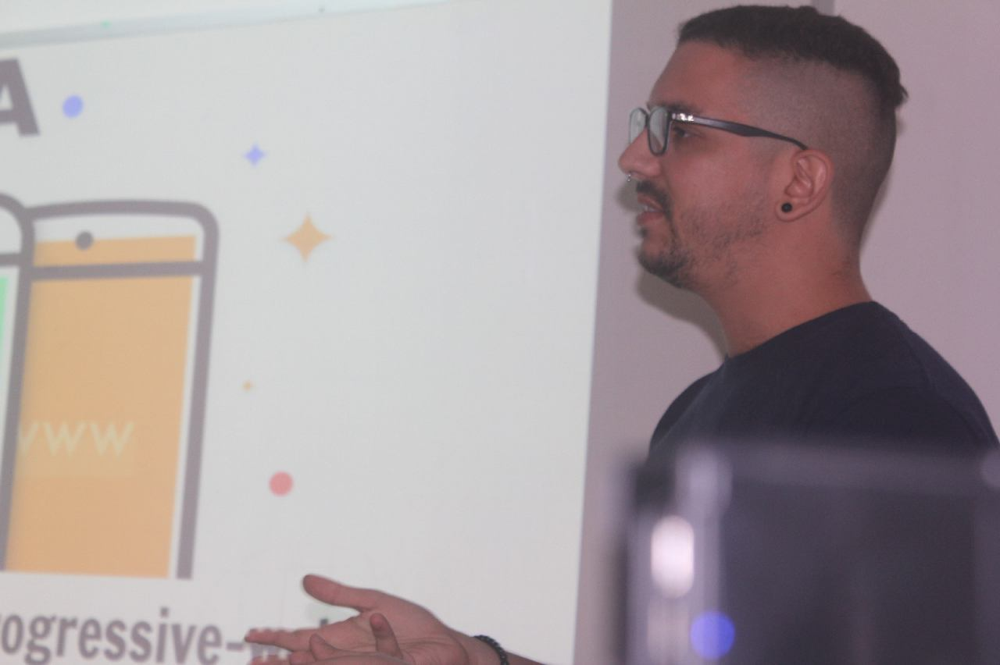

No dia 17 de dezembro de 2016 aconteceu em Natal, nas instalações do Instituto Metrópole Digital/UFRN, a segunda edição do Python Day Natal que foi organizado pela PotiLivre, grupo de usuários de software livre do Rio Grande do Norte e pelo GruPy-RN. O evento teve o objetivo de levar mais informações sobre a plataforma de desenvolvimento Python aos programadores e afirmar essa linguagem no mercado local.

O Python Day Natal foi um dia inteiro de atividades relacionadas à linguagem de programação Python com palestras e troca de experiências. As palestras e palestrantes foram:

- Python: o poder da linguagem, mercado de trabalho e diversidade por [Gabriela Cavalcante da Silva](https://www.facebook.com/gabi.cavalcante.silva) e [Ana Clara Nobre](https://www.facebook.com/claranobre) da PyLadies;
- Speakerfight, mentiras que nunca te contaram sobre software livre por [Luan Fonseca](https://www.facebook.com/luanfonceca);
- A jornada de um programador júnior e um amor chamado Python por [Moisés Abraão](https://www.facebook.com/moises.abraao.9);
- print("Poesia Compilada e Python") por [Soraya Roberta](https://www.facebook.com/soraya.medeiros.52);
- Python e sua estrutura de microsserviços dentro da AWS por [Arthur Cohen](https://www.facebook.com/arthur.cohen.7);
- PyGame e sua simplicidade na criação de jogos por Por [Yuri Freire](https://www.facebook.com/YuriiFreire);
- Introdução à Machine learn com Python por [Randson Cunha](https://www.facebook.com/RandsonCunha) e
- Python, Startups e noites mal dormidas por [Hudson Brendon](https://www.facebook.com/hudson.brendon).

No período da tarde, em paralelo ao evento, aconteceu também um "sprint" com as integrantes do PyLadies. No final tivemos ainda as "lightning talks" onde os participantes tiveram alguns minutos para apresentar suas ideias ou projetos.

Abaixo temos a gravação da palestra Python: o poder da linguagem, mercado de trabalho e diversidade ministrada por [Gabriela Cavalcante da Silva](https://www.facebook.com/gabi.cavalcante.silva) e [Ana Clara Nobre](https://www.facebook.com/claranobre), este vídeo foi produzido por [Moisés Abraão](https://www.facebook.com/moises.abraao.9).

# Ocorreu um erro.

Não é possível executar o JavaScript.

## Fotos

*Amostra de 8 fotos das 81 registradas neste evento.*

