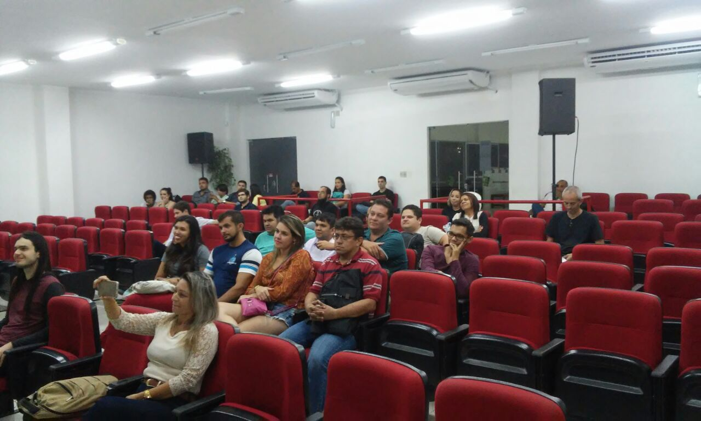
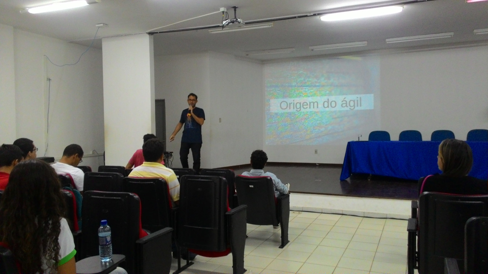
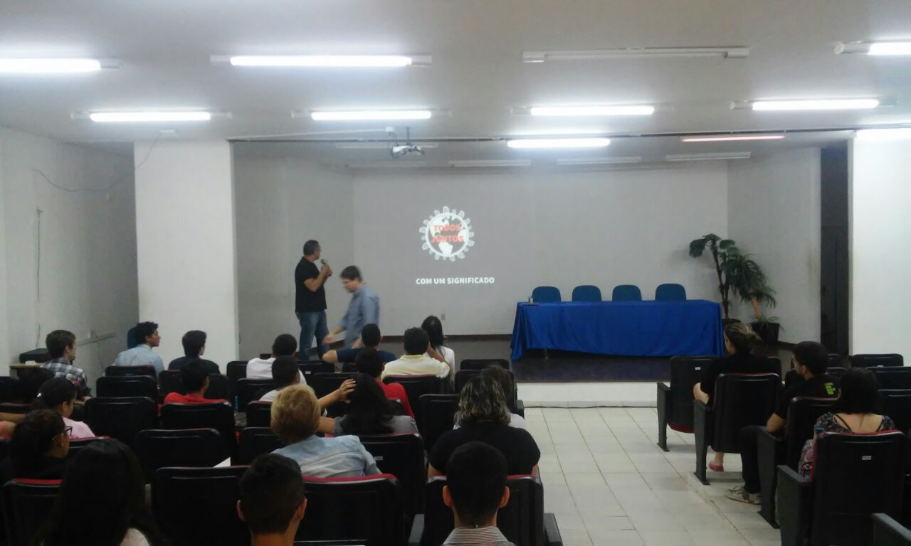
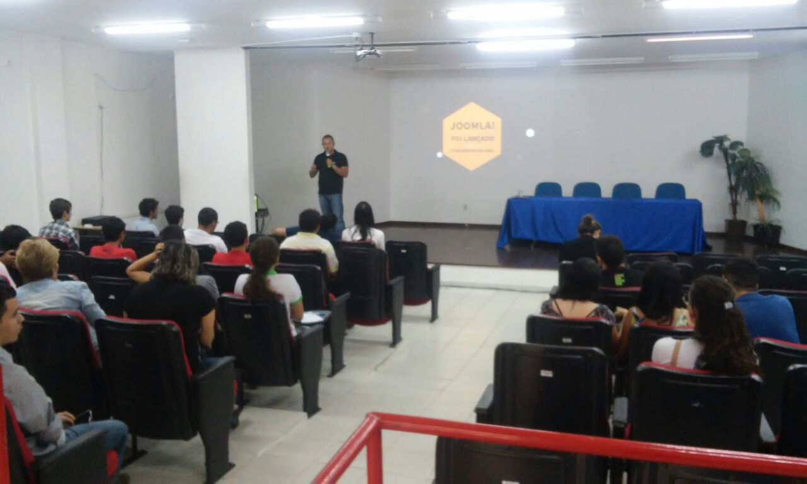
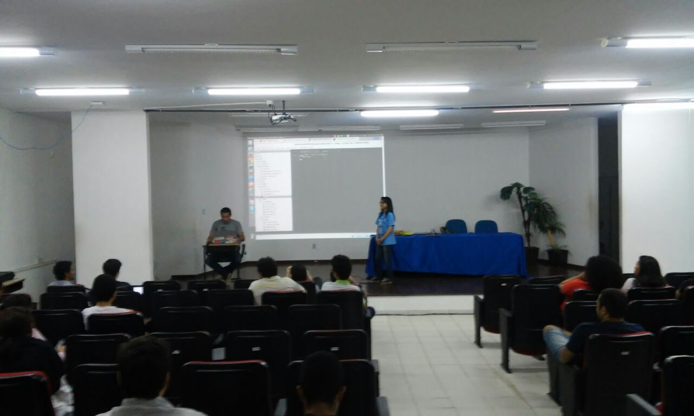
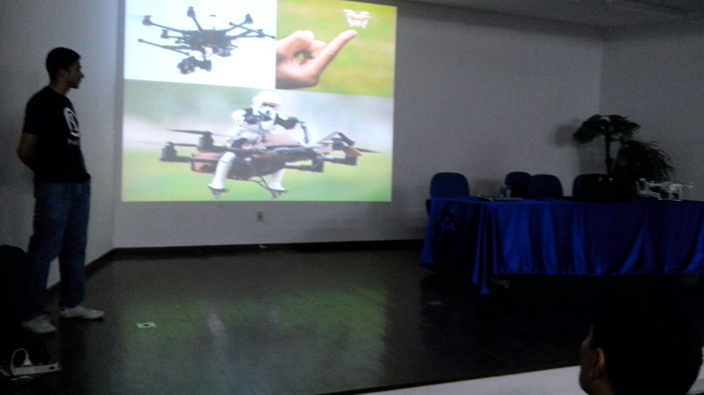
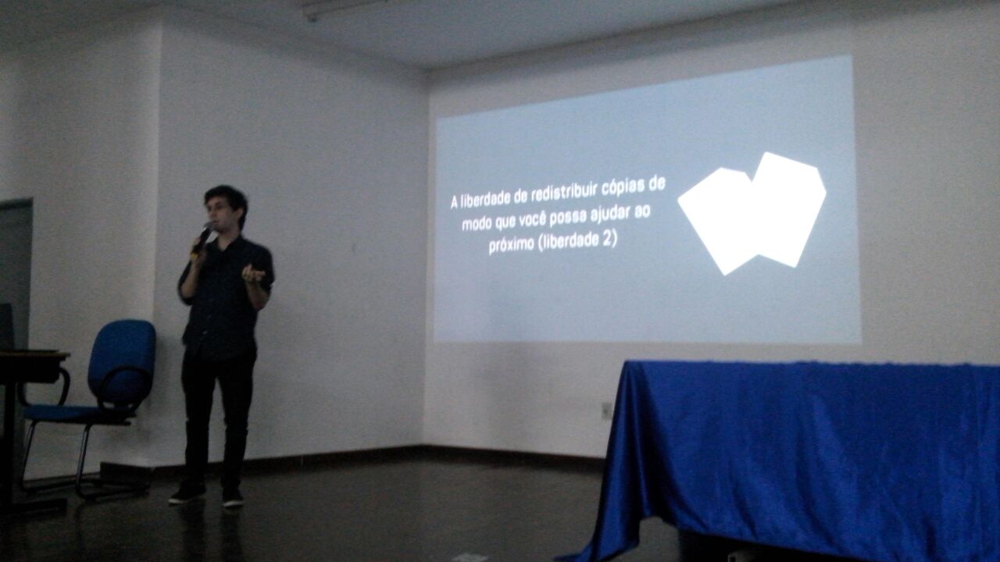
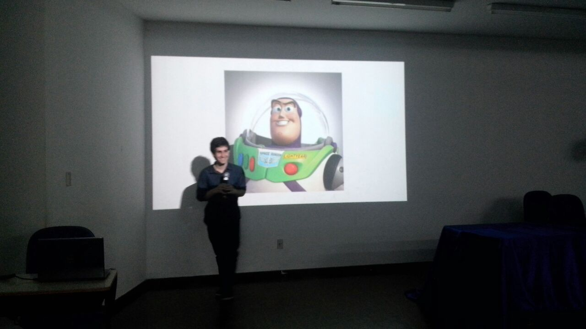

A Coordenação do Curso de Licenciatura em Informática do IFRN Campus Natal Zona Norte com a parceria do Grupo de Usuários de Software Livre do Rio Grande do Norte, PotiLivre, realizou nos dias 8 e 9 de agosto de 2016 a III Semana de Licenciatura em Informática (SELINFO).

O evento teve em sua programação palestras e mesas-redondas sobre o tema "Tecnologias Livres Aplicadas à Educação".

Confira a relação das palestras:

- Conceito de Liberdade do Software - [Pablo Capistrano](https://www.facebook.com/pablo.capistrano.9);
- CODE GIRL - Estimulando a participação feminina no mercado de TI - Suzyanne Queiroz;
- [Pedagogia da Gambiarra](http://www.slideshare.net/potilivre/por-uma-pedagogia-da-gambiarra) - [Ana Eliza Trajano](https://www.facebook.com/anaeliza.trajano);
- A Experiências do Ensino de Estatística Utilizando a Linguagem de Programação R - [Thiago Valentim](https://www.facebook.com/ThiagoASA);
- Como Participar da Comunidade de Software Livre - [Moisés Abraão](https://www.facebook.com/moises.abraao.9);
- Iniciativa Fedora - [Jonhnatha Trigueiro](https://www.facebook.com/joepreludian);
- Javascript na Internet das Coisas - [Hudson Brendon](https://www.facebook.com/hudson.brendon);
- [A Jornada de uma Padawan](http://emmanuellerichard.onbit.com.br/2016/04/a-jornada-de-uma-padawan/) - [Emmanuele Richard](https://www.facebook.com/emmanuelle.richard.0);
- [Gerenciando a sua Vida de Maneira Ágil - Aprendendo Técnicas de Gerenciamento de Projeto para Transformar seus Sonhos em Realidade](http://www.slideshare.net/pbaesse/gerenciando-a-sua-vida-de-maneira-gil) - [Pedro Baesse](https://www.facebook.com/pBaesse);
- [O que é Joomla?](http://pt.slideshare.net/josehroberto/o-que-joomla-iii-semana-de-licenciatura-em-informtica-ifrn-camupus-zona-norte) - [José Roberto da Costa Ferreira](https://www.facebook.com/josehroberto);
- [Acessibilidade Web: um Panorama Sobre a Web Livre e de Fácil Acesso](http://slides.com/netoguimaraes/acessibilidade#/) - [Neto Guimarães](https://www.facebook.com/netutu);
- Ensino Àgil de Programação - [Emmanuele Richard](https://www.facebook.com/emmanuelle.richard.0);
- Vulnerabilidades no Processo de Comando e Controle de Drones - [Eduardo Barros Santos](https://www.facebook.com/eduardobarros.santos);
- [Afinal de Contas, o que é Debian?](http://www.slideshare.net/potilivre/afinal-de-contas-o-que-o-debian) - [Allythy Souza](https://www.facebook.com/allythy.souza) e
- [KDE Edu & Linux Educacional: como o Projeto KDE, o Linux e o Software Livre podem mudar a educação brasileira](http://www.slideshare.net/potilivre/kde-edu-linux-educacional) - [Mário Araujo Xavier](https://www.facebook.com/marioiurd3).

## Fotos

*Amostra de 8 fotos das 48 registradas neste evento.*

