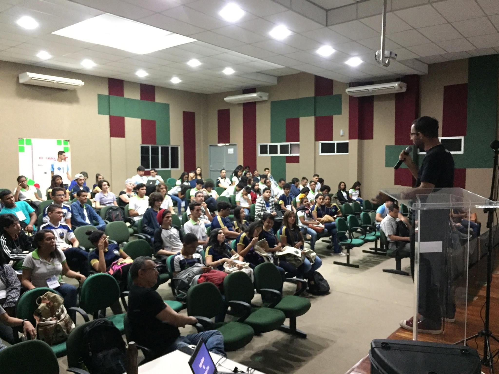
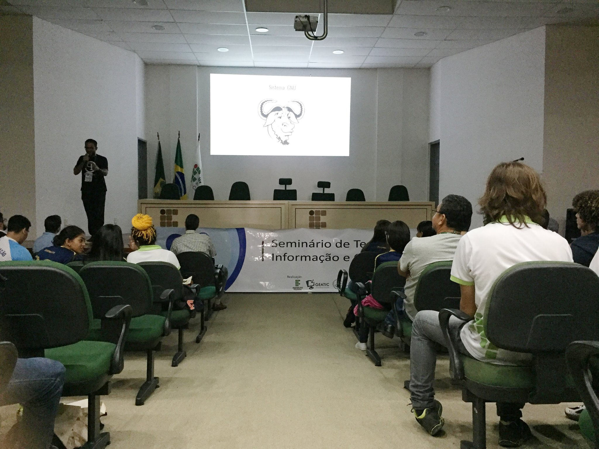
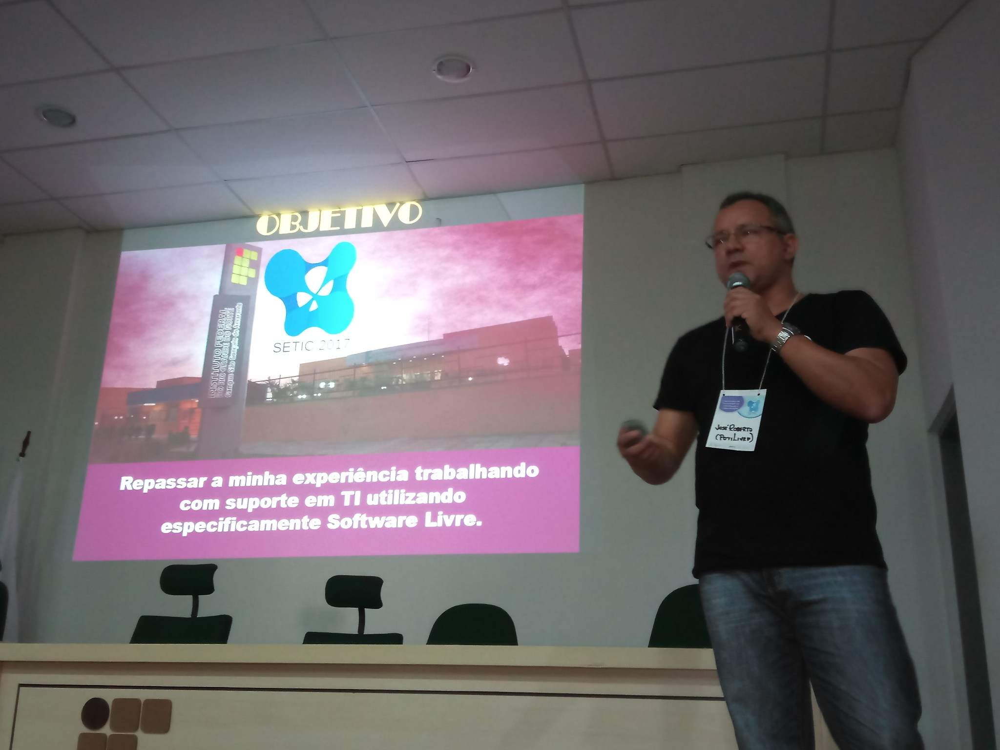
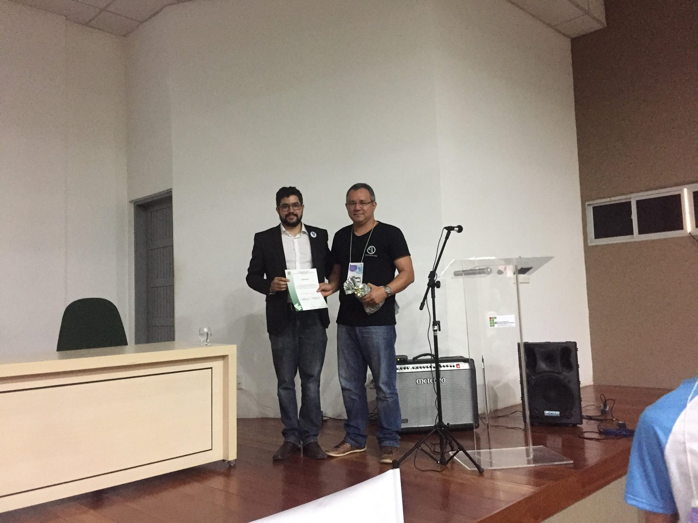
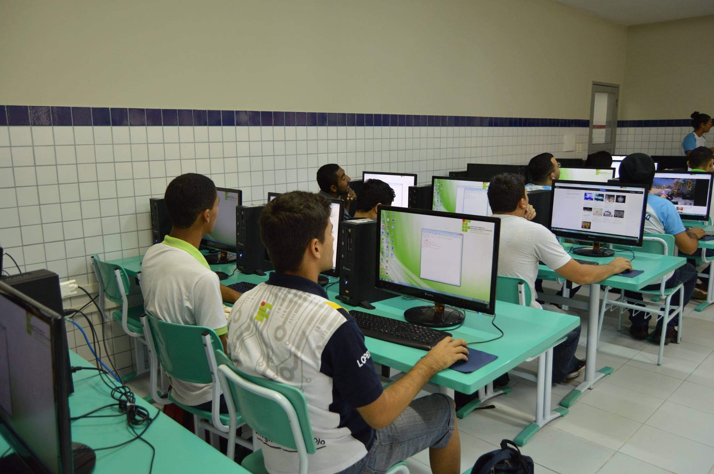
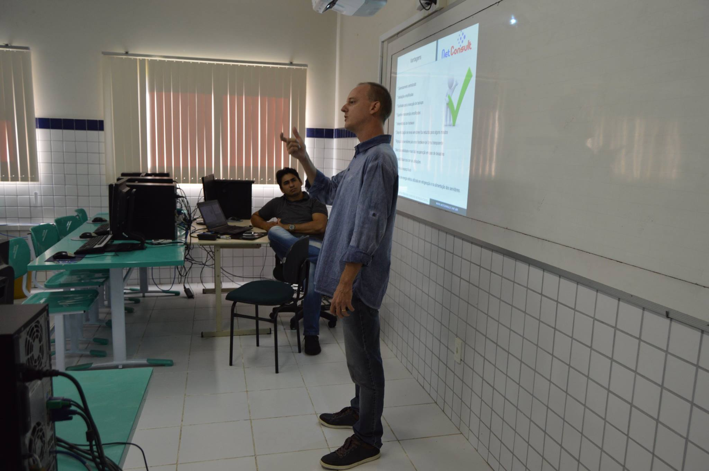
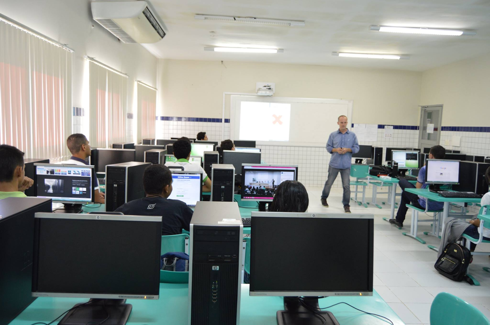
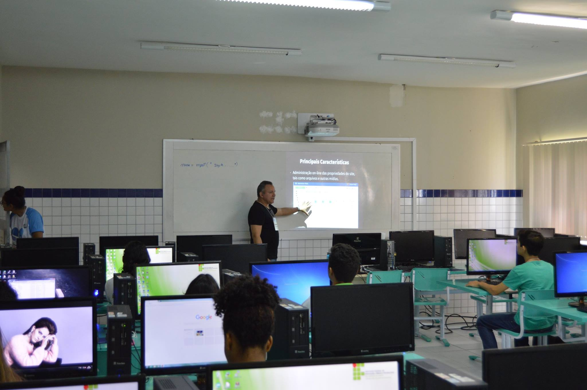

Realizou-se entre os dias 25 e 27 de maio de 2017, o [I Seminário de Tecnologia da Informação e Comunicação (SETIC)](http://eventos.ifrn.edu.br/setic/) do [IFRN Campus São Gonçalo do Amarante](http://portal.ifrn.edu.br/campus/saogoncalo) com a parceria da Comunidade Potiguar de Software Livre, PotiLivre.

O evento registrou mais de 600 inscritos, que tiveram a oportunidade de acompanhar diversas atividades como palestras, mesas-redondas, oficinas e exposições.

A Potilivre colaborou com a I SETIC com as seguintes atividades:

Palestras:

- [O que é Software Livre e Comunidade PotiLivre](https://pt.slideshare.net/potilivre/sofware-livre-e-comunidade-potilivre-setic-ifrnsga) por Profº [Pedro Baesse](https://www.facebook.com/pBaesse) e
- [Suporte em TI para Desktop com Software Livre](https://pt.slideshare.net/potilivre/suporte-em-ti-com-software-livre) por [José Roberto da Costa Ferreira](https://www.facebook.com/josehroberto).

Oficinas:

- [PyLadies Natal](https://www.facebook.com/PyLadiesNatal/) - Minicurso de Python por [Ana Clara Nobre](https://www.facebook.com/claranobre) e [Débora Azevedo](https://www.facebook.com/debora.azevedoo);
- [Virtualização e Conteinerização com Proxmox VE](https://pt.slideshare.net/potilivre/minicurso-virtualizacao-com-proxmox-maicon-wendhausen-flisol-natal-2017) e Segurança de Redes com GNU-Linux por [Maicon Wendhausen](https://www.facebook.com/maicon.wendhausen) e
- Desenvolvimento de SItes com CMS Joomla por [José Roberto da Costa Ferreira](https://www.facebook.com/josehroberto).

## Fotos

*Amostra de 8 fotos das 45 registradas neste evento.*

