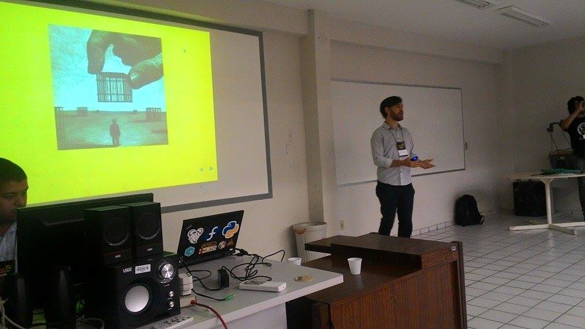
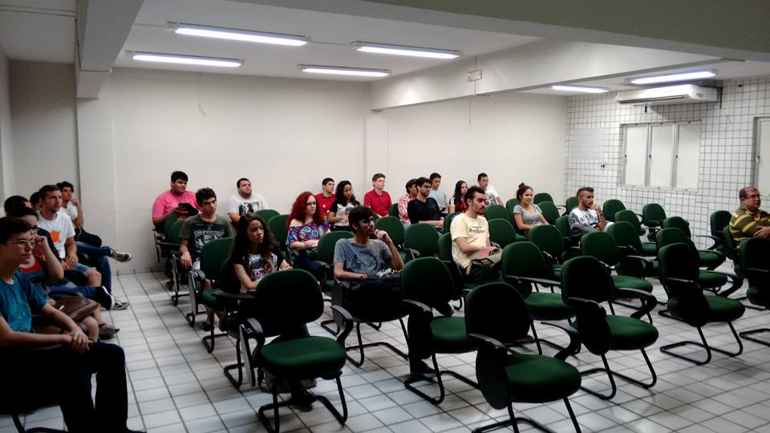
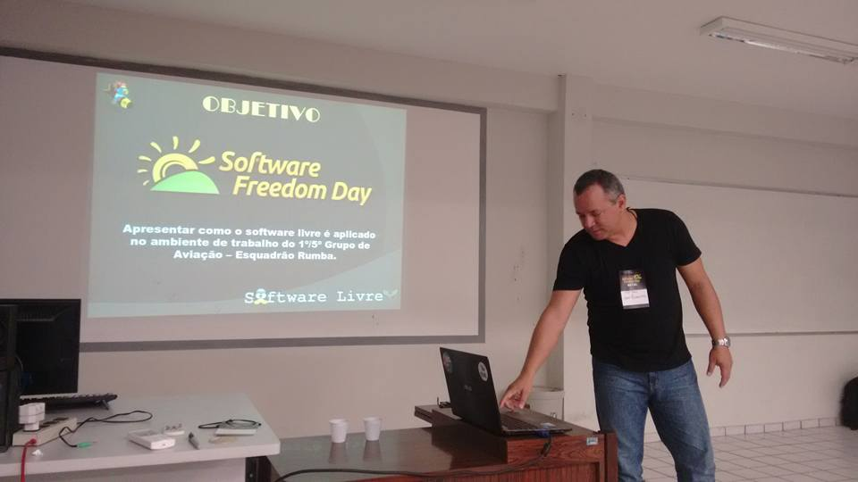
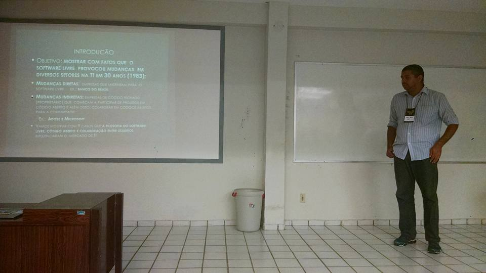
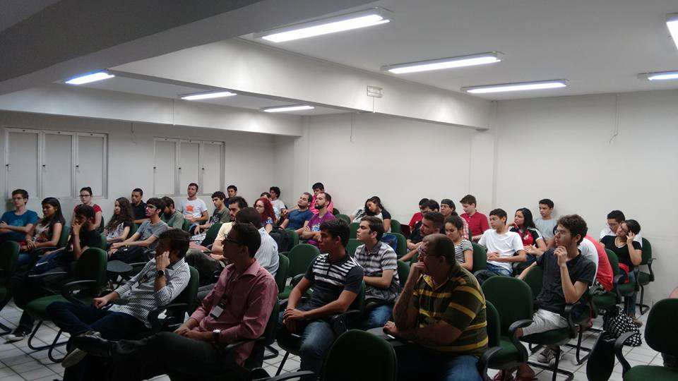
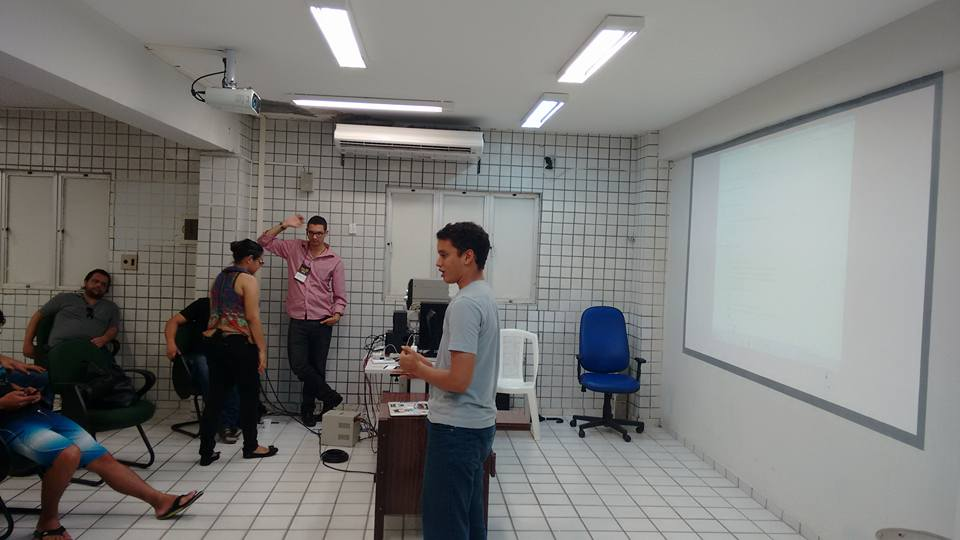
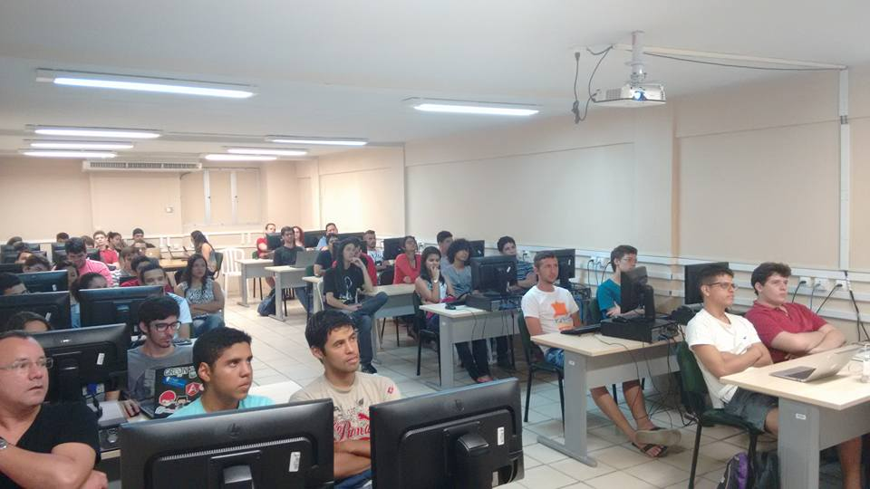
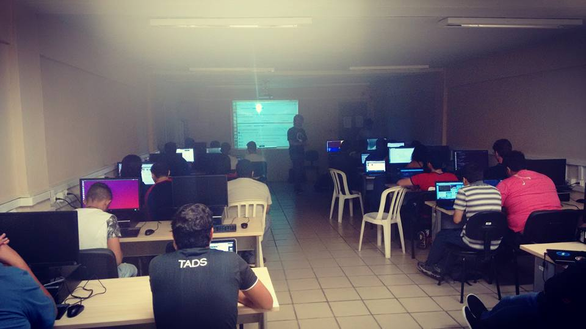

Foi comemorado o Software Freedom Day (Dia da Liberdade de Software), celebração mundial pela liberdade de pessoas envolvidas com programas de código aberto. A edição 2015 em Natal ocorreu no sábado, 19 de setembro, no IFRN Campus Natal Central.

O Software Freedom Day é mundial, gratuito e ocorreu simultaneamente em diversas cidades do mundo, sempre acontece no terceiro sábado de setembro. O SFD contou com o auxílio de voluntários.

Os participantes do evento tiveram a oportunidade de conhecer profissionais da área e trocar informações sobre o mundo do software livre. O SFD Natal 2015 contou com palestras e discussões relacionadas ao uso e aos benefícios oferecidos pelos programas de código aberto, além de minicursos.

As palestras ministradas no evento foram:

\- "Do que se trata o Software Freedom Day?" por Marcel Ribeiro Dantas;

\- "Aplicação de Software Livre no 1º/5º Grupo de Aviação" por José Roberto da Costa Ferreira;

\- "Influência do Software Livre no Mercado de TI" por Mário Araújo Xavier e

\- "Diversidade na Comunidade: PyLadies e Software Livre" por Débora Azevedo.

Ainda pelo período da tarde aconteceram dois minicursos:

\- "GIT" por Marcel Ribeiro Dantas e

\- "Como contribuir na pŕatica para Projetos de Software Livre" por Luan Fonseca de Farias.

## Fotos

*Amostra de 8 fotos das 15 registradas neste evento.*

