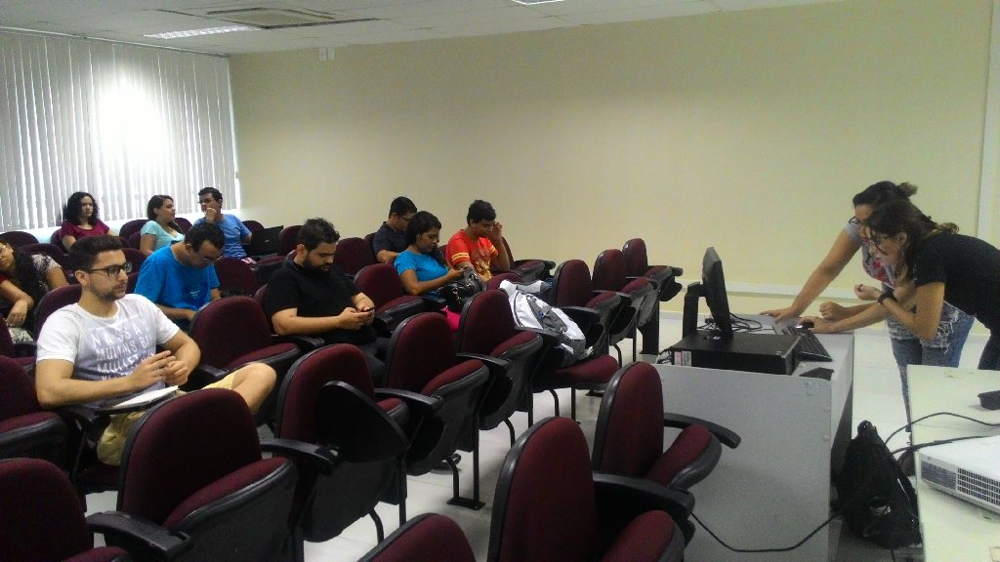
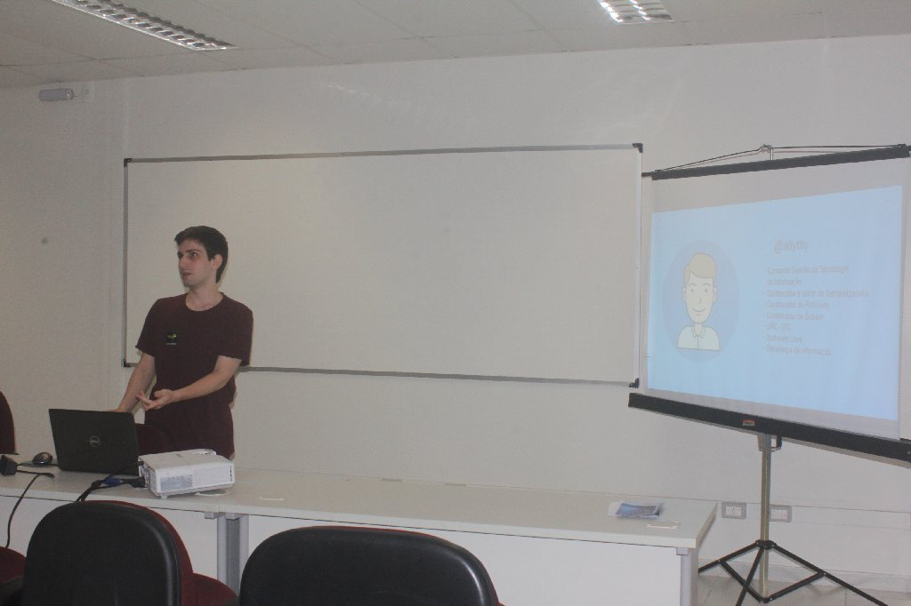
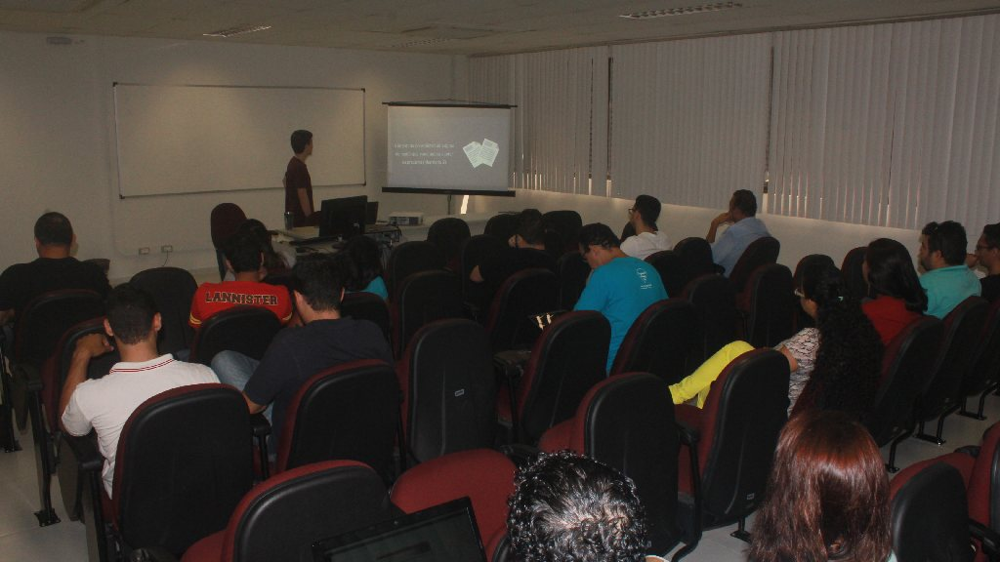
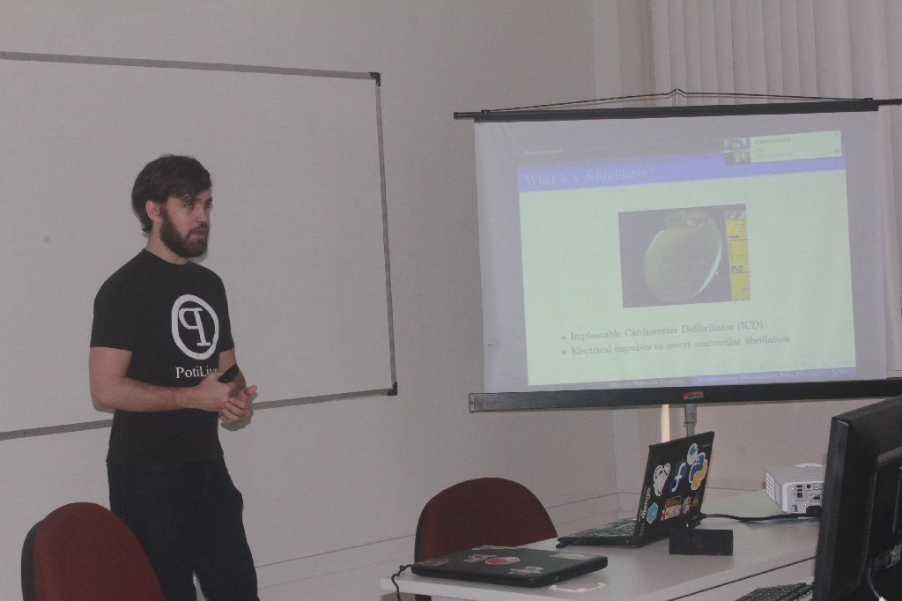
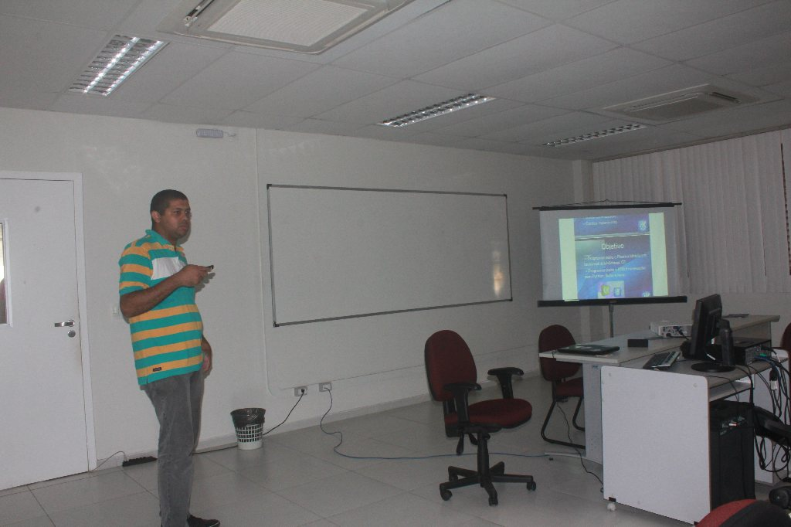
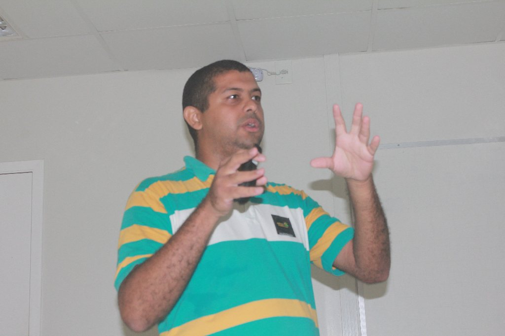
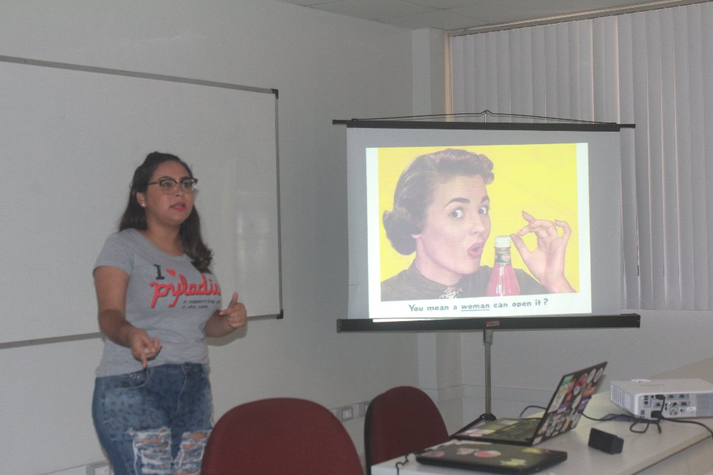
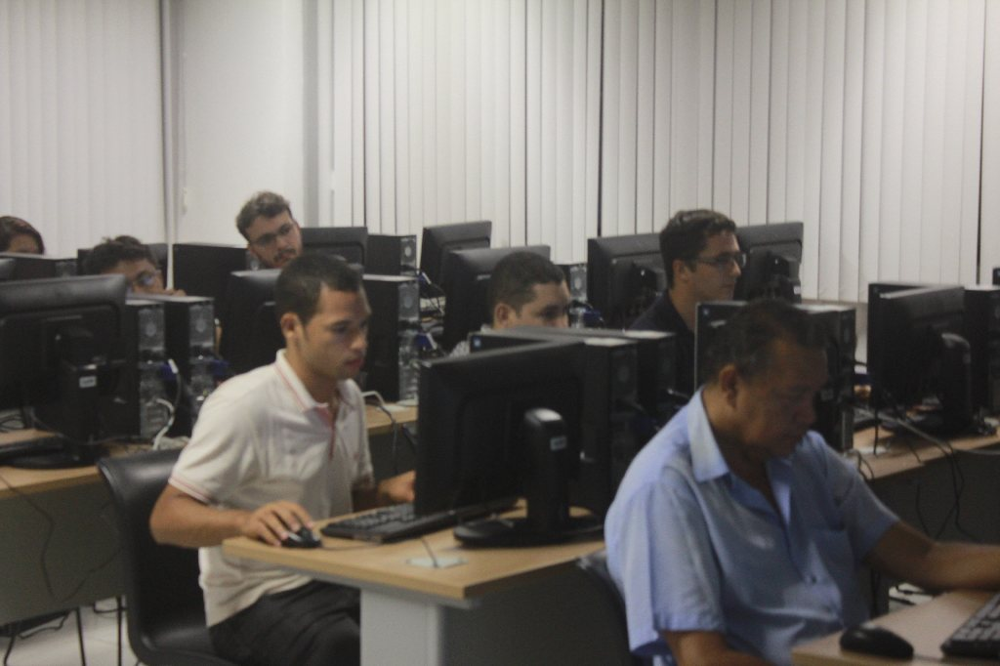

Foi comemorado mais uma vez em Natal o Software Freedom Day (Dia da Liberdade de Software), o evento que busca promover e incentivar o uso de Software Livre. A edição 2016 em Natal ocorreu no sábado, 17 de setembro, nas instalações do Instituto Metrópole Digital/UFRN e foi organizado pela PotiLivre, grupo de usuários de software livre do Rio Grande do Norte. O evento foi direcionado para usuários e entusiastas de tecnologia em geral.

Os participantes do evento tiveram a oportunidade de conhecer profissionais da área e trocar informações sobre o mundo do software livre. O SFD 2016 contou com palestras e discussões relacionadas ao uso e aos benefícios oferecidos pelos programas de código aberto, além de minicursos.

As palestras ministradas no evento foram:\
- "[Afinal de contas, o que é Software Livre?](http://pt.slideshare.net/potilivre/afinal-o-que-e-software-livre)" por [Allythy Souza](https://www.facebook.com/allythy.souza);\
- "[O que é Joomla?](http://pt.slideshare.net/potilivre/o-que-joomla-66192632)" por [José Roberto da Costa Ferreira;](https://www.facebook.com/josehroberto)\
- "[SFD Adverte: O Software não-livre pode ser prejudicial à sua saúde](http://pt.slideshare.net/potilivre/software-freedom-day-adverte-softwares-nao-livres-podem-ser-prejudiciais-a-saude)" por [Marcel Ribeiro Dantas](https://www.facebook.com/mribeirodantas);\
- "[KDE Mobile: Leve o KDE Plasma para o seu Android e codifique nesse projeto](http://pt.slideshare.net/potilivre/kde-mobile-leve-o-kde-plasma-para-o-seu-android-e-codifique-nesse-projeto-66176787)" por [Mário Araújo Xavier](https://www.facebook.com/marioiurd3) e\
- "Diversidade na Comunidade: PyLadies e Software Livre" por [Débora Azevedo](https://www.facebook.com/debora.azevedoo).

Ainda pelo período da tarde aconteceram dois minicursos:

\- "Minicurso de Desenvolvimento de Sites Com CMS Joomla" por [José Roberto da Costa Ferreira](https://www.facebook.com/josehroberto) e\
- "[Do Terminal ao Python: Vamos codificar e decodificar juntos?](http://www.slideshare.net/potilivre/minicurso-do-terminal-ao-python)" - [Ana Clara Nobre](https://www.facebook.com/claranobre) e [Débora Azevedo](https://www.facebook.com/debora.azevedoo).

## Fotos

*Amostra de 8 fotos das 27 registradas neste evento.*

