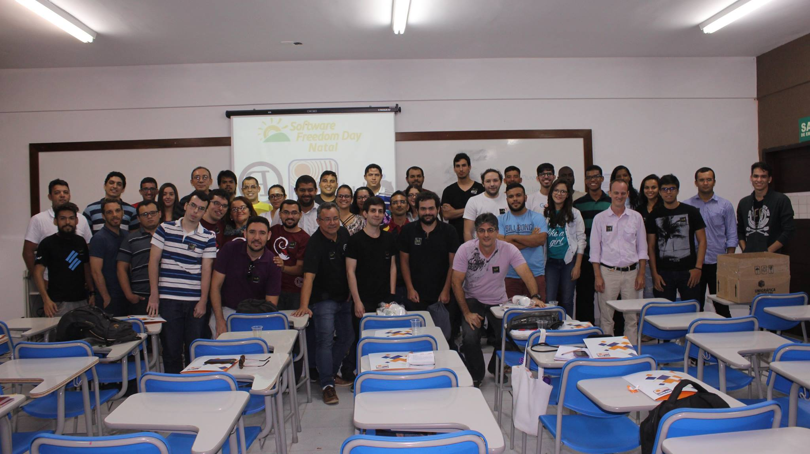
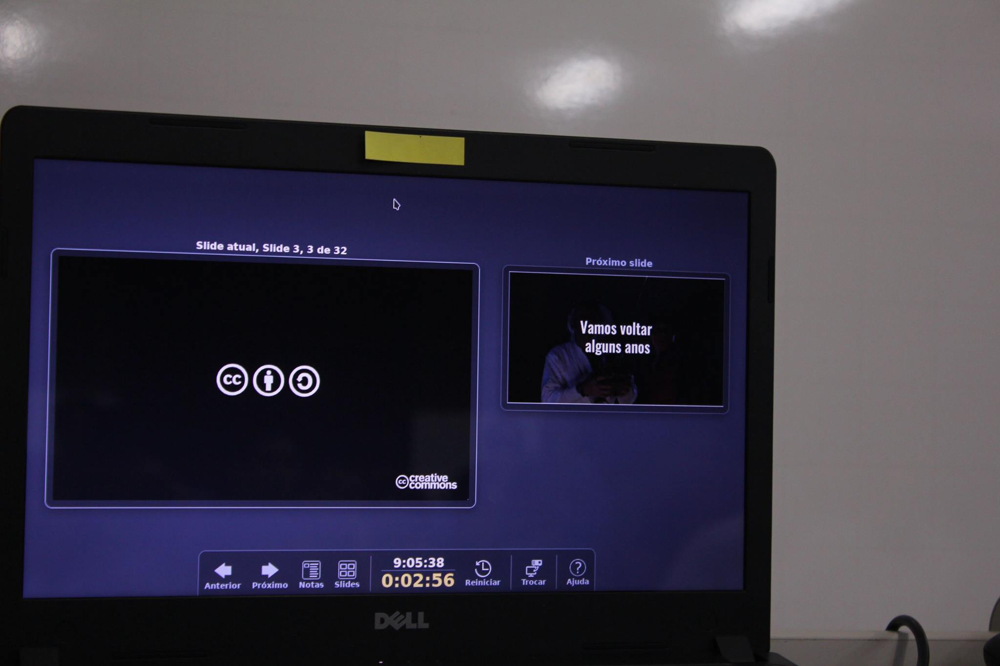
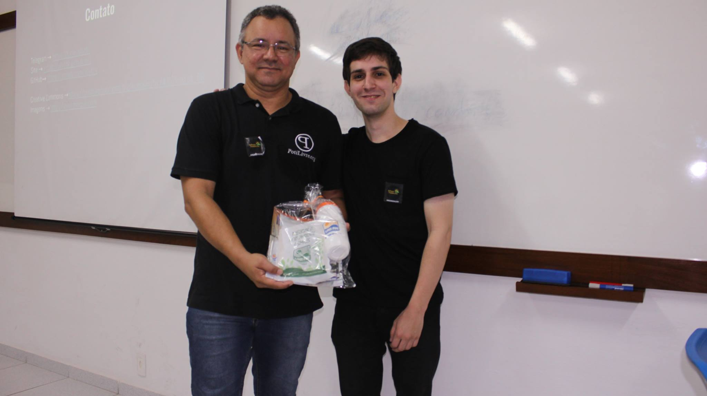
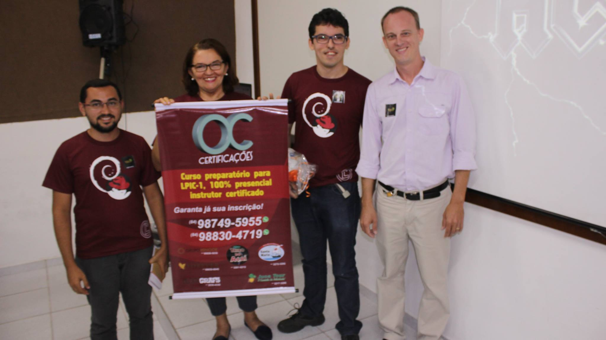
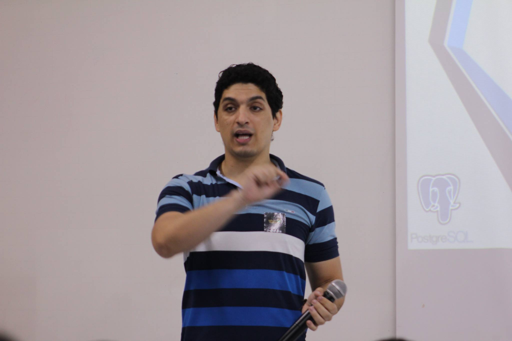
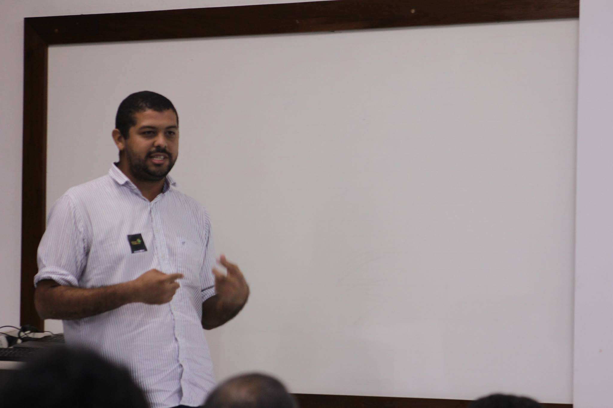
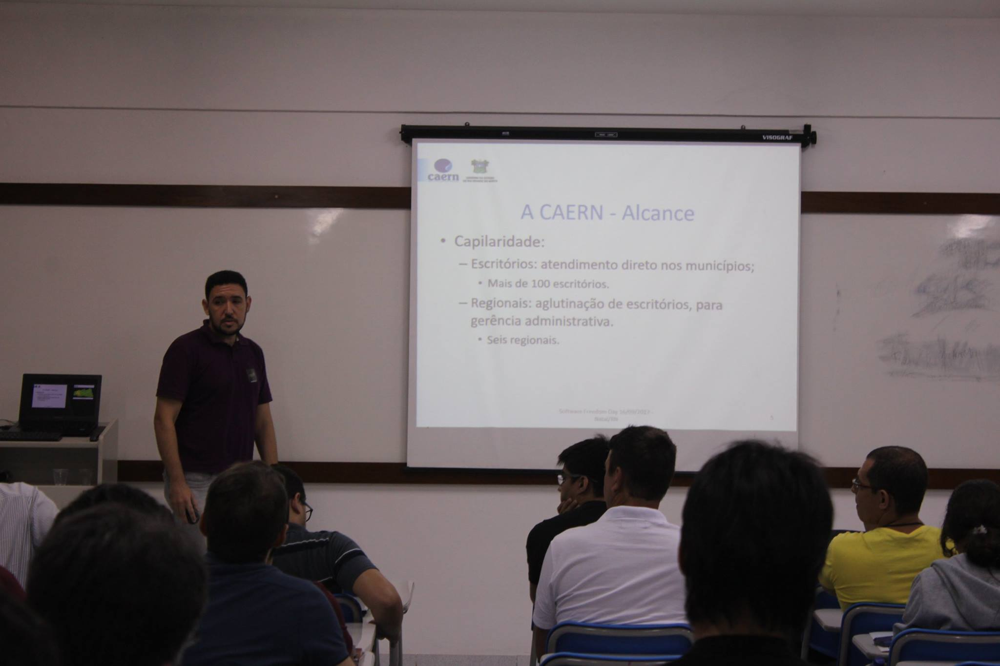
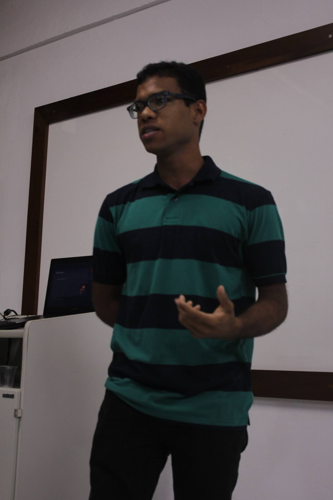

Foi comemorado mais uma vez em Natal o Software Freedom Day (Dia da Liberdade de Software), o evento que busca promover e incentivar o uso de Software Livre. A edição 2017 em Natal ocorreu no sábado, 16 de setembro, nas instalações do Centro Universitário do Rio Grande do Norte (UNI-RN) e foi organizado pela PotiLivre, Comunidade Potiguar de Software Livre. O evento foi direcionado para usuários e entusiastas de tecnologia em geral.

Os participantes do evento tiveram a oportunidade de conhecer profissionais da área e trocar informações sobre o mundo do software livre. O SFD 2017 contou com palestras e discussões relacionadas ao uso e aos benefícios oferecidos pelos programas de código aberto, além de muito networking.

As palestras ministradas no evento foram:

- [Segurança de Redes com GNU/Linux](https://pt.slideshare.net/potilivre/seguranca-de-redes-com-gnu-linux-maicon-wendhausen-sfd2017) por Maicon Wendhausen;

- [Afinal de contas, O que é Software Livre?](https://pt.slideshare.net/potilivre/afinal-de-contas-o-que-e-software-livre-allythy-rennan-medeiros-de-souza-sfd2017) por Allythy Rennan Medeiros de Souza;

- [Importância das Certificações para o Profissional de Software Livre](https://pt.slideshare.net/potilivre/importancia-das-certificacoes-para-o-profissional-de-software-livre-matheus-oliveira-sfd2017-79851111) por Matheus Cavalcante de Oliveira;

- [Banco de dados PostgreSQL](https://pt.slideshare.net/potilivre/postgre-sql-tiago-corcelli-oliveira-e-silva-sfd2017) por Tiago Corcelli

- [Software Livre no Banco do Brasil: como o BB economizou 50 milhões de reais com ferramentas livres](https://pt.slideshare.net/potilivre/software-livre-no-bb-final-mario-araujo-xavier-sfd2017) por Mario Araujo Xavier

- [Algumas soluções F.O.S.S adotadas pela CAERN](https://www.slideshare.net/WerneckCosta/apresentao-software-freedom-day-2017-natalrn-algumas-solues-foss-adotadas-pela-caern) por Werneck Bezerra Costa e

- [Softwares e Sistemas Operacionais Livres na busca pela inovação tecnológica](https://pt.slideshare.net/potilivre/softwares-e-so-livres-na-busca-pela-inovacao-tecnologica-felipe-alison-sfd2017) por Felipe Alison Jerônimo de Lima

O Software Freedom Day em Natal já faz parte da agenda do PotiLivre e conta com um público que tem bastante interesse em conhecer a filosofia do software livre, além de ser bastante participativo. Fica o convite para quem perdeu, não deixar de conferir a próxima edição deste evento e também a sugestão para a realização deste tipo de evento em mais cidades do Rio Grande do Norte.

## Fotos

*Amostra de 8 fotos das 65 registradas neste evento.*

