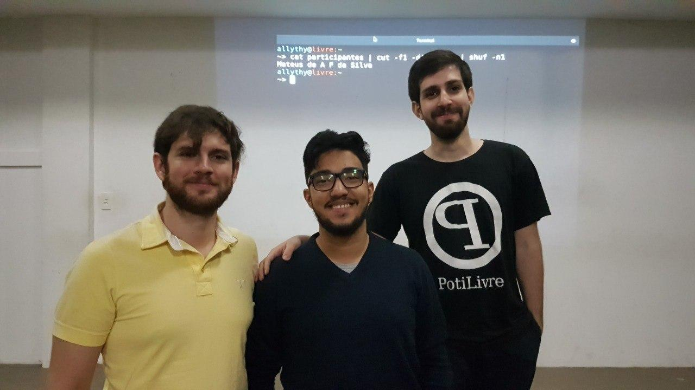
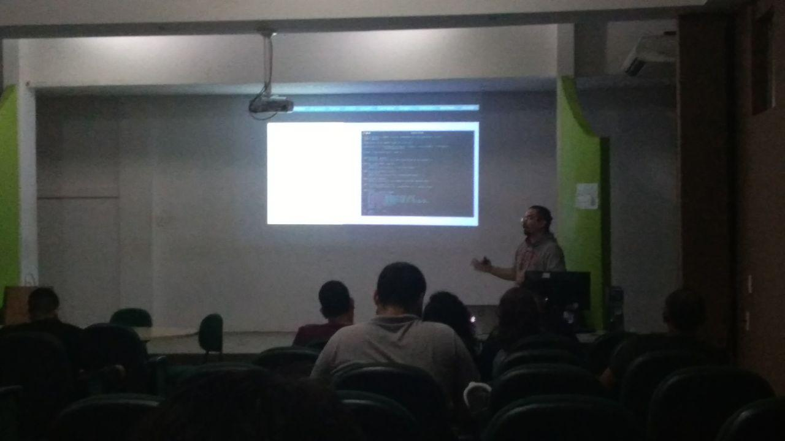
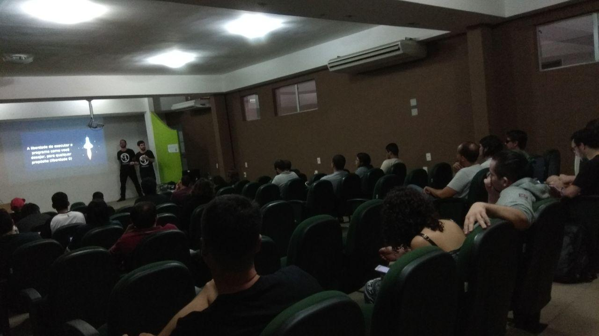
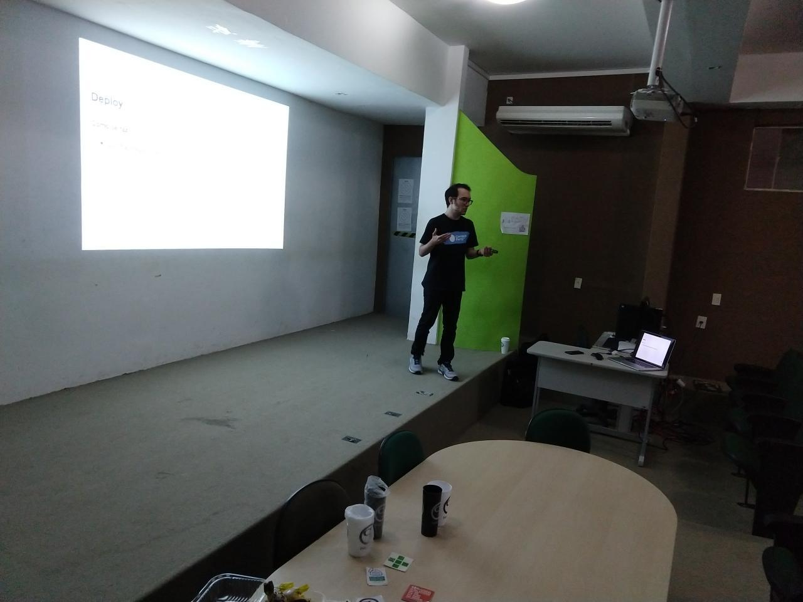
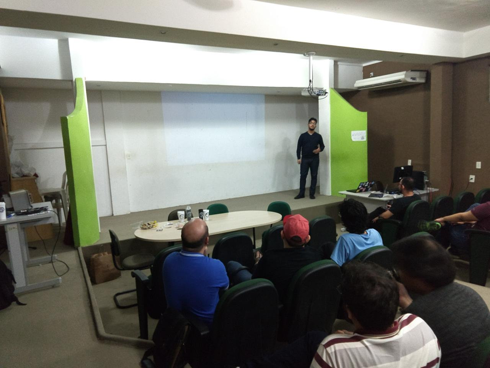
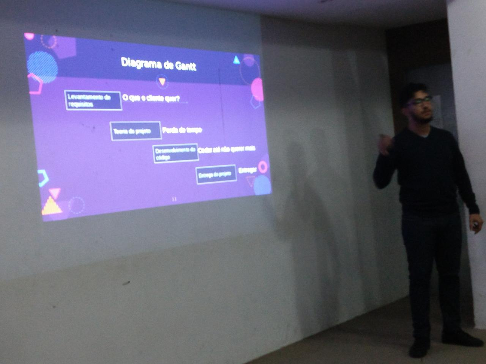
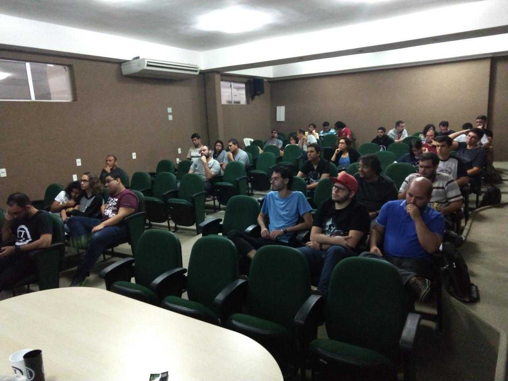
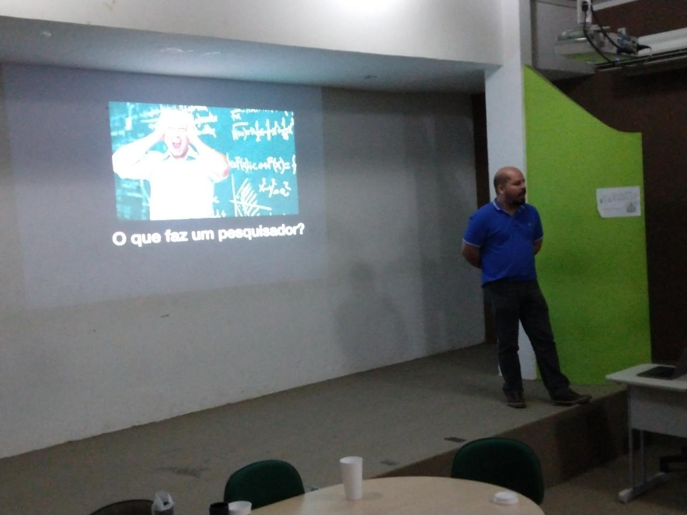

Foi comemorado mais uma vez em Natal o Software Freedom Day (Dia da Liberdade de Software), o evento que busca promover e incentivar o uso de Software Livre. A edição 2018 em Natal ocorreu no sábado, 16 de Setembro, nas instalações do Instituto Federal de Educação, Ciência e Tecnologia do Rio Grande do Norte (IFRN)e foi organizado pela PotiLivre, Comunidade Potiguar de Software Livre.

O evento foi direcionado para usuários e entusiastas de tecnologia em geral. Os participantes do evento tiveram a oportunidade de conhecer profissionais da área e trocar informações sobre o mundo do software livre. O SFD 2018 contou com palestras e discussões relacionadas ao uso e aos benefícios oferecidos pelos programas de código aberto, além de muito networking.

## Palestras

- Integrando Arduino com Bots do Telegram - Geraldo Castro
- O que Software Livre e a Comunidade PotiLivre - Allythy Rennan e  Pedro Baesse
- Dokku: seu Platform-as-a-Service livre - Sedir Morais
- Scrum: Produzindo mais com menos - Paulo Freire
- Fóruns de Governança de Internet e Software Livre - Gustavo Paiva
- Computação Científica e o Software Livre - Caldeira Silva

## Fotos

*Amostra de 8 fotos das 17 registradas neste evento.*

O Software Freedom Day em Natal já faz parte da agenda do PotiLivre e conta com um público que tem bastante interesse em conhecer a filosofia do software livre, além de ser bastante participativo. Fica o convite para quem perdeu, não deixar de conferir a próxima edição deste evento e também a sugestão para a realização deste tipo de evento em mais cidades do Rio Grande do Norte.
