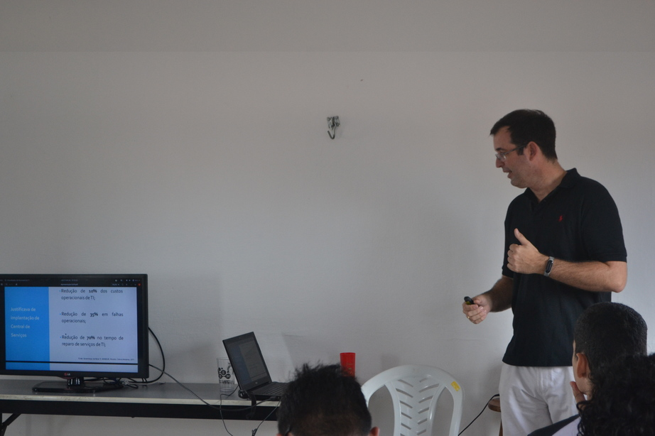
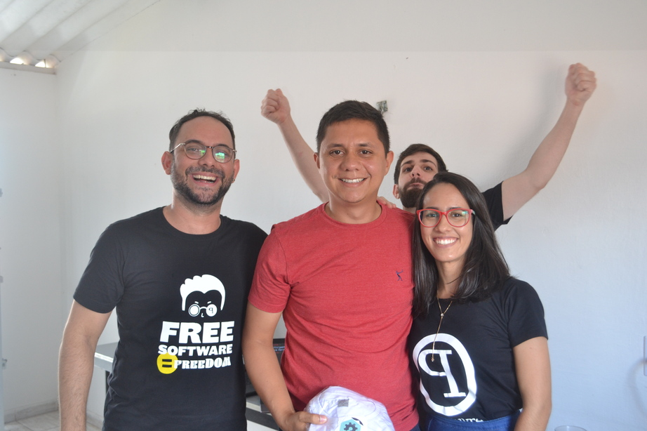
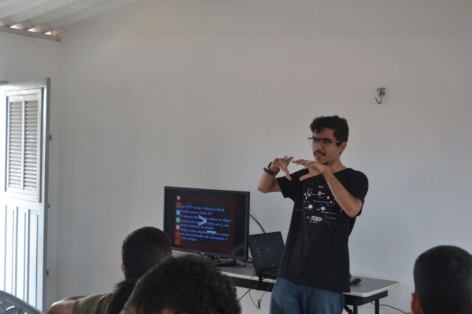
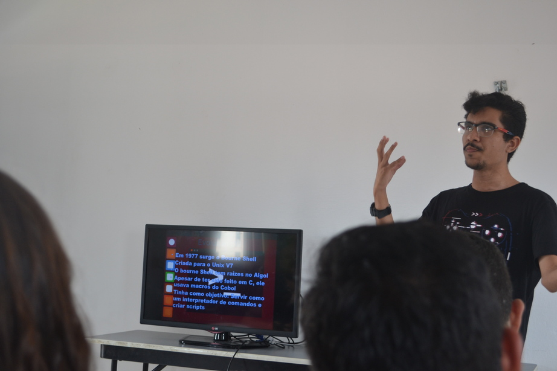
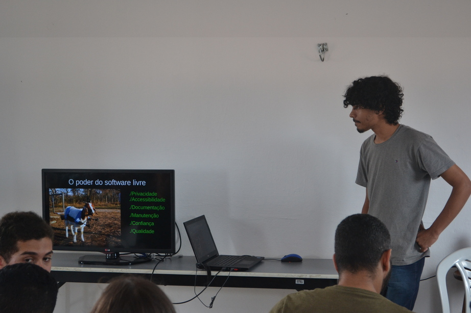
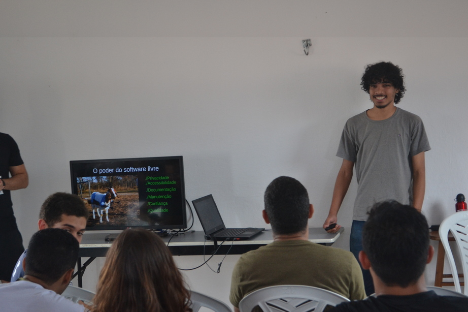
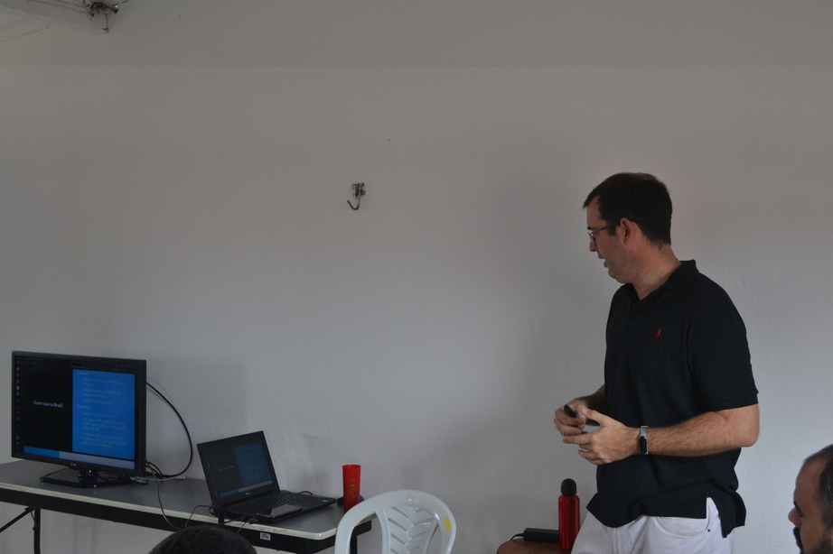
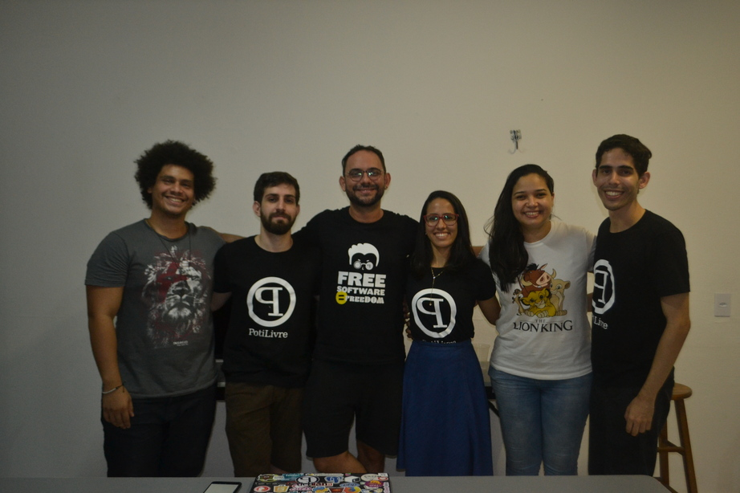

Foi comemorado mais uma vez em Natal o Software Freedom Day (Dia da Liberdade de Software), o evento que busca promover e incentivar o uso de Software Livre. A edição 2019 em Natal ocorreu no sábado, 21 de Setembro, nas instalações do Jerimum Hackerspace e foi organizado pela PotiLivre, Comunidade Potiguar de Software Livre.

Os participantes do evento tiveram a oportunidade de conhecer profissionais da área e trocar informações sobre o mundo do software livre. O SFD 2019 contou com palestras e minicurso relacionadas ao uso e aos benefícios oferecidos pelo Software Livre, além de muito networking.

A coordenação da PotiLivre gostaria de agradecer a todos os voluntários que ajudaram na organização desse ótimo evento. Muito obrigado: Andressa Kroeff, Erick Henrique, Rafael Geronimo, Gabriel Damazio, Josy Palhares, Letícia Pinheiro.

## Palestras

- O que Software Livre e a Comunidade PotiLivre - Allythy Rennan e Pedro Baesse
- Criando seus próprios livros digitais com Software Livre - Giancarlo Silva
- Gestão de Ativos, Helpdesk e Inventário - George Maia
- O poder do software livre - Julio Lira
- O poder do Bash: Uma introdução ao Shell mais amado de todos os tempos - Lucas Matheus

## Minicurso

- Crackear o pacote Adobe é crime e você sabe disso! - Gabriel Damazio

## Fotos

*Amostra de 8 fotos das 69 registradas neste evento.*

O Software Freedom Day em Natal já faz parte da agenda do PotiLivre e conta com um público que tem bastante interesse em conhecer a filosofia do software livre, além de ser bastante participativo. Fica o convite para quem perdeu, não deixar de conferir a próxima edição deste evento e também a sugestão para a realização deste tipo de evento em mais cidades do Rio Grande do Norte.
