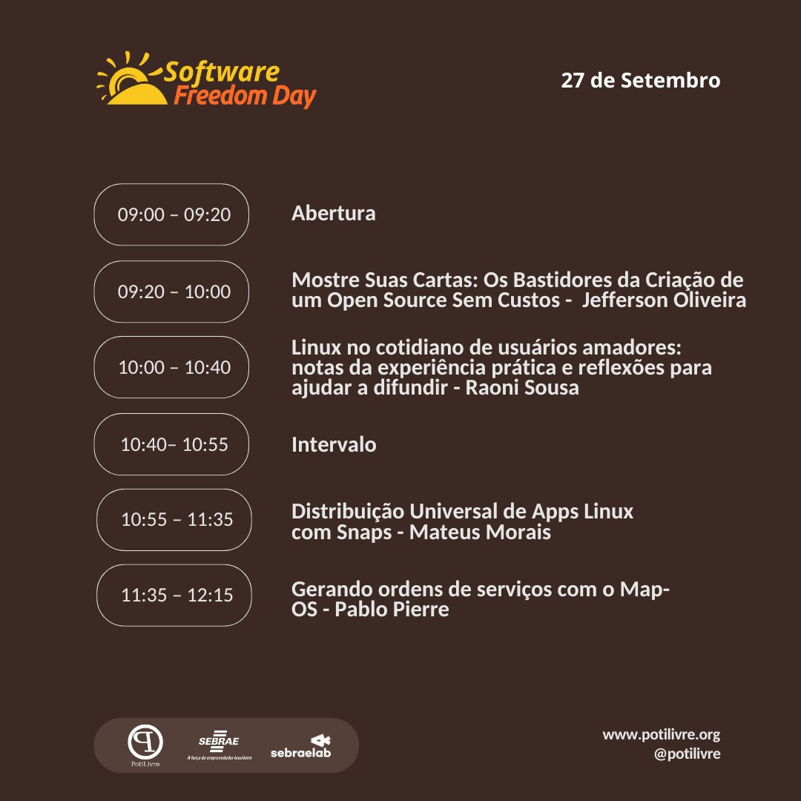

🎉 **O Dia do Software Livre (SFD) Natal 2025 já tem data marcada!**

No dia **27 de setembro**, vamos celebrar juntos a liberdade do conhecimento e do uso da tecnologia, promovendo o Software Livre como ferramenta de transformação social e inovação.

O evento acontecerá no **SEBRAE/RN**, reunindo estudantes, profissionais, comunidades e entusiastas em um dia de palestras e muita colaboração.

## 📋 O que é o Dia do Software Livre?

O Dia do Software Livre é uma celebração global, realizada simultaneamente em diversas cidades do mundo, que busca:

- **Promover** o uso e a filosofia do Software Livre  
- **Divulgar** seus benefícios para a sociedade  
- **Estimular** comunidades locais a se fortalecerem  
- **Incentivar** a troca de conhecimento livre e acessível  

*Se você acredita que liberdade digital importa, o SFD é o seu lugar!*

## 📅 Programação 

    
    
&nbsp;

 
[Abertura]

<ul>
<li>Conhecendo os conceitos do Software Livre e a comunidade PotiLivre</li>
</ul>

 [Palestra] - Mostre suas cartas: Os bastidores da criação de um open source sem custos

<ul>
<li>🧑‍💻 Palestrante: Jefferson Oliveira</li>
<li>📚 Sobre: "E se a sua ideia não precisasse de um grande orçamento para nascer? Vou contar a história de como o Voting Poker foi do conceito à realidade como um projeto open-source mantido sem custos. 
Mais do que uma lista de tecnologias, compartilharei os aprendizados e as estratégias por trás dessa jornada. Uma experiência épica para inspirar e mostrar que é possível construir grandes projetos com os recursos que você já tem."</li>
</ul>

 [Palestra] - Linux no cotiadiano de usuários amadores: notas da experiência prática e reflexões para ajudar a difundir

<ul>
<li>🧑‍💻 Palestrante: Raoni Sousa</li>
<li>📚 Sobre:"E você usa pra quê?" Esta palestra foi concebida a partir dessa frequente reação ao fato de que sou professor de Sociologia e uso Debian. Compartilharei um pouco da minha experiência como usuário amador de Linux ao longo dos anos, trazendo considerações sobre desafios e benefícios, reflexões sobre usabilidade e sugestões de como ajudar outras pessoas a adotar um sistema livre.</li>
</ul>

 [Palestra] - Distribuição universal de apps Linux com Snaps

<ul>
<li>🧑‍💻 Palestrante: Mateus Morais</li>
<li>📚 Sobre: "A fragmentação sempre foi um dos maiores desafios no ecossistema Linux, forçando desenvolvedores a empacotar suas aplicações para dezenas de distribuições e formatos diferentes. Nesta palestra, vamos explorar como os Snaps, o sistema de empacotamento universal da Canonical, resolvem esse problema. Abordaremos as vantagens dos Snaps em segurança com o uso de sandboxing, o sistema de atualizações automáticas e como eles simplificam a vida tanto de desenvolvedores quanto de usuários."</li>
</ul>

 [Palestra] - Gerando ordens de serviços com o Map-OS

<ul>
<li>🧑‍💻 Palestrante: Pablo Pierre</li>
<li>📚 Sobre: "Sistema de Gestão e Controle de Ordens de Serviço pensado para profissionais autonomos e pequenas empresas, com visual limpo e dinâmica simples manterá seu negócio organizado de forma simples e intuitiva."</li>
</ul>

## 🚪 Entrada para o evento no SEBRAE

Segue abaixo o vídeo com orientações para chegar até a entrada do evento no SEBRAE e acessar o local das atividades:

## 🤝 Apoio e parceria

O Dia do Software Livre Natal 2025 conta com a organização da **comunidade PotiLivre**, do apoio do **SEBRAE/RN** e de outras iniciativas locais que acreditam no poder do conhecimento livre.  

*Se sua empresa ou organização deseja apoiar, entre em contato com a organização do evento!*

## 🙌 Participe

O SFD é feito **pela comunidade e para a comunidade**. Sua presença fortalece a luta por uma tecnologia mais livre, inclusiva e acessível a todos.

## 🎟️ Inscreva-se

[*https://evento.potilivre.org/event/6/dia-do-software-livre*](https://evento.potilivre.org/event/6/dia-do-software-livre)

---

**✊🐧 Nos vemos no dia 27 de Setembro de 2025 no Dia do Software Livre Natal!**