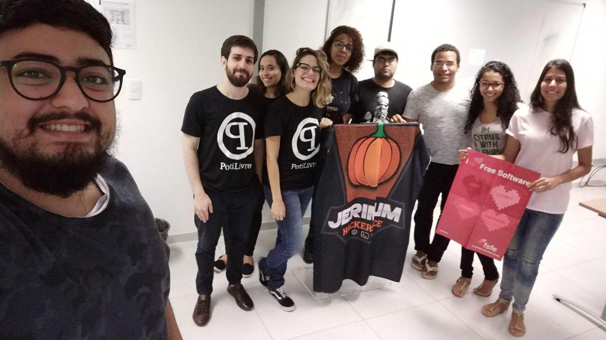
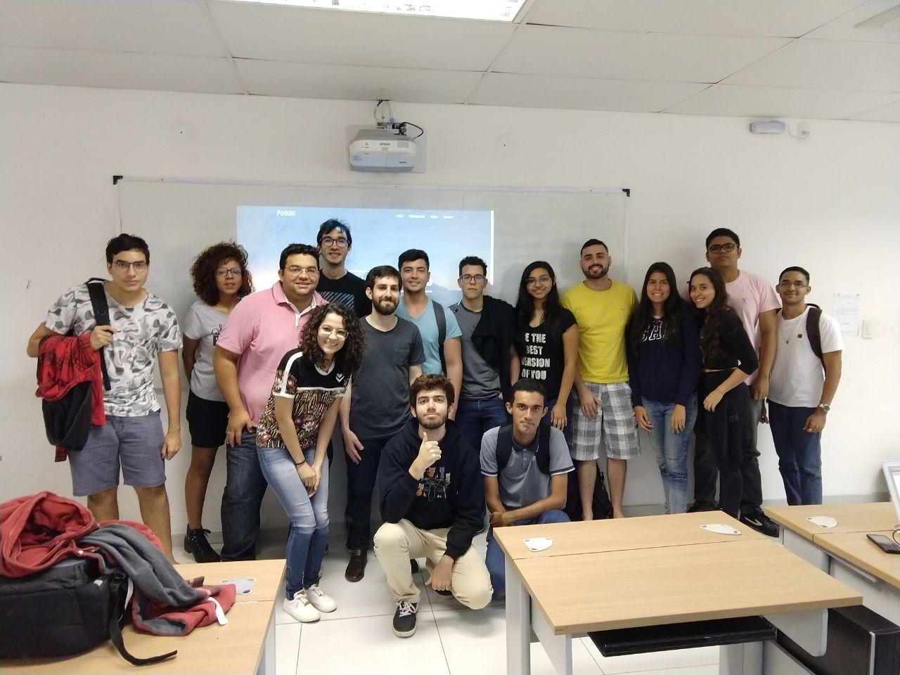

Nos dias 2 e 3 de agosto a Comunidade PotiLivre participou do UPGRADE, evento realizado pelo Instituto Metrópole Digital(IMD), para recepcionar os alunos da instituição nesse segundo semestre. O evento foi marcado por uma variedade de atividades envolvendo a comunidade acadêmica e a PotiLivre colaborou com algumas delas.

Palestras:

- Comunidades Everywhere - Allythy Rennan, Clara Nobre.
- Capture The Flag é muito mais que um jogo - Clara Nobre.

 Minicursos:

- Introdução Introdução ao Git e GitHub - Allythy Rennan.

 Fotos

## Fotos

